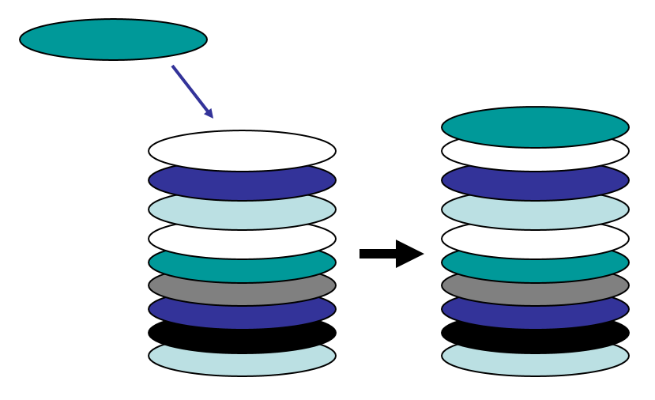
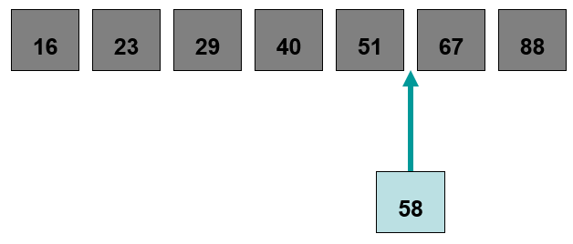

************************
Topic #4 --- Collections
************************

* Collections
* Abstract Data Types
* Data Structures
* Implementations
* Abstraction

Collections and ADTs
====================

* A collection is a group o *things* that we want to treat as a special conceptual unit
    * A contact list
    * A stamp collection

* In computer science, we have a few popular elementary collections
    * Stacks
    * Queues
    * Lists
    * Trees
    * Graphs

* This list is far from complete, but they will be a big part of your early computer science courses

Linear Collections
------------------

* Linear collections are those that arrange data in a sequential way where each thing has a predecessor and a successor
    * Except for the ends

Stack
^^^^^

* Adding and removing data from a stack happens from one end
* The last thing we add to the stack will be the first thing off

Queue
^^^^^

.. image:: ../img/queue_example.png
   :width: 500 px
   :align: center

* Adding to a queue happens at one end and removing happens at the other
* The first thing that gets added would be the first thing to be removed

List
^^^^

* Adding and removing from a list will depend on the type of list we have
* In the above example, the list is ordered, so adding to the list should preserve the order

* Python lists are *lists*, and they are a generalization of stacks and queues

Nonlinear Collections
---------------------

* Sometimes there is no natural way to arrange our data in a nice sequential
* Sometimes there are many successors
* Sometimes the idea of successor does not make sense

Trees
^^^^^

.. image:: ../img/tree_example.png
   :width: 500 px
   :align: center

* The data is arranged in a hierarchical way
* Every element has at most one *parent*, but potentially many *children*
* If I ask you "What comes after Program Files" in this example, there is no obvious answer
* We can think of trees as a generalization of lists

Graphs
^^^^^^

.. image:: ../img/graph_example.png
   :width: 500 px
   :align: center

* Data is often represented along with relationships to other data
    * Vertices/Nodes
    * Edges

* We can think of graphs as a generalization of trees

Abstraction
===========

Data Structures
===============

For next time
=============

* Read Chapter 3 Section 1 of your text
    * 3 pages