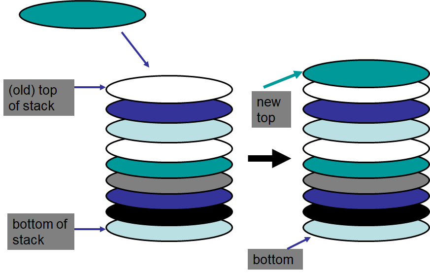
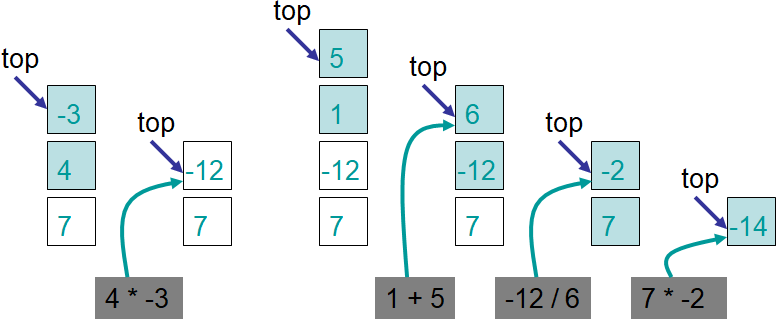

**************************
Topic #5 --- The Stack ADT
**************************

* Stacks are a collection of elements that are only added and removed from one end
    * The *top*

* Given this, the **L**\ ast thing **I**\ n will be the **F**\ irst thing **O**\ ut
    * LIFO

* For example
    * A stack of plates that you'd see at a buffet
    * Webpage history with the back button
    * Undo in your text editor
    * Callstack

**Adding to a Stack**

**Removing from a Stack**

.. image:: ../img/stack_remove.png
   :width: 500 px
   :align: center

Stack Operations
================

Collection Operations
---------------------

* For the collections we're looking at, we need a way to:
    * Add something to the collection
    * Remove something from the collection
    * Look at something, but do not remove it

* However, the way these are done may differ between collections

* Other things we will want to do with our collections are:
    * ``isEmpty`` --- see if the collection is empty
    * ``size`` --- Check how many things are in the collection
    * ``toString`` --- Get a string version of the collection

Stack Context
-------------

* **Push**
    * Add something to the *top* of the stack

* **Pop**
    * Remove something from the *top* of the stack

* **Peek**
    * Look at the thing on the *top* of the stack, but do **not** remove it

* And we will also want out ``isEmpty``, ``size`` and ``toString``

.. warning::

    It is against our definition of a stack to access anything from anywhere other than the *top* of the stack.

Stack ADT
---------

* With this, we now know what the operators are and how they are used

* Notice how none of the above explains a single thing about *how* the stack is implemented
    * Nothing about where we store the data
    * Nothing about how the operators do what they do

* Notice that this also has nothing to do with Java
    * Or Python
    * Or C++
    * Or ...

* This is just the definition of the stack ADT

Example Use
===========

* We'll use a stack to solve a problem without having to know how it is implemented
    * We can even write the pseudocode for an algorithm using a stack

Postfix Expressions
-------------------

* We as humans prefer *infix* notation for our mathematical expressions
    * ``3 + 4 * 2 = 11``
    * ``(7 + 2) / 3 = 3``

* But this is just a convention
* We can use other notations, like *postfix* notation
    * ``3 4 2 * + = (3 (4 2 *) +) = 11``
    * ``7 2 + 3 / = (7 2 +) 3 /) = 3``

Pseudocode for Evaluating Postfix Expressions
^^^^^^^^^^^^^^^^^^^^^^^^^^^^^^^^^^^^^^^^^^^^^

.. code-block::
    :linenos:

    For each symbol in expression
        If symbol is an operand
            PUSH symbol onto stack
        If symbol is an operator
            POP twice from the stack
            Apply operator to the two popped operands
            PUSH result onto stack

Evaluate
^^^^^^^^

* With the pseudocode, evaluate ``7 4 -3 * 1 5 + / *``

* Again, notice that we were able to use the idea of a stack to solve a problem easily despite not knowing the implementation

Interface
=========

Generics
--------

For next time
=============

* Read Chapter 3 Sections 2 -- 6
    * 13 pages