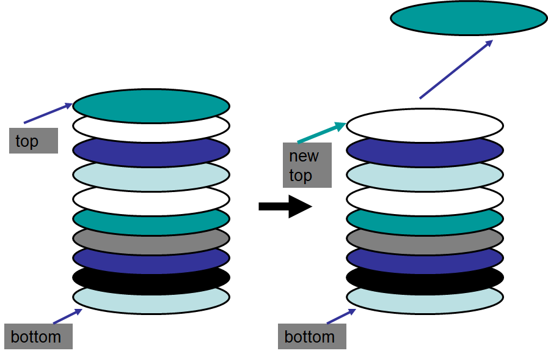

**************************
Topic #5 --- The Stack ADT
**************************

* Stacks are a collection of elements that are only added and removed from one end
    * The *top*

* Given this, the **L**\ ast thing **I**\ n will be the **F**\ irst thing **O**\ ut
    * LIFO

* For example
    * A stack of plates that you'd see at a buffet
    * Webpage history with the back button
    * Undo in your text editor
    * Callstack

**Adding to a Stack**

.. image:: ../img/stack_add.png
   :width: 500 px
   :align: center

**Removing from a Stack**

Stack Operations
================

Example Uses
============

Interface
=========

Generics
--------

For next time
=============

* Read Chapter 3 Sections 2 -- 6
    * 13 pages