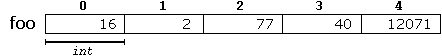

*************************
C++ Lessons #3 --- Arrays
*************************

.. warning::

    * For these, I will only go over the C++ details at a high level
    * Getting into the nitty gritty of C++ is not the purpose of this aside
    * Some of the concepts require knowledge of more advanced ideas that have not been covered yet
        * If this happens, do not panic
        * it probably makes more sense to revisit this later in the course
    * For simplicity, some of the examples will use less than ideal implementations

.. note::

    Here we will go over the basics of arrays in C/C++; however, in practice you will likely be making use of C++'s
    standard library's ``std::vector``.

        * `std::vector <https://en.cppreference.com/w/cpp/container/vector/>`_

Static Arrays
=============

* *Static* arrays mean that the **size** is known at compile time and is not going to change
* In the below example, we are setting aside a chunk of memory that is ready to store 5 integers
* Unlike Java however, there are no default values set in the array

.. code-block:: cpp
    :linenos:

    int foo[5];

* We can also assign values to the array on creation

.. code-block:: cpp
    :linenos:

    int foo[] = {16, 2, 77, 40, 12071};

* Or we can assign/change and/or retrieve the values with indexing
* These static arrays have known sizes at compile time, but we can still change the contents
* In the below example
    * The value at index ``3`` in ``foo`` will be set to ``99``
    * The value from index ``3`` in ``foo`` (``99``) will be copied to ``x``

.. code-block:: cpp
    :linenos:

    foo[3] = 99;
    int x = foo[3];

Dynamic Arrays
==============

Further Reading
===============

* Read the `cplusplus.com <http://www.cplusplus.com/doc/tutorial/arrays/>`_ tutorial on arrays
    * Images are taken directly from the cplusplus page
    * Click the images to visit the page

* Read up on ``std::vector``
    * `cppreference.com <https://en.cppreference.com/w/cpp/container/vector>`_
    * `cplusplus.com <https://www.cplusplus.com/reference/vector/vector/>`_

* There also exists a ``std::array`` too, which you may find interesting
    * `cppreference.com <https://en.cppreference.com/w/cpp/container/array>`_
    * `cplusplus.com <https://www.cplusplus.com/reference/array/array/>`_
