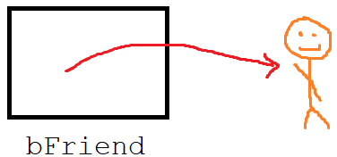

**************************
C++ Lessons #5 --- Objects
**************************

.. warning::

    * For these, I will only go over the C++ details at a high level
    * Getting into the nitty gritty of C++ is not the purpose of this aside
    * Some of the concepts require knowledge of more advanced ideas that have not been covered yet
        * If this happens, do not panic
        * it probably makes more sense to revisit this later in the course
    * For simplicity, some of the examples will use less than ideal implementations

* The same example described in :doc:`Topic3 </topic3.rst>` is used here
    * A collection of ``Friend`` objects stored in an ``ContactList`` obejct

Friend
======

* We will create a ``Friend`` class to keep track of a few details
    * First Name
    * Last Name
    * Email

* We will also want
    * Constructor
    * Accessors

* That's about it

Header
------

* The first thing we want is a *header* file
* Call this ``Friend.h``
* This is where we typically declare all the member fields and methods the class will have
* This file will also have all our ``#include``s too
* Below is a complete ``Friend.h``

.. code-block:: cpp
    :linenos:

    // Friend.h
    #include <string>

    class Friend {
        private:
            std::string firstName_;
            std::string lastName_;
            std::string email_;

    public:
        Friend();
        Friend(std::string, std::string, std::string);

        const std::string& firstName() const    {return firstName_;}
        const std::string& lastName() const     {return lastName_;}
        const std::string& email() const        {return email_;}
              std::string& email()              {return email_;}
    };

* Notice the two constructors for the ``Friend``
    * A default constructor that takes no parameters
    * A constructor that takes three strings as parameters

* The last four lines are a way we can have accessors for a private fields
* The first thing to note is that the whole method is actually written here in the header since it is only one line long
* The first two return ``const std::string&`` --- a constant reference to a string
    * These values can be accessed, but not changed
    * You can access the like this ``someFriend.firstName()``

* ``email()`` on the other hand has another method that does not return a ``const``, which means that this value may be changed
    * You can modify the email like this ``someFriend.email() = "new email address"``

Implementation
--------------

* The .cpp file is where we typically define and write the actual methods
* Mind the use of ``Friend::`` before all the method names
* Only the constructors are needed here because the implementation for the others were declared in the header

.. code-block:: cpp
    :linenos:

    // Friend.cpp
    #include "Friend.h"

    Friend::Friend() {
        firstName_ = "Person";
        lastName_ = "Doe";
        email_ = "pDoe@email.com";
    }

    Friend::Friend(std::string firstName, std::string lastName, std::string email) {
        firstName_ = firstName;
        lastName_ = lastName;
        email_ = email;
    }

Using the Friend Class
----------------------

* We can create ``Friend`` objects on the stack, or the heap
* In the below example
    * The variable ``aFriend`` is a variable containing a ``Friend`` object
    * ``bFriend`` is a variable containing the memory address of where a ``Friend`` object is in memory

.. code-block:: cpp
    :linenos:

    int main() {
        // Create a friend on the stack with the default constructor
        // Mind the missing parentheses
        Friend aFriend;

        // Create a friend in the heap and create a pointer variable
        Friend* bFriend = new Friend("Jane", "Doe", "jdoe@gmail.com");
    }

* The example with the friend pointer will be more similar to what you are used to in Python and Java
* The big difference is that we need to dereference pointers, where we do not need to explicit dereference reference variables in Python and Java

.. warning::

    In the below example, the variables and what is happening is quite different.

    Consider that ``wFriend`` is a variable containing a ``Friend`` object. When we assign ``xFriend = wFriend``, we
    copy the contents of the variable (the ``Friend`` object) and put it into ``xFriend``. Given the simplicity of this
    class, cpp is happy to make a copy for us on its own, but once classes get more sophisticated, we would need to
    write a copy constructor for this scenario.

    .. image:: img/cpp_friend_copy.png
       :width: 250 px
       :align: center

    Similarly, ``yFriend`` is a variable containing a pointer to a ``Friend`` object. When we assign
    ``zFriend = yFriend``, we copy over the contents of the variable (a ``Friend`` pointer) and put it into ``zFriend``.

    .. image:: img/cpp_friend_pointer_copy.png
       :width: 250 px
       :align: center

    .. code-block:: cpp
        :linenos:

        Friend wFriend("Clarence", "Cartwrite", "treelover1523@hotmail.com");
        Friend xFriend = wFriend;

        Friend* yFriend = new Friend("Sandy", "Seaside", "boatsboatsboats@yachtclub500.com");
        Friend* zFriend = yFriend;

ContactList
===========

* We will create a ``ContactList`` class to keep track of ``Friend`` objects
* The ``ContactList`` will know it's
    * Capacity (arrays do not know their capacity)
    * Size (only one we would want access to)
    * An array to hold to keep track of the ``Friend`` objects

* We will also want
    * Constructors
    * A way to add ``Friend`` objects
    * A way to remove ``Friend`` objects
    * Access the size
    * A way to update a ``Friend`` object's email
    * A linear search
    * A way to access a ``Friend`` from a specific intex

Header
------

* Below is a complete ``ContactList.h``
* Notice that the only private variable with an accessor is ``size_``
* You will also notice the *deconstructor* ``~ContactList();``
    * Simply put, deconstructors describe how to deallocate the memory assigned to the instance
    * This will be discussed in more detail in the implementation section below

* And you will also notice the *copy constructor* ``ContactList(const ContactList &contactList)``
    * Simply, this describes how to make a copy of an instance of this class
    * More on this in the implementation section

.. code-block:: cpp
    :linenos:

    // ContactList.h
    #include "Friend.h"

    class ContactList {
        private:
            const int DEFAULT_CAPACITY = 10;
            const int NOT_FOUND = -1;
            int size_;
            int capacity_;
            Friend** friends_;

            void expandCapacity();

        public:
            ContactList();
            ContactList(int);
            ContactList(const ContactList& contactList);
            ~ContactList();

            const int& size() const {return size_;}
            void add(std::string, std::string, std::string);
            void remove(std::string, std::string, std::string);
            void updateEmail(std::string, std::string, std::string);
            int find(std::string, std::string, std::string);
            Friend* at(int);
    };

Further Reading
===============

* Read the `cplusplus.com <http://www.cplusplus.com/doc/tutorial/classes/>`_ tutorial on classes
* Read the other `cplusplus.com <http://www.cplusplus.com/doc/tutorial/templates/>`_ tutorial on classes
