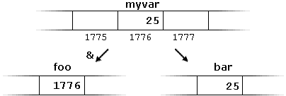

***************************
C++ Lessons #2 --- Pointers
***************************

.. warning::

    * For these, I will only go over the C++ details at a high level
    * Getting into the nitty gritty of C++ is not the purpose of this aside
    * Some of the concepts require knowledge of more advanced ideas that have not been covered yet
        * If this happens, do not panic
        * it probably makes more sense to revisit this later in the course
    * For simplicity, some of the examples will use less than ideal implementations

.. note::

    Here we will go over the basics of pointers in C/C++; however, in practice you will likely be making use of C++'s
    smart pointers. 

        * `std::unique_ptr <https://en.cppreference.com/w/cpp/memory/unique_ptr>`_
        * `std::shared_ptr <https://en.cppreference.com/w/cpp/memory/shared_ptr>`_
        * `std::weak_ptr <https://en.cppreference.com/w/cpp/memory/weak_ptr>`_

* Variables we make in our program go into RAM

.. code-block:: cpp
    :linenos:

    int anInt = 5;

* This makes a variable called ``anInt`` and assigns it the value ``5``
* The value ``5`` is stored in RAM somewhere, and we use the label ``anInt`` to access it
* Generally, where in RAM the value is actually stored is up to the operating system
* But a neat thing about C++ is that we can ask *where* in RAM the value is stored

Address Of Operator
===================

* The address of operator --- ``&``
    * The symbol ``&`` is used a lot, but it is context sensitive

* We can get the memory address of where a given variable is stored by putting the ``&`` right in front of the variable name

.. code-block:: cpp
    :linenos:

    int anInt = 5;
    std::cout << anInt << " is at " << &anInt << std::endl;

* The result would look something *like* this

    ``5 is at 0x7ffde2544134``

* This tells us that the operating system used memory address ``0x7ffde2544134`` to store the value ``5``
    * Note that this memory address is represented in *hexadecimal*
    * Also note that your memory address will differ if you run this, and will differ every time you run the program

* The variable name, ``anInt``, is the label for this memory address in this context

Pointer Variable
================

* Instead of simply printing out the memory address, we can store it in a variable for later use
* We call these variables *pointers* because we can think of them as pointing to a memory address
* The trick here is to be mindful of the type of data we are storing
    * If we want to store an integer pointer, we will have an integer pointer type

.. code-block:: cpp
    :linenos:
    :emphasize-lines: 4

    int myVar = 25;

    // Create a pointer variable
	int* foo = &myVar;
	int bar = myVar;

* In the above example, notice the asterisk (``*``) next to the ``int``
* This means that the data being stored in the variable labelled ``foo`` must be of type integer pointer
* ``bar`` on the other hand just has type ``int``

* In the above example, assuming ``myVar`` is stored at address ``1776``
    * The address is stored in the integer pointer ``foo``
    * The integer from ``myVar`` is copied to the integer ``bar``

Dereferencing
=============

* If you have a pointer variable, but you do not care about the memory address; you want to know what is stored *at* the memory address, we *dereference*

* For example, if you do not care that the integer pointer ``foo`` stores ``1776``, but you care what is at ``1776``

.. code-block:: cpp
    :linenos:
    :emphasize-lines: 2,4

    int myVar = 25;
    int* foo = &myVar;
    int bar = myVar;
    int baz = *foo;

* The use of ``*foo`` on line 4 means *dereference*
* It means, take the memory address stored in the integer pointer variable ``foo``, but tell me what is in that address
* If we follow the code on line 4, it will execute like this:
    * ``foo`` is a label for an integer pointer variable containing ``1776``
    * But the ``*foo`` means, get what is **at** memory address ``1776``
    * Take the value there (``25``) and copy it to the integer variable ``baz``

.. image:: img/cpp_pointer1.png
   :width: 300 px
   :align: center
   :target: https://www.cplusplus.com/doc/tutorial/pointers/

.. warning::

    Note the two different uses of ``*``. (a) ``int* foo`` and (b) ``*foo``. In (a), we are specifying the type to be
    integer pointer --- it's having an impact on the type, so the asterisk (``*``) is by the type in the variable
    declaration. With (b) however, we already have an existing pointer variable that we want to dereference, thus the
    asterisk (``*``) is by the already existing variable.

.. note::

    You can still actually use ``int *myIntPointer`` as opposed to ``int* myIntPointer``, but I recommend the latter
    since it helps emphasize that it's the *type* that is the pointer. That said, this is my preference.

* The address of and dereference operators are complementary

.. code-block:: cpp
    :linenos:

    int myVar = 25;
	std::cout << *&myVar <<	std::endl;

* In practice the above example is quite silly, but if break the instructions down
    * ``myVar`` is an integer variable holding ``25``
    * ``&myVar`` is the memory address of the ``myVar`` integer variable
    * ``*&myVar`` is what's at the memory address... of the memory address... of where the variable ``myVar`` is in RAM

.. code-block:: cpp
    :linenos:

    int myVar = 25;
	std::cout << *&*&*&*&*&*&*&*&*&*&*&*&*&*&*&*&*&*&*&*&*&myVar <<	std::endl;

* Similarly, this would work too, but that much more idiotic
    * Tell me what is at the address of the address of the thing at the address of the address of ...

.. warning::

    It's a common joke among students that pointers are difficult to wrap your brain around. Although it's not trivial
    to learn them, the joke has been blown way out of proportion. Like anything programming related, you'll pick it up
    with practice. The trick I suggest is (a) slow down, (b) think about your types, and (c) think about what you want.

.. code-block:: cpp
    :linenos:

    int myVar = 25;
    std::cout << *myVar << std::endl;

* The above example is nonsense code in terms of what it means
* It's asking an integer what is at the memory address stored in ``myVar``
* But ``myVar`` does not store an integer pointer, it stores an integer, thus, it's a nonsense request
* Sure, it's an integer, which is a number, and pointers are numbers too, but that doesn't make this OK since it's not a pointer; it's not something that can be dereferenced

Fun Examples
============

.. code-block:: cpp
    :linenos:

    int firstValue = 5;
    int secondvalue = 15;
    int* p1;
    int* p2;

    p1 = &firstValue;
    p2 = &secondvalue;
    *p1 = 10;
    *p2 = *p1;
    p1 = p2;
    *p1 = 20;

    std::cout << firstValue << std::endl;
    std::cout <<  secondvalue << std::endl;

* What's printed out by the above code?
* There is no trick to this other than following through the code one line at a time

**First 7 Lines**

* ``firstvalue`` is ``5`` and ``p1`` is a pointer to ``firstvalue``
* ``secondvalue`` is ``15`` and ``p2`` is a pointer to ``secondvalue``

**Line 8**

* Dereference ``p1``, so, don't give me the memory address, but the contents of the memory address
* Replace the contents with the integer ``10``

**Line 9**

* Put the contents of ``p1``'s dereferenced value (``fistvalue``) into the contents of ``p2``'s dereference (``secondvalue``)

**Line 10**

* Copy the contents of ``p2``, the memory address of ``secondvalue``, and put it into ``p1``
* Both ``p1`` and ``p2`` point to the memory address of ``secondvalue``

**Line 11**

* Put the integer ``20`` into the contents of ``p1``'s dereferenced value (``secondvalue``)

.. code-block:: cpp
    :linenos:

    #include <iostream>

    void sum_no_pointer(int x, int y, int z){
        z = x + y;
    }

    int main(){
        int a = 1, b = 2, c = 0;
        sum_no_pointer(a, b, c);
        std::cout << a << std::endl;
        std::cout << b << std::endl;
        std::cout << c << std::endl;
        return 0;
    }

* If you run the above code, you would see ``1``, ``2``, and ``0`` printed out
    * ``c`` is ``0`` since ``sum_no_pointer``'s parameters get a copy of the values
    * The function has it's own variables, with their own memory addresses, to store the values

.. code-block:: cpp
    :linenos:

    #include <iostream>
    void sum_pointer(int* x, int* y, int* z){
        *z = *x + *y;
    }

    int main(){
        int a = 1, b = 2, c = 0;
        sum_pointer(&a, &b, &c);
        std::cout << a << std::endl;
        std::cout << b << std::endl;
        std::cout << c << std::endl;
        return 0;
    }

* Running this, on the other hand, will get us ``1``, ``2``, and ``3``
    * ``sum_pointer`` store memory addresses (integer pointers) of where the ``main``'s ``a``, ``b``, and ``c`` are stored
    * If we dereference these pointers, we can modify what is at the specified memory address

Further Reading
===============

* `If you would like additional discussion and examples, check out cpp reference <https://en.cppreference.com/w/cpp/language/pointer>`_

* Images are taken directly from `cplusplus.com <https://www.cplusplus.com/doc/tutorial/pointers/>`_
    * Click the images to visit the page