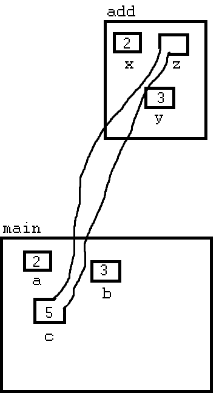

*****************************
C++ Lessons #3 --- References
*****************************

.. warning::

    * For these, I will only go over the C++ details at a high level
    * Getting into the nitty gritty of C++ is not the purpose of this aside
    * Some of the concepts require knowledge of more advanced ideas that have not been covered yet
        * If this happens, do not panic
        * it probably makes more sense to revisit this later in the course
    * For simplicity, some of the examples will use less than ideal implementations

What Are They?
==============

.. warning::

    Although the word used here is "reference", these are not the same as a reference variable in Java. The closest
    analogue to a reference variable from Java in Cpp is an automatically dereferenced pointer.

* Reference variables are a way to give a variable another name
    * Alias

* The ``&`` character is used to create reference variables
    * ``&`` is already used for *and* and *address of*, but it is context sensitive

* To create a reference for an integer, we use ``int&``
    * Note the similarity to the pointer variables

* Reference variables are assigned their value on creation
* They cannot change which variable they are a reference for
* They do not need to be dereferenced

How To Use Them
===============

* Below is an example of using a reference variable
    * Create an ``int`` variable ``a``
    * Assign ``6`` to ``a``
    * Create a reference to an ``int`` called ``b`` and assign it to ``a``
    * Change the contents of ``a``/ ``b`` through ``b``

.. code-block:: cpp
    :linenos:

    int a;
    a = 6;
    int& b = a;
    b = 7;

.. image:: img/cpp-ref.gif
   :width: 300 px
   :align: center

Using With Functions
====================

Function With Regular Variable Parameters
-----------------------------------------

* In the below example, the ``add`` function creates two local variables ``x`` and ``y`` to store integers

.. code-block:: cpp
    :linenos:

    int add(int x, int y) {
        return x + y;
    }

    int main(){
        int a = 2;
        int b = 3;
        int c = 0;
        c = add(a, b);
    }

.. image:: img/cpp-ref_regular.png
   :width: 300 px
   :align: center

Function With Pointer Variable Parameters
-----------------------------------------

* In the below example, the ``add`` function creates three local variables ``x``, ``y``, and ``z`` to store pointers to integers

.. code-block:: cpp
    :linenos:

    void add(int x, int y int* z) {
        *c = x + y;
    }

    int main(){
        int a = 2;
        int b = 3;
        int c = 0;
        add(&a, b, c);
    }

Function With Reference Variable Parameters
-------------------------------------------

* In the below example, the ``add`` function gets reference to ``a``, ``b``, and ``c`` (labeled as ``x``, ``y``, and ``z``)
    * No need for a copy

.. code-block:: cpp
    :linenos:

    void add(int x, int y, int& z) {
        z = x + y;
    }

    int main(){
        int a = 2;
        int b = 3;
        int c = 0;
        add(a, b, c);
    }

