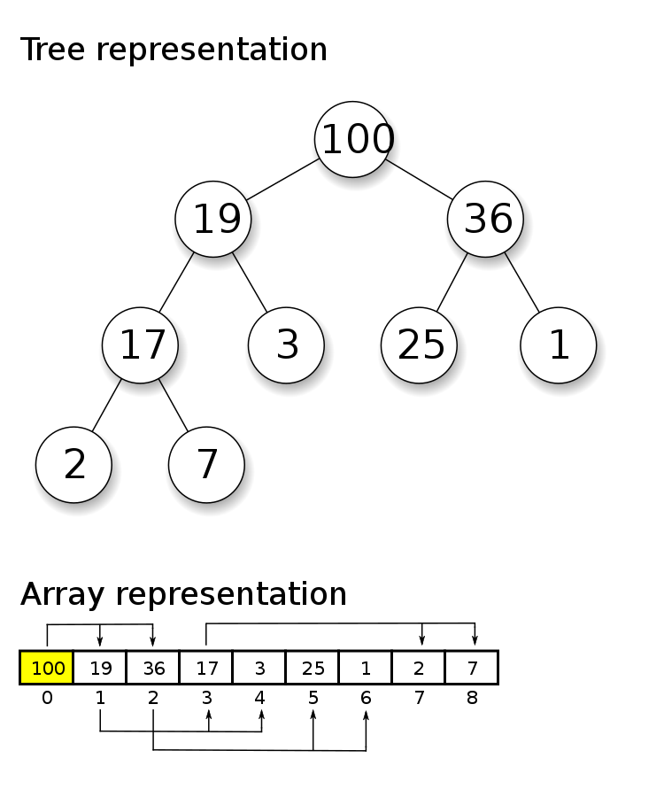

*******
Lab #10
*******

* Refer to the topic pages for this lab
    * You will find many of the answers to your questions there
* Feel free to use your laptop if you have it
* I strongly encourage you to work with others in the lab
* Ensure I have recorded your completion. Failure to do so will result in a grade of 0
* When you get stuck, do me a favour and ask those sitting around you for help
    * I want people to get used to working together in the labs
    * Peer teaching and peer learning is super effective

.. Note::

    We have not gone over this topic in lecture, but this should not be a problem

Heaps
=====

Have you ever wanted to store a binary tree in an array?

* The root of the tree is always at index :math:`0`
* Given an element at index :math:`i`
    * Its left child can be found at :math:`2i + 1`
    * Its right child can be found at :math:`2i + 2`
    * Assuming it's not the root, it's parent can be found at :math:`\lfloor (i-1)/2 \rfloor`
        * :math:`\lfloor x \rfloor` just means to round down if needed

* For example, consider the element 17 located at index :math:`3` in the array
    * Left child would be at :math:`3*2 + 1 = 7`
    * Right child would be at :math:`3*2 + 2 = 8`
    * Parent would be at :math:`\lfloor (3-1)/2 \rfloor = 1`

Min Heap
========

* A *min* heap is a special heap with the property that the parent must be smaller than their children
    * Or, children of an element must be greater than their parent

* In other words, the root must be the smallest element in the tree
    * This definition can be recursively applied to all subtrees within a tree

* A *max* heap is similar to a min heap, but instead the root is the largest
    * The image above provides an example of a max heap

.. warning::

    Although min/max heaps are binary trees, they are **not** binary *search* trees; do not get the idea of min/max
    heaps confused with binary search trees. Where binary search trees have the ordering based on left/right
    orientation, the min/max heaps have their ordering based on up/down direction.

Bubble Up
---------

* Whenever something is added to the heap, it is placed at the next available index in the array
    * This ensures that our heap is always a *complete binary tree*

* However, if the goal is to make a min heap, simply adding something to the end may cause a problem since it may have a value less than its parent
* Fortunately, there is a simple way to address this issue --- *Bubbling up*

* If the value at the index :math:`i` is less than the value at the index of :math:`\lfloor (i-1)/2 \rfloor` --- its parent
    * Swap the values

* Repeat this process for the inserted value until either
    * The inserted value is not less than the parent's value
    * The inserted value is at the root

Bubble Down
-----------

* Given the min heap's property of the smallest element being at the root, I may be using this data structure for keeping track of ordered data
    * I can easily access the minimum value from the collection since it is always at :math:`i = 0`

* Unfortunately, if the minimum value is to be *removed*, there will be no value at the root of the tree
    * A solution to this problem is to *bubble down*

* Remove the element at the last index in the heap and place it in the root position :math:`i = 0`
* Compare the moved value with its left and right children at indices :math:`2i + 1` and :math:`2i + 2`
    * Swap the value with the smaller of the two child's value

* Repeat this process until either
    * The value is not greater than either child
    * There are no more children to compare to; the value is at a leaf

* It is important to always swap with the smaller of the two children when bubbling down since it ensures the min heap property

Kattis Problems
===============

Recommended Kattis Problems (don't worry, you don’t need to do all of them or anything):

1. https://open.kattis.com/problems/quadrant
2. https://open.kattis.com/problems/judgingmoose
3. https://open.kattis.com/problems/timeloop
4. https://open.kattis.com/problems/oddities
5. https://open.kattis.com/problems/fizzbuzz
6. https://open.kattis.com/problems/twostones
7. https://open.kattis.com/problems/spavanac
8. https://open.kattis.com/problems/cetvrta
9. https://open.kattis.com/problems/bus
10. https://open.kattis.com/problems/timeloop
11. https://open.kattis.com/problems/oddities
12. https://open.kattis.com/problems/fizzbuzz
13. https://open.kattis.com/problems/sibice
14. https://open.kattis.com/problems/datum
15. https://open.kattis.com/problems/dicecup
16. https://open.kattis.com/problems/autori
17. https://open.kattis.com/problems/apaxiaaans
18. https://open.kattis.com/problems/hissingmicrophone
19. https://open.kattis.com/problems/trik
20. https://open.kattis.com/problems/pot
21. https://open.kattis.com/problems/filip
22. https://open.kattis.com/problems/reversebinary
23. https://open.kattis.com/problems/sevenwonders
24. https://open.kattis.com/problems/zamka
25. https://open.kattis.com/problems/bijele
26. https://open.kattis.com/problems/cold
27. https://open.kattis.com/problems/nastyhacks
28. https://open.kattis.com/problems/grassseed
29. https://open.kattis.com/problems/pet
30. https://open.kattis.com/problems/batterup
31. https://open.kattis.com/problems/aboveaverage
32. https://open.kattis.com/problems/icpcawards
33. https://open.kattis.com/problems/quickbrownfox
34. https://open.kattis.com/problems/nodup
35. https://open.kattis.com/problems/conundrum
36. https://open.kattis.com/problems/bela
37. https://open.kattis.com/problems/kornislav
