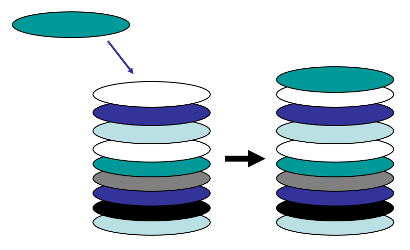
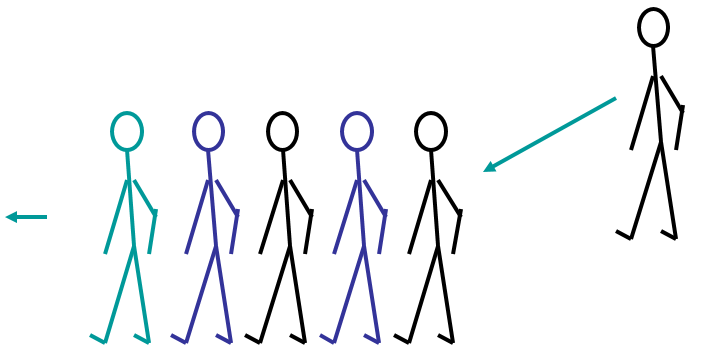
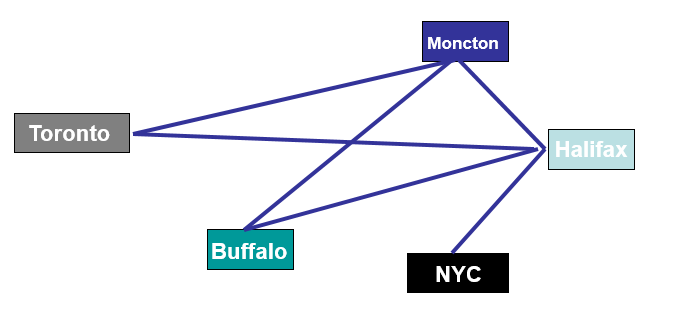

******************
Topic #1 --- Intro
******************

:doc:`Read the outline </outline>`

The main focus of this course is:

* The organization and manipulation of data
* Choosing how to organize data: into collections, such as
    * Stacks
    * Queues
    * Lists
    * Trees

* Choosing how to implement various data structures
* Algorithm Analysis

Data Structures?
================

Linear Data Structures
----------------------

**Stacks**

* Like a stack of plates
* The last thing put on top of the stack will be the first thing off

**Queues**

* Like any line you've ever waited in
* First person in the line will be the first person served

**Lists**

* Basically Python lists, but we can define specific types
    * Ordered
    * Indexed
    * Unordered

.. image:: img/ordered_list_example.png
   :width: 500 px
   :align: center

**What is meant by "linear" though?**

    * The data is stored in, like, a line
    * Generally, everything has one thing that comes before it (predecessor) and one thing that comes after it (successor)
        * Watch edge cases though

Nonlinear Data Structures
-------------------------

**Trees**

* Like your file system
* Information is stored in a hierarchy

.. image:: img/tree_example.png
   :width: 500 px
   :align: center

**Graphs**

* Good for showing relationships between *things*
* Like a road network, or flight routes

**What is meant by "nonlinear" though?**

    * Sometimes data has no natural ordering
        * The data is *not* stored in a line
    * What comes after "Toronto" in the graph example?
    * What comes after root in the filesystem example?
    * What comes after car?

Abstract Data Types
-------------------

* These *collections* of data are sometimes called *Abstract Data Types* (ADTs)
    * ADTs because they are an *abstract* idea of how we want to interact with our data
        * What they do and how we interact with them
    * We do **not** want to talk about specific implementations and implementation issues

* A specific implementation of these ADTs is a *data structure*
* They implement an ADT... like, the actual code
    * ArrayStack
    * LinkedStack

Java
====

* I thought this was supposed to be C++?
    * Not anymore

* We are now going to switch programming languages to Java

* But I liked Python
    * Don't worry, you'll quickly realize how similar Python and Java are
    * More than that, the main and important ideas are the same between the languages
    * There are some java-*isms* I will point out along the way

.. warning::

    Programming and Java are **not** a direct learning objective of this course. We are learning abstraction, data structures,
    and algorithms.

How do I go about programming Java!?
------------------------------------

:doc:`Go here </gettingset>`

Can we Write Code Now?
----------------------

**Python**

.. code-block:: python
    :linenos:
    :emphasize-lines: 2

    # Python --- hello world
    print("Hello, world!")

**Java**

.. code-block:: java
    :linenos:
    :emphasize-lines: 4

    // Java --- hello world
    public class SomeClass {
        public static void main(String[] args){
            System.out.println("Hello, world!");
        }
    }

* Other than the boilerplate code in the Java example and the actual they're almost the same
    * ``System.out.println("Hello, world!")`` is basically ``print``
    * Mind the fact that our strings have double quotes " as single quotes is for a single character
        * ``"Hello"`` vs. ``'h'``

* What about:
    * ``public``
    * ``class``
    * ``static``
    * ``void``
    * ``main``
    * ``String[] args``
    * ``{`` ... ``}``

``public``
    * Visibility modifier...
    * Remember adding underscores in Python to our attributes?
    * ... More on this later

.. code-block:: python
    :linenos:
    :emphasize-lines: 3, 4, 5, 6

    def __init__(self, firstName='John', lastName='Doe', stNum='000000000', curAvg=0):
        # The following attributes are "private"
        self._firstName = firstName
        self._lastName = lastName
        self._stNum = stNum
        self._curAvg = curAvg

``class``
    * This is the same idea as a Python class
    * Everything in Java needs to be within a class

``static``
    * Means that the function (or variable) belongs to the class, and not an instance of the class
        * We don't need to make an instance of the class to use the method
    * A good example of this in Java is the `Math class <https://docs.oracle.com/javase/8/docs/api/java/lang/Math.html>`_.
    * More on this later, but here is an example

.. code-block:: java
    :linenos:
    :emphasize-lines: 2, 5

    // Calling a static function from the class "SomeClass"
    SomeClass.someStaticFunction();

    // Creating an instance of SomeClass and calling a method
    SomeClass anInstance = new SomeClass();
    anInstance.someMethod();

``void``
    * This is the return type of the function
    * All values have a *type* in Java
        * Variables
        * Return types
    * In this case, the function returns nothing, so the type is ``void``

``main``
    * A **very very very** special function.
    * The ``main`` function is the function that is called when we tell our computer to run our programs
    * Line 1 of the ``main`` function is the first line run by the program

``String[] args``
    * This defines a variable called ``args`` that is an array (indicated by the ``[]``) of ``Strings``
        * Remember, all values need a type
    * This is how we give our programs command line arguments
        * Basically parameters for our whole program
    * More on this later

``{`` ... ``}``
    * In Java we don't use indentation to define scope, we use open and close squiggly braces

For next time
=============
* Get your computer at home :doc:`set up for CS 162 </gettingset>`
* Read Chapter 1 of your text
    * 15 pages
