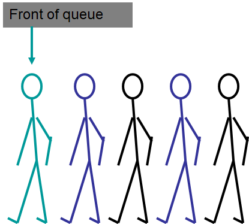
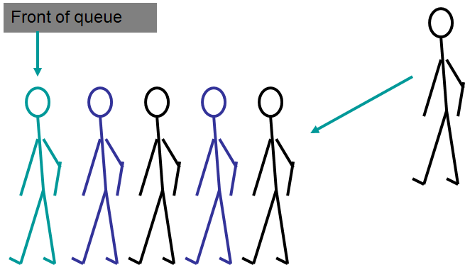
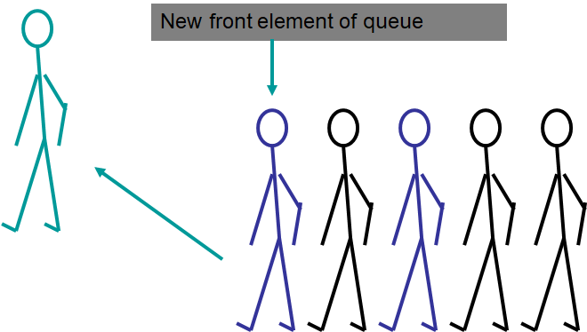

***************************
Topic #10 --- The Queue ADT
***************************

* Queues are a collection of elements where
    * Things are added to one end (rear or tail)
    * Things are removed from the other end (front or head)

* This is *First in First out* (FIFO)

* Given this, the **F**\ irst thing **I**\ n will be the **F**\ irst thing **O**\ ut
    * FIFO

* For example, any ordinary single file line you have ever lined up in
    * Assuming people were following the rules and not cutting in line

**Adding to a Queue**

**Removing from a Queue**

Queue Operations
================

Example Uses
============

* Example
    * Your typical queueing line, like at a grocery store checkout
    * Cars at a stoplight
    * Input buffers

* We can get a little more sophisticated

Caesar Cipher
-------------

* A caesar cipher is a simple way to encode a message
* The idea is, shift each letter in the message by some constant amount ``k``
* If ``k=5``
    * ``a`` becomes ``f``
        * ``a -> b -> c -> d -> e -> f``
    * ``b`` becomes ``g``
        * ``b -> c -> d -> e -> f -> g``
    * ...
    * ``z`` becomes ``e``
        * ``z -> a -> b -> c -> d -> e``

Interface
=========

For next time
=============

* Read Chapter 5 Sections 1 -- 5
    * 14 pages
