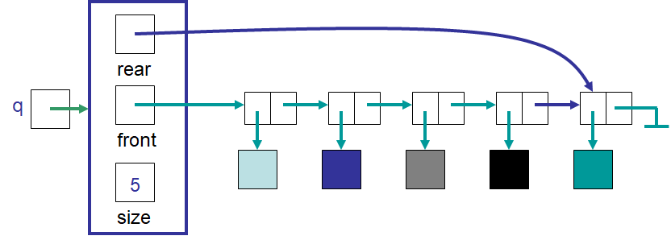
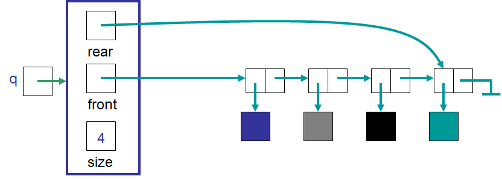

*************************
Topic #11 --- LinkedQueue
*************************

* Now that we have an idea of what the Queue is, we need to think of how to implement it
    * Remember, the *what* and the *how* are separated

* We need to think of:
    * A container
    * A way to keep track of the front/head
    * A way to keep track of the rear/tail
    * A way to keep track of the size

Implementing a Queue --- Linked Container
=========================================

.. image:: img/linkedqueue0.png
   :width: 500 px
   :align: center

* Enqueuing happens at the rear
* Notice that the rear reference is updated to the newly added (enqueued) thing

* Dequeuing happens at the front
* Again, notice how the front reference must be updated to the successor node of the thing being removed (dequeued)

Edge Cases
----------

* What if the queue is empty?
* What if the queue only has one element in it?

Enqueue
-------

.. code-block:: java
    :linenos:

    @Override
    public void enqueue(T element) {
        Node<T> toEnqueue = new Node<>(element);

        if (isEmpty()) {
            front = toEnqueue;
        } else {
           rear.setNext(toEnqueue);
        }
        rear = toEnqueue;
        size++;
    }

* Take your time looking at the ``enqueue`` method
* The easier things to notice are
    * Create a new node with the element being added
        * ``Node<T> toEnqueue = new Node<>(element);``
    * Once everything is done, set the rear to be the new enqueued node
        * ``rear = toEnqueue;``
    * Update the size
        * ``size++;``

* The ``if`` statement may be a little harder to chew on
* The trick to understanding it is to take your time, look at the code, and think carefully

Enqueuing into an Empty Queue
^^^^^^^^^^^^^^^^^^^^^^^^^^^^^

* **If** the queue is empty, both ``front`` and ``rear`` reference ``null``
* When this is the case, the thing being enqueued will end up being the only element in the queue
    * Thus, both ``front`` and ``rear`` need to reference the new node
    * The new node will be both the first and last thing in the queue

* When looking at the code, this would result in
    1. Making a new node with the element being enqueued
    2. Setting ``front`` to reference the new node
    3. Setting ``rear`` to reference the new node
    4. Updating the count

Enqueuing into a Nonempty Queue
^^^^^^^^^^^^^^^^^^^^^^^^^^^^^^^

* **If** the queue is not empty there is at least one element in it
    * It may be the case that both ``front`` and ``rear`` reference the same node (if there is only 1 thing in the queue)

* When looking at the code, this would result in
    1. Making a new node with the element being enqueued
    2. Setting the ``rear``'s next to be the new node
    3. Setting the ``rear`` to reference the new node
    4. Updating the count

* What is the computational complexity of an ``enqueue``?

Dequeue & First
---------------

.. code-block:: java
    :linenos:

    @Override
    public T dequeue() {
        if (isEmpty()) {
            throw new NoSuchElementException("Dequeueing from an empty queue.");
        }
        T returnElement = front.getData();
        front = front.getNext();
        size--;
        if (isEmpty()) {
            rear = null;
        }
        return returnElement;
    }

    @Override
    public T first() {
        if (isEmpty()) {
            throw new NoSuchElementException("First from an empty queue.");
        }
        return front.getData();
    }

* Like ``LinkedStack`` and ``ArrayStack``, trying to access something from the empty queue throws an exception

* Notice in ``dequeue`` that, if it's not empty, we just *remove/delete from the front of a linked structure*
    * This was the same as ``pop`` in the ``LinkedStack``

* In addition to being empty, the only other edge case we need to watch out for is if the ``dequeue`` makes the queue empty
* If this happens, we must set ``front`` to ``null``
    * This is actually taken care of already since ``front``'s next would be ``null``, and saying ``front = front.getNext()`` makes ``front`` ``null``

* We should also set ``rear`` to ``null``
* This helps with garbage collection and keeping the state of the queue *correct*
* If we don't do this, ``rear`` will continue to point to a node that should not be in the queue anymore
    * Our current implementation will handle this scenario fine as an enqueue on an empty queue sets both ``front`` and ``rear`` to ``null``
    * But imagine also having a messed up count and ``enqueuing`` after this without setting ``rear`` to ``null``
    * If we ``enqueue`` in this case, we might end up saying ``rear.setNext(toEnqueue)``
    * What would that mean?
    * What would that look like?

* What is the computational complexity of a ``dequeue``?

Variations
==========

* We can define any variation we could want

Priority Queue
--------------

* A queue is great and all, but there are variations in real life we are probably aware of
* One that comes to my mind is a *priority queue*
* Think of triage at a hospital
* Sure, it's kinda' first-come-first-serve
* But if you are there for a cut thumb and someone comes in with an arrow sticking out of their knee, they will likely be helped first
* In other words, it's first-come-first-serve, but those with a priority value deemed more important will be jump the line

What
^^^^

* Think about how we could describe the *what* of a priority queue
* Everything would be the same except ``dequeue``
* We would need to get the element with the most important priority of all those in the queue
    * If there is a tie, then use first-come-first-serve to break the tie

How
^^^

* Now think about how this could be implemented
* We have a decision to make

* We can make it that every ``enqueue`` inserts something into the queue such that the queue is ordered based on priority and time of arrival
    * If we do a linear search to find the right place to insert, this would be :math:`O(n)`
* Then our ``dequeue`` would be a simple :math:`O(1)` operation since it's just removing the front of the queue

* Or, we could make it that every ``enqueue`` just adds the thing to the end of the queue
    * :math:`O(1)`
* Then our ``dequeue`` would need to do the search through the queue to find the thing with the most important priority
    * If we use a linear search, then this is :math:`O(n)`

* Which implementation is better?

For next time
=============

* Download and play with the :download:`LinkedQueue <../main/java/LinkedQueue.java>` code
* Download and run the :download:`LinkedQueueTest <../test/java/LinkedQueueTest.java>` tests
* Read Chapter 5 Section 6
    * 6 pages

Playing Code
============

.. code-block:: java
    :linenos:

        // Create a LinkedQueue
        Queue<Integer> myQueue = new LinkedQueue<>();

        // Check queue is empty
        System.out.println(myQueue.size());
        System.out.println(myQueue.isEmpty());
        System.out.println(myQueue);

        // Test enqueue
        myQueue.enqueue(0);
        myQueue.enqueue(1);
        myQueue.enqueue(2);
        myQueue.enqueue(3);
        myQueue.enqueue(4);
        System.out.println(myQueue.size());
        System.out.println(myQueue.isEmpty());
        System.out.println(myQueue);

        // Test enqueue more
        myQueue.enqueue(10);
        myQueue.enqueue(11);
        myQueue.enqueue(12);
        myQueue.enqueue(13);
        myQueue.enqueue(14);
        System.out.println(myQueue.size());
        System.out.println(myQueue.isEmpty());
        System.out.println(myQueue);

        // Test first
        System.out.println(myQueue.first());
        System.out.println(myQueue.size());
        System.out.println(myQueue.isEmpty());
        System.out.println(myQueue);

        // Test dequeue
        System.out.println(myQueue.dequeue());
        System.out.println(myQueue.dequeue());
        System.out.println(myQueue.dequeue());
        System.out.println(myQueue.dequeue());
        System.out.println(myQueue.dequeue());
        System.out.println(myQueue.dequeue());
        System.out.println(myQueue.dequeue());
        System.out.println(myQueue.dequeue());
        System.out.println(myQueue.dequeue());
        System.out.println(myQueue.dequeue());
        System.out.println(myQueue.size());
        System.out.println(myQueue.isEmpty());
        System.out.println(myQueue);

        // Test first and dequeue throwing exception
        try {
            myQueue.first();
        }
        catch (NoSuchElementException e) {
            e.printStackTrace();
        }
        try {
            myQueue.dequeue();
        }
        catch (NoSuchElementException e) {
            e.printStackTrace();
        }