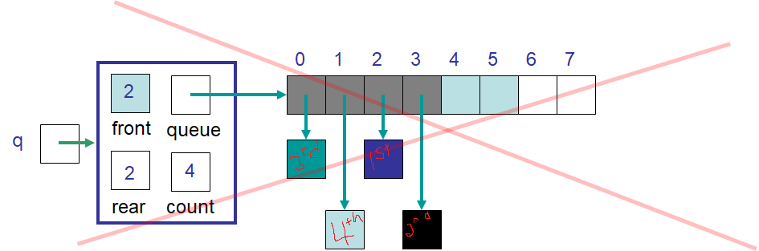

**********************************
Topic #12 Aside --- expandCapacity
**********************************

* Consider the scenario where we attempt to use the ``expandCapacity`` we used for the ``ArrayStack``
    * Where we simply double the size of the array and copy the contents over

* Note that ``front`` is ``2`` and ``rear`` is ``2``
* The order of the elements' indices in the queue from first to last is ``2``, ``3``, ``0``, ``1``
    * Our ``ArrayQueue`` manages this ordering with our index update rule of ``rear = (rear + `) % queue.length``
* Even after the ``expandCapacity`` there is no room for any new element in index ``2``

* Imagine we just ``enqueue`` and add the element in the first free index (index ``4``)
* If we do this twice, think about the ordering of the elements in this array

* Index ``2`` has the first thing in the queue
* Index ``3`` has the second thing in the queue
* Index ``4`` has the fifth thing?
* Index ``5`` has the sixth?
* Index ``6`` and ``7`` have nothing currently
* Index ``0`` has the third thing
* Index ``1`` has the fourth

* This ordering seems rather chaotic and would require more complex bookkeeping

ArrayStack
==========

.. image:: img/arraystack0.png
   :width: 500 px
   :align: center

* With the ``ArrayStack``, this was not an issue since the adding and removing only happened from one end of the array
    * The array will always be contiguous from the bottom of the stack (index ``0``) to the top
* The added complexity of ``expandCapacity`` for the ``ArrayQueue`` is caused by the circle array idea
    * The circle array idea allows for the information to not be contiguous in the underlying linear array

* Note that for ideas #1 and #2 for the ``ArrayQueue``, this added complexity is not an issue since the data will always be contiguous