************************
Topic #12 --- ArrayQueue
************************

* We need to think of:
    * A container
    * A way to keep track of the front/head
    * A way to keep track of the rear/tail
    * A way to keep track of the size

* We used a linked structure last time
* Let's now use an array...
* But how...


Idea #1
=======

* Use an array for the container
* Keep track of the ``front`` by simply having it always be index ``0``
* Keep track of the ``rear`` index
* Size will conveniently be ``rear``

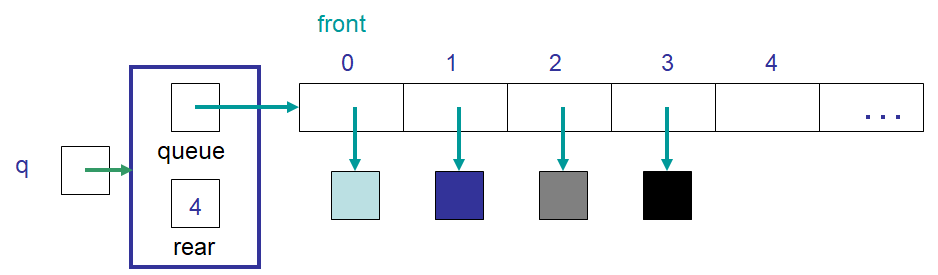

* All adding happens at the ``rear`` end
* Add the element to index ``rear``
* Increment ``rear``

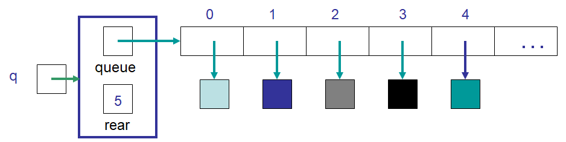

* ``dequeue`` always happens at index ``0``
* Requires that elements are shuffled down ``1`` index
* Decrement ``rear``

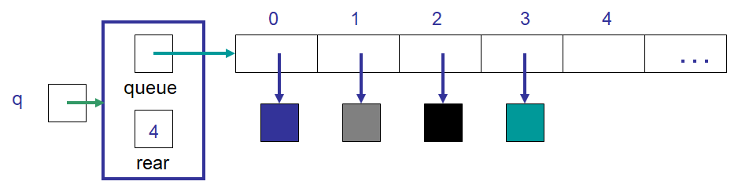

Discussion
----------

* Will this implementation work?
    * Is it *correct*
* Knowing that this is an array implementation, will we ever need to call ``expandCapacity``?
* What is the computational complexity of this ``enqueue``?
* What is the computational complexity of this ``dequeue``?


Idea #2
=======

* Use an array for the container
* Keep track of the ``front`` index
* Keep track of the ``rear`` index
* Size will conveniently be ``rear - front``

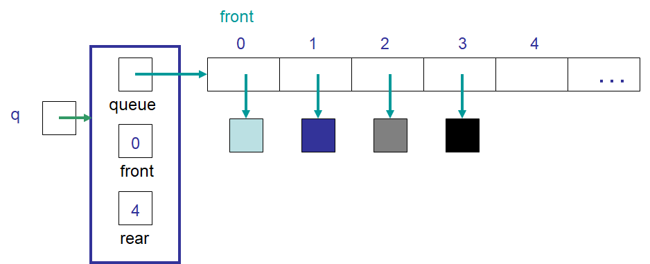

* All adding happens at the ``rear`` end
* Add the element to index ``rear``
* Increment ``rear``

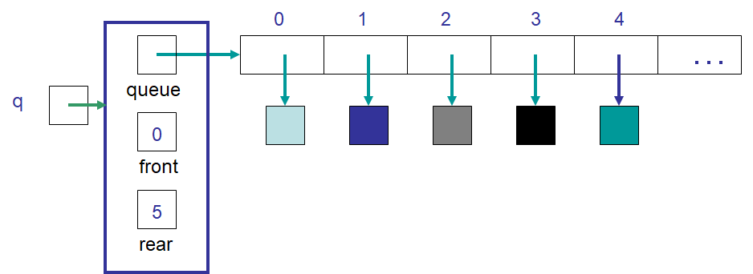

* ``dequeue`` always happens at index ``front````
* Increment ``front``


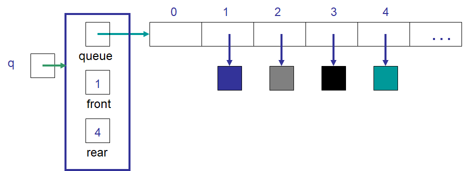

Discussion
----------

* Will this implementation work?
    * Is it *correct*
* Will we ever need to call ``expandCapacity``?
* What is the computational complexity of this ``enqueue``?
* What is the computational complexity of this ``dequeue``?
* How often will we call ``expandCapacity`` relative to idea #1?
* What drawback do you see?


Idea #3
=======

* An array for the container
* Keep track of the ``front`` index
* Keep track of the ``rear`` index
* If there is space at the front of the array, loop the indices back to ``0`` once we hit the end

"Circular Array"
----------------

* We can *pretend* our array is a circle
    * It's still a linear array, but that's OK

* For example, pretend we have an array with a capacity of ``n``
* The indices order would be

    ``0, 1, 2, 3, 4, ..., n-2, n-1, 0, 1, 2, 3, 4, ..., n-2, n-1, 0, 1, 2, 3, 4, ...``

* The index that comes before ``n-1`` is ``n-2``
* The index that comes after ``n-1`` is ``0``
* The index that comes before ``0`` is ``n-1``
* The index that comes after ``0`` is ``1``

* Take this "circular array" with 7 things in it

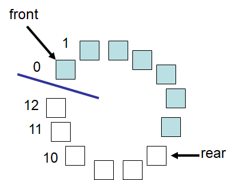

* If we ``dequeue`` 5 times, we end up with this

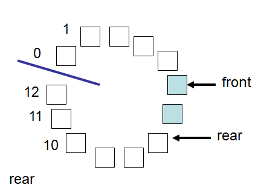

* And after 8 more ``enqueues`` we have this

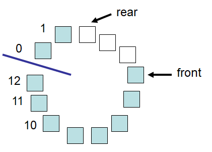


* With this idea, we can think of our idea #3 implementation as this


* After a bunch of ``enqueues`` and ``dequeues`` it will loop around like this


* Here is the same scenario, but with the array shown as a linear array


Modulo
------

* We've already seen the modulo operator: ``%``
* With this ``%`` operator, we can get the remainder of a division
    * ``4 % 2``
        * :math:`4/2 = 0` remainder :math:`0`
        * Therefore, ``4 % 2`` is :math:`0`
    * ``5 % 4``
        * :math:`5/4 = 1` remainder :math:`1`
        * Therefore, ``5 % 4`` is :math:`1`
    * ``7 % 8``
        * :math:`7/8 = 0` remainder :math:`7`
        * Therefore, ``7 % 8`` is :math:`7`

* The modulo operator is handy for checking if a number is even or odd
    * ``x % 2`` will be 0 when the number is evenly divisible by 2 and will be 1 if there is a remainder (not evenly divisible)

* We can make use of this ``%`` operator to help us loop back around to the beginning of our linear array

* We'll try to derive this ourselves
* Assume we have an array with a capacity ``10``
* Our ``rear`` is currently ``9``
* If we do an ``enqueue`` we simply add the element to index ``9`` and increment ``rear`` such that it's now ``10``
* **However** this causes a problem because there is no index ``10``; we want ``rear`` to become ``0`` instead

* We *could* do this with an ``if`` statement and just check ``if (rear == queue.length) rear = 0``
* But notice that when ``rear == queue.length``, that would mean that ``rear % queue.length`` is ``0``
* But also notice that, if ``rear`` was another number, like ``4``, then ``rear % queue.length`` would be ``4``

* With this information, the following expression for incrementing the ``rear`` should make sense

    ``rear = (rear + 1) % queue.length;``

* If ``rear`` is ``9`` and we use this expression, ``rear`` will end up being ``(9 + 1) % 10 == 10 % 10 == 0``
* If ``rear`` is any other number ``< 10``, the number is not divisible by ``10`` and the ``%`` will effectively make no difference


Discussion
----------

* With this special expression for updating the ``rear``, do we need it for updating the ``front``?
* With this idea, will we ever run out of room in our array?


Expand Capacity
---------------

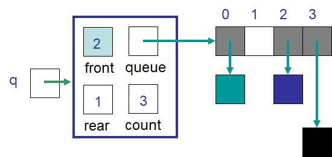

* Suppose we ``enqueue`` one more element

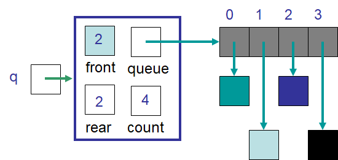

* Now the queue is full
    * ``size == queue.length``

* If we ``enqueue`` again, we'll need to call ``expandCapacity``
* **However** we can't just double the size of the array and copy the contents over like we did before
    * :doc:`See the aside on expandCapacity. </topic12-expand>`

.. Skip arrayqueue_expand2 since it is just a copy of 1
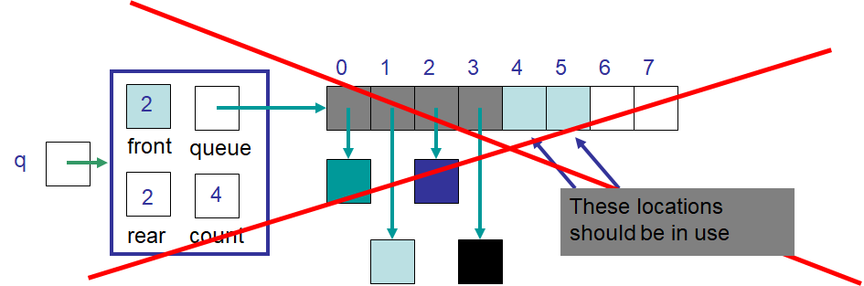

* Instead, we could copy the contents into contiguous indices starting at index ``front``

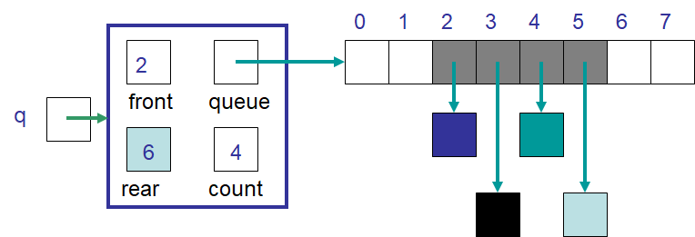

* Or, we could even copy the contents into contiguous indices starting at the beginning (index ``0``) of the new array

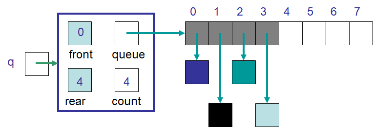

* Doing another ``enqueue`` will add the element at index ``rear``
* Update ``rear`` with ``rear = (rear + 1) % queue.length;``


Discussion Again
----------------

* Will this implementation work?
    * Is it *correct*
* What is the computational complexity of this ``enqueue``?
* What is the computational complexity of this ``dequeue``?
* How often will this call ``expandCapacity`` relative to idea #1 and #2?


Implementing a Queue --- Array Container
========================================


* All code is available for download from links at the bottom of the page
* Here, only a subset of methods are shown


enqueue
-------

.. code-block:: java
    :linenos:
    :emphasize-lines: 4, 7

    @Override
    public void enqueue(T element) {
        if (size == queue.length) {
            expandCapacity();
        }
        queue[rear] = element;
        rear = (rear + 1) % queue.length;
        size++;
    }

* Note the call to ``expandCapacity``
* Also note the use of the ``%`` operator for updating ``rear``


.. code-block:: java
    :linenos:
    :emphasize-lines: 4, 5, 7, 8

    private void expandCapacity() {
        T[] newQueue = (T[]) new Object[queue.length * 2];
        for (int i = 0; i < queue.length; ++i) {
            newQueue[i] = queue[front];
            front = (front + 1) % queue.length;
        }
        front = 0;
        rear = size;
        queue = newQueue;
    }

* ``expandCapacity`` is different from before
* First, we're copying into index ``i`` from index ``front``
    * Previously for the stack, we used ``newStack[i] = stack[i]``
* Then we update ``front`` with the use of ``%``

* After all the copying, the ``front`` for the ``newQueue`` is set to ``0``
* ``rear`` is set to the size
    * When ``front`` is ``0``, ``rear`` must be equal to ``size``

.. warning::

    Take your time with this one and make sure you understand the nuance here.


dequeue
-------

.. code-block:: java
    :linenos:
    :emphasize-lines: 7

    @Override
    public T dequeue() {
        if (isEmpty()) {
            throw new NoSuchElementException("Dequeueing from an empty queue.");
        }
        T returnElement = queue[front];
        front = (front + 1) % queue.length;
        size--;
        return returnElement;
    }

* Since we're wrapping, we must remember that ``front`` may wrap around too


Testing
=======

* The testing code is available for download at the bottom of the page
* Here, a noteworthy test is presented

.. code-block:: java
    :linenos:

    @Test
    @DisplayName("Enqueuing 6 elements expands capacity while maintaining queues FIFO ordering.")
    void enqueuingBeyondCapacityCallsExpandCapacityToMakeRoomWhileMaintainingQueueOrdering() {
        Queue<Integer> queue = new ArrayQueue<>(5);
        queue.enqueue(99);
        queue.dequeue();
        for (int i = 0; i < 6; ++i) {
            queue.enqueue(i);
        }
        for (int i = 0; i < 6; ++i) {
            assertEquals(i, queue.dequeue());
        }
    }

* What we're really testing is the ``Queue`` *interface*
* But, in order to do this, we have to make sure the implementation properly implements the interface
* We need to check that we can use enqueue and dequeue and have ``expandCapacity`` called without messing up the ordering of the queue
* The ``enqueue`` and ``dequeue`` on lines 5 & 6 are to have ``front == rear == 1``
    * Just not at ``0``

* Six ``enqueues`` will require that ``expandCapacity`` is called, but now ``front == rear == 1`` again
* If the ``expandCapacity`` was broken, it would be possible that we overwrite the first element in the queue

* After ``expandCapacity`` is called, ``front`` is ``0`` and ``rear is ``6``, but I don't actually care what the indicies are
* All I care about is that I can ``dequeue`` the ``6`` elements and get them in FIFO order

.. warning::

    Remember, we're testing the **interface**, not the implementation; however, we ultimately need to write tests that
    exercise the specific implementation we have in order to ensure the interface is implemented correctly.


For next time
=============

* Download and play with the :download:`ArrayQueue <../main/java/ArrayQueue.java>` code
* Download and run the :download:`ArrayQueueTest <../test/java/ArrayQueueTest.java>` tests
* Read Chapter 5 Section 7
    * 7 pages


Playing Code
============

.. code-block:: java

        // Create a ArrayQueue
        Queue<Integer> myQueue = new ArrayQueue<>(5);

        // Check queue is empty
        System.out.println(myQueue.size());
        System.out.println(myQueue.isEmpty());
        System.out.println(myQueue);

        // Test enqueue
        myQueue.enqueue(0);
        myQueue.enqueue(1);
        myQueue.enqueue(2);
        myQueue.enqueue(3);
        myQueue.enqueue(4);
        System.out.println(myQueue.size());
        System.out.println(myQueue.isEmpty());
        System.out.println(myQueue);

        // Test enqueue more to check expandCapacity
        myQueue.enqueue(10);
        myQueue.enqueue(11);
        myQueue.enqueue(12);
        myQueue.enqueue(13);
        myQueue.enqueue(14);
        System.out.println(myQueue.size());
        System.out.println(myQueue.isEmpty());
        System.out.println(myQueue);

        // Test first
        System.out.println(myQueue.first());
        System.out.println(myQueue.size());
        System.out.println(myQueue.isEmpty());
        System.out.println(myQueue);

        // Test dequeue
        System.out.println(myQueue.dequeue());
        System.out.println(myQueue.dequeue());
        System.out.println(myQueue.dequeue());
        System.out.println(myQueue.dequeue());
        System.out.println(myQueue.dequeue());
        System.out.println(myQueue.dequeue());
        System.out.println(myQueue.dequeue());
        System.out.println(myQueue.dequeue());
        System.out.println(myQueue.dequeue());
        System.out.println(myQueue.dequeue());
        System.out.println(myQueue.size());
        System.out.println(myQueue.isEmpty());
        System.out.println(myQueue);

        // Test first and dequeue throwing exception
        try {
            myQueue.first();
        }
        catch (NoSuchElementException e) {
            e.printStackTrace();
        }
        try {
            myQueue.dequeue();
        }
        catch (NoSuchElementException e) {
            e.printStackTrace();
        }