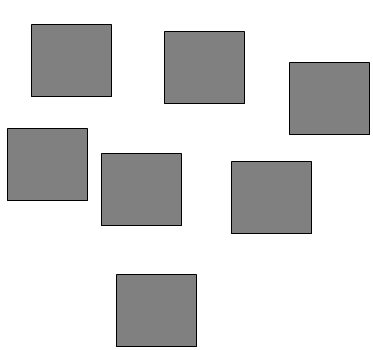

***********************
Topic #13 --- Lists ADT
***********************

Bags
=====

* By default, our bag shouldn't really be thought of as having an ordering
    * It's implementation may be with some sort of linear collection, but the idea is that the information in the bag has no order

* What things do we want to do with our new data structure?
    * Add things
    * Remove things
    * Get the size
    * Check if it's empty

* Adding to a Bag
    * How should we add things?
    * Where should they go?

* Removing from a Bag
    * How should we remove things?
    * Where should they be removed from?

* Other things me may want to do?
    * Take a minute and think about potential ideas

For next time
=============

* Read Chapter 6 Section 1 -- 5
    * 23 pages
