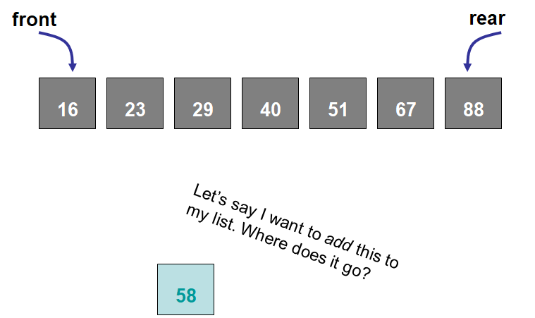
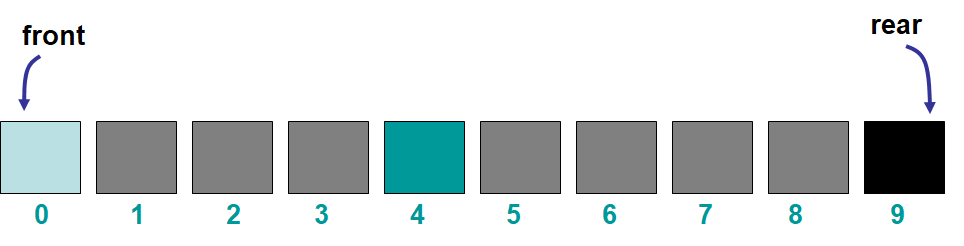

***********************
Topic #13 --- Lists ADT
***********************

Sorted Lists
------------

* If we want to have a specific type of list that keeps elements sorted based on some ordering, adding will need to be done carefully
* The ordering of the elements will depend on some characteristic of the contents of the list
    * Numbers in ascending order
    * Strings in alphabetical order

* The elements themselves determine the ordering

* There really is only one way to add elements to this sorted list
    * The elements **must** go where it belongs
* We cannot specify where we add it because that may break our sorted ordering

.. image:: img/sortedList1.png
   :width: 500 px
   :align: center

* Should there be rules restricting removing from the list?

Indexed List
------------

* Indexed lists are lists where the elements are referenced by their numeric position in the list
    * Numeric position is called the index
    * This is like arrays or the Python lists you're used to

* Element position is important
* User determines the ordering of the elements
* Every time something is added or removed, the indices of the elements will need to be updated

.. image:: img/IndexedList0.png
   :width: 500 px
   :align: center

* We can add to any arbitrary index, assuming it is valid

* We also will have removes from arbitrary locations

For next time
=============

* Read Chapter 6 Section 1 -- 5
    * 23 pages
