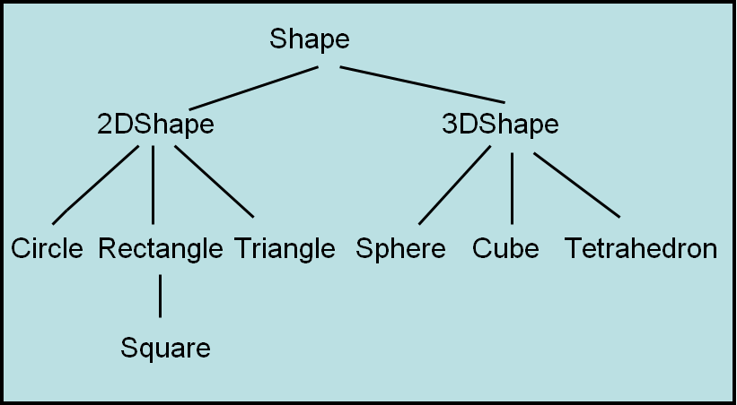

*************************
Topic #13 --- Inheritance
*************************

* Inheritance is a way to derive a new class from an existing one
* This allows us to *inherit* functionality from the original class

* Consider the hierarchies below
* Notice how the top element is the most general of all things included
* As you move down the three, the things get more and more specific
* But as you move down, the things are still a type of the element at the top
    * A square *is a* rectangle, which *is a* 2d shape, which *is a* shape
* The hierarchy is important here
    * A square is **not** a sphere

.. image:: img/inheritance_vehicle.png
   :width: 500 px
   :align: center

* Other examples
    * From a *student* we can derive a *undergraduate student* and a *graduate student*
    * From a *bank account*, derive a *savings account* and a *chequing account*
    * From a *loan*, derive a *student loan*, a *car loan*, and a *mortgage*

For next time
=============

* Go back and read Chapter 3 Section 3
    * 3 pages