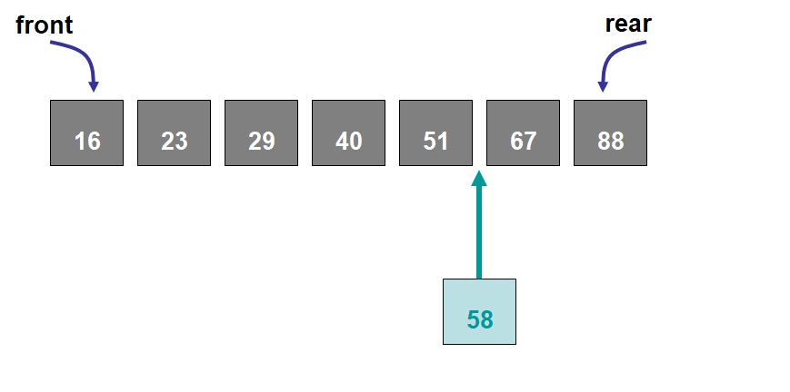

***********************
Topic #13 --- Bag ADT
***********************

* Like stacks and queues, bags are another data structure
* However, bags are more general than stacks and queues
    * We have more flexibility on where we add and remove elements

Bags
=====

* By default, our bag shouldn't really be thought of as having an ordering
    * It's implementation may be with some sort of linear collection, but the idea is that the information in the bag has no order

* What things do we want to do with our new data structure?
    * Add things
    * Remove things
    * Get the size
    * Check if it's empty

* Adding to a Bag
    * How should we add things?
    * Where should they go?

* Removing from a Bag
    * How should we remove things?
    * Where should they be removed from?

* Other things me may want to do?
    * Take a minute and think about potential ideas

Sorted Bags
-----------

* If we want a specific kind of bag that keeps our elements sorted based on some ordering, adding will need to be done carefully
    * Unlike the general bag, this specific kind of bag will have an ordering

* The ordering of the elements will depend on some characteristic of the contents of the bag
    * Numbers in ascending order
    * Strings in alphabetical order

* The elements themselves are what determine the ordering

* There really is only one way to add elements to this sorted bag
    * The elements **must** go where it belongs
* We cannot specify where we add it because that may break our sorted ordering

* Should there be rules restricting removing from the bag?

Indexed Bags
------------

* Indexed bags are bags where the elements are referenced by a numeric position
    * Numeric position is called the index
    * This is like arrays or the Python lists you're used to
* Like the sorted bag, this specific kind of bag will have an ordering

* Element position is important
* User determines the ordering of the elements
* Every time something is added or removed, the indices of the elements will need to be updated

* We can add to any arbitrary index, assuming it is valid

.. image:: img/bag_IndexedBag1.png
   :width: 500 px
   :align: center

* We also will have removes from arbitrary locations

Functionality
=============

* We will keep our functionality of the bag simple
    * Add stuff
    * Remove stuff
    * Check if something is in the bag
    * Count the number of times something exists in the bag
    * See if it's empty
    * Get the size
    * Get an iterator for the bag
        * Iterators are handy tools for looping and consistency
        * More on iterators later

.. code-block:: java
    :linenos:

    import java.util.Iterator;

    public interface Bag<T> {

        void add(T element);

        T remove(T element);

        boolean contains(T target);

        int getCount(T target);

        boolean isEmpty();

        int size();

        Iterator<T> iterator();
    }

Sorted Bag Functionality
------------------------

* We want our sorted bags to be bags and have all the functionality as the bag
    * Add stuff
    * Remove stuff
    * Check if something is in the bag
    * Count the number of times something exists in the bag
    * See if it's empty
    * Get the size
    * Get an iterator for the bag

* However, there will be some functionality specific to the sorted bag that we will want
    * We have to make sure our `add` adds stuff to the proper location in the bag
    * Remove the first element
    * Remove the last element
    * Check the first element (but leave it in the bag)
    * Check the last element (but leave it in the bag)

.. code-block:: java
    :linenos:
    :emphasize-lines: 1

    public interface SortedBag<T> extends Bag<T> {

        // Special add to keep proper order
        void add(T element);

        T removeFirst();

        T removeLast();

        T first();

        T last();
    }

* You will notice that, despite wanting all the functionality of the bag, we do not write them in our interface
* You will also notice that the first line says `public interface SortedBag<T> extends Bag<T>`

* The `extends` keyword means that we will *inherit* all the functionality from the class we are extending
    * `Bag` is being extended in this case

* This means that, although we did not write the functions from the `Bag` interface in the `SortedBag` ourselves, they are still part of what makes up a `SortedBag`
    * If you try to implement a `SortedBag` without implementing all the functionality from the `Bag` interface, it won't work

* The idea is inheritance will be discussed further later

Indexed Bag
-----------

* Similar to the sorted bag, the indexed bag will make use of inheritance to get all the functionality for bags
* We will also add specific functionality for our indexed bag
    * Stuff to be able to specify indices in the data structure

.. code-block:: java
    :linenos:

    public interface IndexedBag<T> extends Bag<T> {

        void add(T element);

        void add(int index, T element);

        void set(int index, T element);

        T get(int index);

        // Mind the difference in function signature
        // from the inherited remove
        T remove(int index);

        int indexOf(T element);
    }

For next time
=============

* Download the various bag interfaces:
    * :download:`Bag <../main/java/Bag.java>`
    * :download:`SortedBag <../main/java/SortedBag.java>`
    * :download:`IndexedBag <../main/java/IndexedBag.java>`

* Read Chapter 6 Section 1 -- 5 on Lists
    * 23 pages
