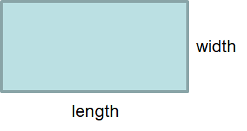
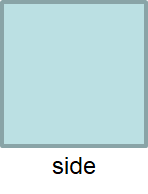

***************************
Topic #14 Aside --- Careful
***************************

.. image:: img/inheritance_bad.png
   :width: 500 px
   :align: center

* There is nothing wrong with extending concrete classes, but this is where things can become problematic
* Sometimes taking literal inspiration can be bad

Rectangles and Squares
======================

* A classic example used for teaching inheritance is squares and rectangle
    * `And it's also amusingly known for being a problematic example <https://en.wikipedia.org/wiki/Circle%E2%80%93ellipse_problem>`_

* We all know that, in real life, a square is a special type a rectangle
    * A square is a rectangle where the length and width are equal

* We can implement a simple ``Rectangle`` class

.. code-block:: java
    :linenos:

    public class Rectangle {

        private double length;
        private double width;

        public Rectangle() {
            this(1,1);
        }

        public Rectangle(double length, double width) {
            this.length = length;
            this.width = width;
        }

        public double getLength() {
            return length;
        }

        public double getWidth() {
            return width;
        }

        public double getArea() {
            return length * width;
        }

        public String toString() {
            return String.format("Rectangle(Length = %.2f, Width = %.2f)", length, width);
        }
    }

* And we can also make a ``Square`` class and have it extend the ``Rectangle`` class

.. code-block:: java
    :linenos:

    public class Square extends Rectangle {

        public Square() {
            // Call the superclass' constructor
            super();
        }

        public Square(double side) {
            // Call the superclass' constructor
            super(side, side);
        }

        public double getSide() {
            // Could have done getLength
            return getWidth();
        }

        public String toString() {
            return String.format("Square(Side = %.2f)", getSide());
        }
    }

* This *seems* great
* We inherit the ``getLength``, ``getWidth``, and ``getArea``
* We override the ``toString`` for our special needs
* We even can even hijack the superclass' constructors with ``super()`` in a similar way to using ``this()``

Substitution Principle
======================

https://en.wikipedia.org/wiki/Liskov_substitution_principle