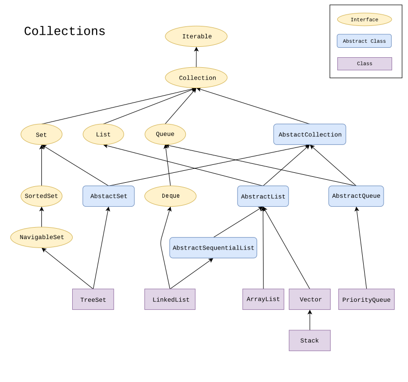

*************************
Topic #14 --- Inheritance
*************************

* Inheritance is a way to derive a new class from an existing one
* This allows us to *inherit* functionality from the original class

.. image:: img/inheritance_vehicle.png
   :width: 500 px
   :align: center

* Notice how the top element is the most general of all things included
* As you move down the tree, the things get more and more specific
* But as you move down, the things are still a type of the element at the top
    * In our bag examples, a ``SortedBag`` *is a* ``Bag``

.. image:: img/inheritance_bag.png
   :width: 500 px
   :align: center

* This hierarchical thinking exists in real life too,
    * But we should be careful not to translate what makes sense in real life to our code

Terminology
===========

* The class that is being inherited *from* is referred to as the **superclass**
    * Parent class
    * Base class

* The class that is inheriting from a superclass is called the **subclass**
    * Child class
    * Derived class

* When considering the hierarchies, these terms are relative
    * A ``SortedBag`` is a subclass of a ``Bag``
    * A ``Bag`` is a superclass of a ``IndexedBag``
    * An ``Object`` is also a superclass of ``Bag``, ``SortedBag``, and ``IndexedBag``

Object
======

* The class ``Object`` is the root of the hierarchy
* Every class you make will inherit from the ``Object`` class
    * This is done automatically, so you do not ``extend`` it explicitly

* Since we inherit everything from the superclasses we inherit from, this means that we get all methods from the ``Object`` class without having to write them ourselves
    * Although, we almost always override them if were using them
* We have seen and used a few of these already
    * ``equals``
    * ``toString``

* However, we ended up *overriding* these methods a bunch of times
    * We inherited them, but we wrote our own implementations for our needs

* The inherited behaviour of ``equals`` checks if the references are to the same exact object
    * ``x.equals(y)`` checks if ``x`` and ``y`` are the same object (same as ``x == y``)

* The inherited behaviour of ``toString`` is to return a string of the object's class name + @ + the has code of the object

* If we do not override these methods in our classes, we can still use them, but get the default behaviour

Collections Example
===================

* This is a visualization of part of Java's collections' class hierarchy

Abstract Class
--------------

* You will notice that there is an *Abstract Class* designation
* An abstract class is one that
    * Is declared with the ``abstract`` keyword
    * May or may not include abstract methods
        * Methods declared, but with no implementation, like interfaces
    * May **not** be instantiated
    * May be subclassed/inherited from

* An abstract class may include some concrete implementation of methods that will be the same among multiple subclasses

* `Take Java's AbstractQueue class <https://docs.oracle.com/en/java/javase/11/docs/api/java.base/java/util/AbstractQueue.html>`_ and its subclass, `PriorityQueue <https://docs.oracle.com/en/java/javase/11/docs/api/java.base/java/util/PriorityQueue.html>`_

* The ``AbstractQueue`` has a few important concrete methods implemented within the abstract class (it also inherits a bunch from superclasses too)
    * ``add``
    * ``addAll``
    * ``clear``
    * ``element``
    * ``remove``

* The ``PriorityQueue`` class, which ``extends AbstractQueue``, makes direct use of a few of these methods
    * ``addAll``
    * ``element``
    * ``remove``

* But the ``PriorityQueue`` also overrides a few of the methods from ``AbstractQueue`` since it needs a specific implementation
    * ``add``
    * ``clear``

* If you open the ``PriorityQueue.java`` file
    * You will not find ``addAll``, ``element``, or ``removed`` within it since it is inherited
    * You will find the overridden methods (``add`` and ``clear``)

For next time
=============

* Have a *quick* look at the JDK specification link (you won't understand everything, but that's OK)
    * `AbstractCollection <https://docs.oracle.com/en/java/javase/11/docs/api/java.base/java/util/AbstractCollection.html>`_
    * `Queue <https://docs.oracle.com/en/java/javase/11/docs/api/java.base/java/util/Queue.html>`_
    * `AbstractQueue <https://docs.oracle.com/en/java/javase/11/docs/api/java.base/java/util/AbstractQueue.html>`_
    * `PriorityQueue <https://docs.oracle.com/en/java/javase/11/docs/api/java.base/java/util/PriorityQueue.html>`_
* Go back and read Chapter 3 Section 3
    * 3 pages