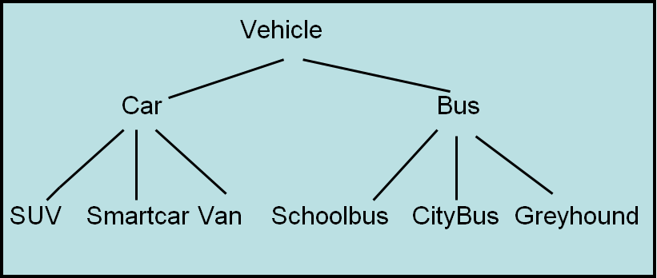
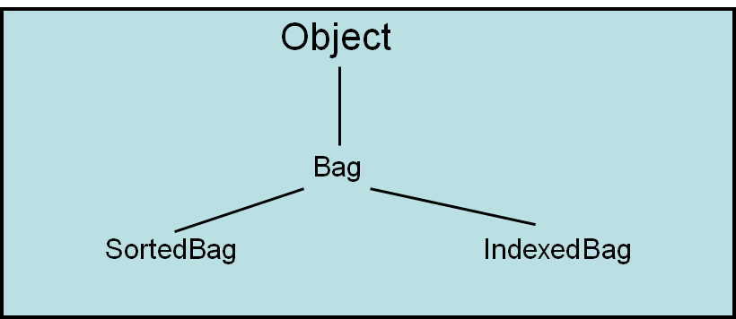

*************************
Topic #14 --- Inheritance
*************************

* Inheritance is a way to derive a new class from an existing one
* This allows us to *inherit* functionality from the original class

* Notice how the top element is the most general of all things included
* As you move down the tree, the things get more and more specific
* But as you move down, the things are still a type of the element at the top
    * In our bag examples, a ``SortedBag`` *is a* ``Bag``

* This hierarchical thinking exists in real life too,
    * But we should be careful not to translate what makes sense in real life to our code

Terminology
===========

* The class that is being inherited *from* is referred to as the **superclass**
    * Parent class
    * Base class

* The class that is inheriting from a superclass is called the **subclass**
    * Child class
    * Derived class

* When considering the hierarchies, these terms are relative
    * A ``SortedBag`` is a subclass of a ``Bag``
    * A ``Bag`` is a superclass of a ``IndexedBag``
    * An ``Object`` is also a superclass of ``Bag``, ``SortedBag``, and ``IndexedBag``

For next time
=============

* Go back and read Chapter 3 Section 3
    * 3 pages