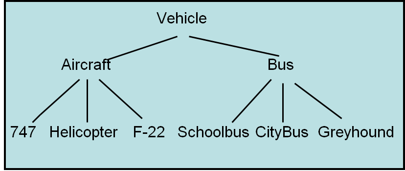

*************************
Topic #14 --- Inheritance
*************************

* Inheritance is a way to derive a new class from an existing one
* This allows us to *inherit* functionality from the original class

* Notice how the top element is the most general of all things included
* As you move down the tree, the things get more and more specific
* But as you move down, the things are still a type of the element at the top
    * In our bag examples, a ``SortedBag`` *is a* ``Bag``

* This hierarchical thinking exists in real life too,
    * But we should be careful not to translate what makes sense in real life to our code

Terminology
===========

* The class that is being inherited *from* is referred to as the **superclass**
    * Parent class
    * Base class

* The class that is inheriting from a superclass is called the **subclass**
    * Child class
    * Derived class

* When considering the hierarchies, these terms are relative
    * A ``SortedBag`` is a subclass of a ``Bag``
    * A ``Bag`` is a superclass of a ``IndexedBag``
    * An ``Object`` is also a superclass of ``Bag``, ``SortedBag``, and ``IndexedBag``

Object
======

* The class ``Object`` is the root of the hierarchy
* Every class you make will inherit from the ``Object`` class
    * This is done automatically, so you do not ``extend`` it explicitly

* Since we inherit everything from the superclasses we inherit from, this means that we get all methods from the ``Object`` class without having to write them ourselves
    * Although, we almost always override them if were using them
* We have seen and used a few of these already
    * ``equals``
    * ``toString``

* However, we ended up *overriding* these methods a bunch of times
    * We inherited them, but we wrote our own implementations for our needs

* The inherited behaviour of ``equals`` checks if the references are to the same exact object
    * ``x.equals(y)`` checks if ``x`` and ``y`` are the same object (same as ``x == y``)

* The inherited behaviour of ``toString`` is to return a string of the object's class name + @ + the has code of the object

* If we do not override these methods in our classes, we can still use them, but get the default behaviour

Polymorphism
============

* Polymorphism is the idea that behavior can change depending on the type of the object
* We've already made use of this idea without having gone into any details
    ``Stack<Integer> myStack = new ArrayStack<>();``
    ``Stack<Integer> myStack = new LinkedStack<>();``

* Our reference variables here is for something of type ``Stack``
* Yet, it can reference an object of type ``ArrayStack`` or ``LinkedStack``
* This is because, ``ArrayStack`` *is a* ``Stack`` and ``LinkedStack`` *is a* ``Stack``

* You **cannot** however do this
    ``ArrayStack<Integer> myStack = new LinkedStack<>();``

* This is because a ``LinkedStack`` is **not** an ``ArrayStack``

.. warning::

    If we did something like this:

        .. code-block:: java
            :linenos:

            Stack<Integer> myStack = new LinkedStack<>();
            Object o = myStack;

    The data both ``myStack`` and ``o`` reference has the type ``LinkedStack``. It is the reference variable that's type
    changed (and can change to any supertype); the type of the object itself does not change.

.. warning::

    We should be careful with the *is a* metaphor as it can be abused and cause trouble. *Is a* is fine if we're
    referring to the types, not the things they represent.

Binding
-------

.. code-block:: java
    :linenos:

    Stack<Integer> myStack;
    if (randomNumber < 50) {
        myStack = new ArrayStack<>();
    } else {
        myStack = new LinkedStack<>();
    }

    myStack.push(11);
    myStack.push(22);
    myStack.push(33);
    System.out.println(myStack);

* Given the above code, which version of ``toString`` would be called?
    * ``ArrayStack``?
    * ``LinkedStack``?

* Connecting a call of a method to the actual implementation of the method is called *binding*
* Sometimes we know what will get called at compile-time --- static binding
* Sometimes we will not know until runtime --- dynamic binding

* If you want to know what the type of the object is, you can ask it
    ``myStack.getClass()``

For next time
=============

* :doc:`Read the aside on inheriting from concrete classes </topic14-careful>`
* Go back and read Chapter 3 Section 3
    * 3 pages