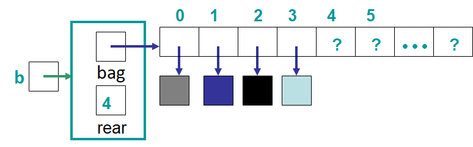

**********************
Topic #15 --- ArrayBag
**********************

* :doc:`We already know what we want to do with our bags </topic13>`
* We also extended the ``Bag`` to make more specialized bags
    * ``IndexedBag``
    * ``SortedBag``

* Let's implement them now

Array Implementation Idea
=========================

* The idea will be similar to the ``Stack`` and ``Queue`` array based implementations
* Unlike a ``Queue``, we will keep the front always at index 0
    * Any ideas why?

* We will need to use ``expandCapacity`` again since our arrays are fixed size
    * The simpler version though, since, again, front is always index 0

* The functionality we want out of our ``Bag``, regardless of what implementation it is:
    * ``void add(T element)``
    * ``T remove(T element)``
    * ``boolean contains(T element)``
    * ``int getCount(T element)``
    * ``boolean isEmpty()``
    * ``int size()``
    * ``Iterator<T> iterator()``

For next time
=============

* Read Chapter 6 Sections 6 & 7
    * 17 pages
