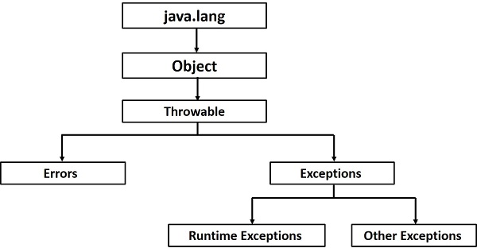

************************
Topic #16 --- Exceptions
************************

* We've seen a number of exceptions at this point
* We should also be familiar with them at a fairly high level
* We should know how to use them and handle them

* Exceptions are great for keeping a logical separation between the regular code and the exceptional situations
* They make it easy to propagate the exception up the call stack so the situation can be managed in a desired place
* It also allows us to group and differentiate between exception types and how to deal with them specifically

Errors
======

* In Java, there are two classes of throwable objects
    * A *throwable* object is one that can be thrown with a ``throw`` statement

* Errors are one of the two throwable classes
* Errors are typically for unrecoverable situations
    * They're generally **very** abnormal situations
* We will not try to handle and catch Errors
* Errors and regarded as *unchecked* for the purpose of compile-time checks

Throwing an Exception
=====================

* We have seen multiple examples of throwing an exception
* Below is ``peek`` from our ``LinkedStack`` implementation
* ``peek`` may throw an exception if we try to ``peek`` from an empty stack
    * Note, although a method can only throw one exception at a time, it may have multiple throw statements with various types of exceptions

.. code-block:: java
    :linenos:
    :emphasize-lines: 3

    public T peek() {
        if (isEmpty()) {
            throw new NoSuchElementException("Popping from an empty stack.");
        }
        return top.getData();
    }

* In this ``peek`` example, the exception being thrown, ``NoSuchElementException``,  is a subclass of ``RuntimeException``
    * It is an unchecked exception, so we don't explicitly need to add ``throws`` to our method signature

* The motivation for using an exception here is that if someone tries to ``peek`` at an empty stack and it's empty, what should happen?
* This is going to be situational
    * Perhaps this means some critical error happened, so the program must stop immediately
    * Or maybe the program using our stack can just ignore the exception and carry on
    * Either way, I cannot know today how you may want to address this exception in your code tomorrow

* You will also see the string ``"Popping from an empty stack."`` in the ``peek`` method
    * This is the exception message
* This would be like the message you see when you get an ``ArrayIndexOutOfBoundsException`` or ``NullPointerException``
* When your program crashes due to a runtime exception, you will also see the *stack trace*

Catching Exceptions
===================

For next time
=============

* Read the :doc:`aside on creating your own exceptions. </topic16-create>`
* Go back and read Chapter 3 Section 5
    * 2 pages
