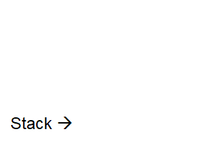

*************************************
Topic #18 --- Memory & The Call Stack
*************************************

* When running programs on our computer, memory is used and accessed in different ways
* Typically, we physically store instructions *and* data in the same address space
    * Note that there are other architectures/strategies one could use for a computational system

* This could be a recipe for disaster, but our modern systems have strategies for mitigating this
* For many programming languages, Java included, we logically separate out memory into areas for
    * Instructions
        * e.g. Classes & Interfaces
    * Dynamically allocated stuff
        * e.g. Objects
    * Stuff related to what is currently happening
        * e.g. Variables & parameters

.. warning::

    The content of this topic is kept at a high-level for introductory purposes. There may be many asterisks added to many of the
    statements contained within.

Memory Allocation
=================

* Memory is broken down into two broad sections

1. The Stack
    * Stores information about the current method running
        * Local variables
        * Formal parameters
        * Return address

2. The Heap
    * Which can be broken down further into storage for
    a. Static information
        * e.g. your code
    b. Instance information
        * e.g. Objects
        * Technically, in Java, this can be broken down further into an area for longer living objects and an area for younger ones
            * We will ignore this here

.. image:: img/memory_abstraction.png
   :width: 500 px
   :align: center

* For example, if I were to run ``SortedBag<T> myBag = new ArraySortedBag<>();`` in my main method
    * The information on what an ``ArraySortedBag`` is is stored in the static area of the heap
    * The ``ArraySortedBag`` that is created is put into the instance area of the heap
    * The reference variable ``myBag`` is stored in the stack

The Call Stack
==============

* The call stack is the part of memory where the information about the current method being run is stored
    * Along with the other methods that were running, but are waiting on the current running method to end so it can resume

* The call stack is also a *stack* --- we push and pop information to/from the stack at one end

Call Frame
----------

* Each time we start running a method, a *call frame* containing relevant information for the method is created and pushed onto the stack

* The call frame contains important information for the execution of the method
    * Space for the parameters passed to the method
    * Space for local variables
        * If the data type is a primitive type, the data is simply stored here
        * If the data is an object, then the data stored is a reference to where the object is in the heap
    * Memory address of where the program returns to when the method finishes
        * Where the calling method's call frame can be found in memory

.. code-block:: java
    :linenos:

    public static void main(String[] args) {
        function1();
    }

    static void function1() {
        System.out.println("Starting function1");
        System.out.println("Calling function2");
        function2();
        System.out.println("Calling function3");
        function3();
        System.out.println("Finished function1");
    }

    static void function2() {
        System.out.println("Starting function2");
        System.out.println("Calling function4");
        function4();
        System.out.println("Finished function2");
    }

    static void function3() {
        System.out.println("Starting function3");
        System.out.println("Finished function3");
    }

    static void function4() {
        System.out.println("Starting function4");
        System.out.println("Finished function4");
    }

* Running the above example would result in the call stack behaving like the below gif

Heap
====

Static Space
------------

Object Space
------------

Garbage Collection
==================

Stack Overflow
==============

* What do you think would happen if I run the following method from ``main``?

.. code-block:: java
    :linenos:

    static void uhOh() {
        System.out.println("Weeeeeeeeeeeeeeeeeeeeeeee!!!");
        uhOh();
    }

.. image:: img/memory_overflow.png
   :width: 500 px
   :align: center

For next time
=============

* Read Chapter 8
    * 28 pages
