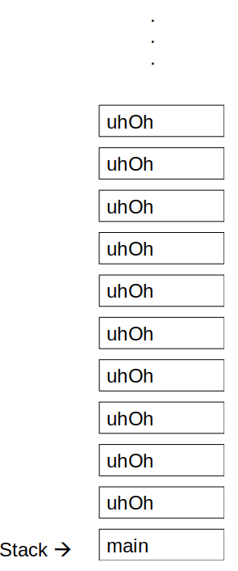

*************************************
Topic #18 --- Memory & The Call Stack
*************************************

* When running programs on our computer, memory is used and accessed in different ways
* Typically, we physically store instructions *and* data in the same address space
    * Note that there are other architectures/strategies one could use for a computational system

* This could be a recipe for disaster, but our modern systems have strategies for mitigating this
* For many programming languages, Java included, we logically separate out memory into areas for
    * Instructions
        * e.g. Classes & Interfaces
    * Dynamically allocated stuff
        * e.g. Objects
    * Stuff related to what is currently happening
        * e.g. Variables & parameters

.. warning::

    The content of this topic is kept at a high-level for introductory purposes. There may be many asterisks added to many of the
    statements contained within.

Memory Allocation
=================

* Memory is broken down into two broad sections

1. The Stack
    * Stores information about the current method running
        * Local variables
        * Formal parameters
        * Return address

2. The Heap
    * Which can be broken down further into storage for
    a. Static information
        * e.g. your code
    b. Instance information
        * e.g. Objects
        * Technically, in Java, this can be broken down further into an area for longer living objects and an area for younger ones
            * We will ignore this here

* For example, if I were to run ``SortedBag<T> myBag = new ArraySortedBag<>();`` in my main method
    * The information on what an ``ArraySortedBag`` is is stored in the static area of the heap
    * The ``ArraySortedBag`` that is created is put into the instance area of the heap
    * The reference variable ``myBag`` is stored in the stack

The Call Stack
==============

Call Frame
----------

Heap
====

Static Space
------------

Object Space
------------

Garbage Collection
==================

* When a method finishes running and the call frame from the call stack is not needed anymore, the memory is deallocated
* When an object in the object space is not needed anymore, *garbage collection* comes into play

* In some programming languages, when we don't need something from the heap that we've allocated anymore, we need to deallocate the memory it used
    * If we don't we have a *memory leak*

* In Java, if an object is not reachable anymore, then it can't be used, thus it is available for garbage collection
    * Not reachable?

Stack Overflow
==============

* What do you think would happen if I run the following method from ``main``?

.. code-block:: java
    :linenos:

    static void uhOh() {
        System.out.println("Weeeeeeeeeeeeeeeeeeeeeeee!!!");
        uhOh();
    }

For next time
=============

* Read Chapter 8
    * 28 pages
