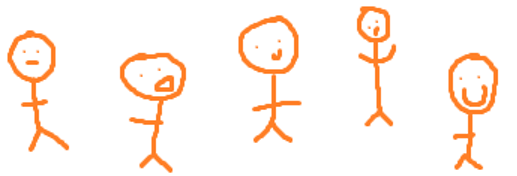
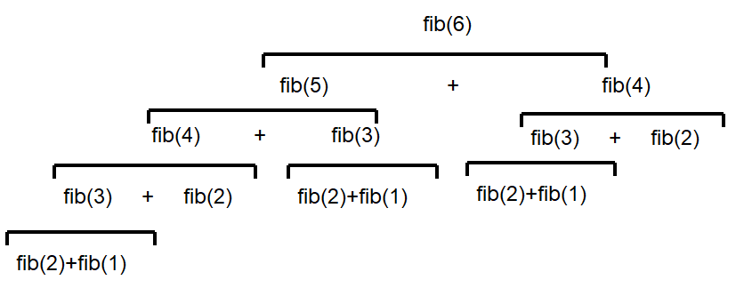
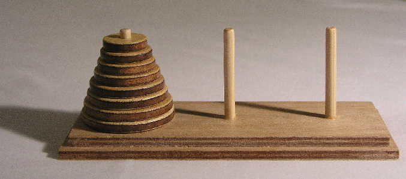

***********************
Topic #19 --- Recursion
***********************

|lineA| |lineB| |lineC|

* How many people are in this line?
    * How would you count them?

* I'd say the answer is, just by looking at the first person, it's exactly ``1 +`` the number of people after the first person

Iterative Definition vs. Recursive Definition
=============================================

* Iterative definitions of things are fairly natural for us
* Recursion on the other hand may *feel* a little less natural, but it pops up a lot in our lives and in nature

Groups of People
----------------

* Like the line of people example above, it may seem like a silly question because it is so intuitive

* A group of people is:
    * 2 people
    * OR 2 people
    * OR 3 people
    * OR 4 people
    * OR ...
    * ...
    * ...

* Alternatively, we can use the idea of recursion to define a group of people a different way
* When we use recursion to define something, we use the definition of itself in it's definition
    * Define something in terms of itself

* Recursive definition of a **group of people** is:
    * 2 people
    * OR a **group of people** plus one more person

* Based on this definition, if I ask you if 2 people are a **group of people**, the answer is clearly yes (the first point)
* But if I ask you if 4 people is a **group of people**, we need to do some digging
    * In order to tell you if 4 people is a **group of people**, I need to know if 3 people is a **group of people**
        * If 3 is, then I know 4 is since 4 is then be a **group of people** plus one more person
    * To know if 3 people is a **group of people**, I must know if 2 people is a **group of people**
    * I know, by definition, that 2 people is, in fact, a **group of people**
    * Therefore, I know that 3 people is a **group of people**
    * Thus, 4 people must be a **group of people**

* In the above recursive example, you will notice a **base case** and a **recursive** case
    * The base case is something with a clear definition
    * The recursive case is one that defines itself in terms of itself

.. warning::

    Although there is no **hard** rule saying that you need a base case, and there are examples of situations where you
    would not include one, not including a base case is a recipe for disaster. Remember ``uhOh()`` from topic 18?

    For our purposes in this course, always include your base case.

Lists
-----

* Think of a list from Python, or a linear linked structure
* We can define this recursively in a rather natural way

* A list is:
    * **Base Case** --- An empty list
    * **Recursive Case** --- There is a head of the list, followed by a tail that's a list

* Consider the following list

    ``[a, b, c, d, e]``

* This can be broken down into the head ``a`` and the tail ``[b, c, d, e]``

    ``a + [b, c, d, e]``

* Further, we can break the tail list down again and again and again until we hit an empty list

    ``a + b + [c, d, e]``

    ``a + b + c + [d, e]``

    ``a + b + c + d + [e]``

    ``a + b + c + d + e + []``

Recursion
=========

* In counting example, it may feel like cheating by saying "1 + however many are after the front"
    * *however many are after the front* seems like we're skipping a step

* However, with the list example, we also see the we repeatedly apply the same rule over and over again on smaller and smaller lists until we get to the end (the empty list)
    * This pattern arises a lot with recursion --- repeatedly apply the same rules on slightly different versions of the problem

* As mentioned earlier, we're typically going to have a **base case** and a **recursive case**
* In fact, we can have multiple base cases and recursive cases
    * We will see examples of these when discussing trees

Going Up and Down
-----------------

* The set of natural numbers :math:`\mathbb{N}` can be recursively defined as:
    * 0 is a natural number
    * A natural number + 1 is a natural number

* With this recursive definition, we have a complete definition of :math:`\mathbb{N}`

* We can start at the base case and repeatedly apply the recursive case to generate all natural numbers
    * This is a great way to mathematically define something infinite
        * Though, your computers will not be all too happy with running this

* We could also take this definition and use it to answer questions by working down to the base case, and then back up with the answer
    * Is 4 a natural number?
    * Is 3 + 1 a natural number?
    * Is (2 + 1) + 1 a natural number?
    * Is ((1 + 1) + 1) + 1) a natural number?
    * Is ((((0 + 1) + 1) + 1) + 1) a natural number?
    * 0 is a natural number
    * Therefore 1 (0 + 1) is a natural number
    * Therefore 2 (1 + 1) is a natural number
    * Therefore 3 (2 + 1) is a natural number
    * Therefore 4 (3 + 1) is a natural number

Recursive Programming
=====================

Factorial
---------

* The factorial,  :math:`n!`, of a non-negative integer is the product of all non-negative between n and 1 inclusively
    * It also includes zero, but this is addressed below

    :math:`n! = n \times (n - 1) \times (n - 2) \times \dots \times 3 \times 2 \times 1`

* We can nicely define this recursively

.. math::

    n! =
    \begin{cases}
        1 & \text{if $n = 0$} \\
        n \times (n-1)! & \text{if $n > 0$} \\
    \end{cases}

.. note::

    You will notice that :math:`0! = 1` and may wonder why. This is because:

    1. It is :math:`1` by definition (because we said so), but this isn't really a satisfying answer.

    2. :math:`1` is the multiplicative identity, and it's used as the result when multiplying no factors.

        * This is just like how adding *nothing* together results in :math:`0` --- the additive identity.

    3. It also aligns with the `gamma function <https://en.wikipedia.org/wiki/Gamma_function>`_

* If I ask you what :math:`4!` is, we can calculate it by applying the rules; there are no real tricks to it

    :math:`4! = 4 * 3!`
        :math:`3! = 3 * 2!`
            :math:`2! = 2 * 1!`
                :math:`1! = 1 * 0!`
                    :math:`0! = 1`

                :math:`1! = 1 * 0! = 1 * 1 = 1`

            :math:`2! = 2 * 1! = 2 * 1 = 2`

        :math:`3! = 3 * 2! = 3 * 2 = 6`

    :math:`4! = 4 * 3! = 4 * 6 = 24`

**Iterative Factorial**

.. code-block:: java
    :linenos:

    static int iterativeFactorial(int n) {
        int factorial = 1;
        for (int i = 1; i <= n; ++i) {
            factorial = factorial * i;
        }
        return factorial;
    }

**Recursive Factorial**

.. code-block:: java
    :linenos:

    static int recursiveFactorial(int n) {
        if (n == 0) {
            return 1;
        }
        return n * recursiveFactorial(n - 1);
    }

* Both the iterative and recursive functions do the same thing
    * But, doesn't the recursive function have a sort of beauty to it?

* When considering the call stack, the stack will grow until it hits the base case
* Then, each frame will return the product to the calling function
    * Regardless of if the calling function is ``recursiveFactorial`` or ``main``

    .. image:: img/recursion_recursiveFactorial.png
       :width: 250 px
       :align: center

Observations
============

* Notice how in the call ``recursiveFactorial(4)``, we would have made a call to ``recursiveFactorial(3)``
* If I ever call this function again, but want to check ``recursiveFactorial(5)``, we would have to call ``recursiveFactorial(4)`` again
* In other words, to know ``recursiveFactorial(x)``, we will be answering ``recursiveFactorial(x - 1)``, ``recursiveFactorial(x - 2)``, ... ``recursiveFactorial(1)``, and ``recursiveFactorial(0)``

* You may have also noticed the relationship between the Stack ADT we discussed and the call stack

* Additionally, anything you do with iteration you can do with recursion, and anything you do with recursion you can do with iteration
* However, just because you *can* doesn't mean you *should*
    * Based on the design of the computational systems we use, recursion creates additional overhead that slows things down
        * Creating frames
        * Pushing/popping from the stack
    * In many programming languages, the compilers will even optimize certain types of recursive functions by translating them to an iterative version
    * This does not mean, however, that one should not use recursion as sometimes recursive implementations are elegant and easier for you to write
        * Simplicity of your code may be tradeoff --- remember, sometimes *good enough is good enough*
        * If you end up actually needing to improve performance later, then do that later

.. warning::

    The computers we use are one type of computational system, and although recursion often ends up being slower than
    iteration on our computational systems, this is due to how they operate. Recursion is not intrinsically a slower
    process within our universe when compared to iteration.

Computational Complexity
========================

* When analysing iterative code, one of the tricks was to think about how many operations will be needed relative to an input size ``n`` and how much the amount of work done scales as we change ``n``

* When looking at ``iterativeFactorial(n)``
    * We see there are a few constant time operations (do not depend on ``n``)
    * But we see the loop running constant time work that runs ``n`` times
    * Therefore, :math:`O(n)`

* When analyzing recursive functions, the idea is the same --- how many operations will be needed relative to an input size ``n`` and how much the amount of work done scales as we change ``n``

* When looking at ``recursiveFactorial(n)``
    * We see there are constant time operations
    * We also see the recursive call, which means the code inside this function can run repeatedly
    * The question then is, how many times will ``recursiveFactorial(n)`` get called?

    +---------------------------------------+-----------------------------+
    | *Times Function Runs*                 | *Function Call*             |
    +=======================================+=============================+
    | 1                                     | ``recursiveFactorial(n)``   |
    +---------------------------------------+-----------------------------+
    | 2                                     | ``recursiveFactorial(n-1)`` |
    +---------------------------------------+-----------------------------+
    | 3                                     | ``recursiveFactorial(n-2)`` |
    +---------------------------------------+-----------------------------+
    | ...                                   | ``recursiveFactorial(...)`` |
    +---------------------------------------+-----------------------------+
    | n - 1                                 | ``recursiveFactorial(2)``   |
    +---------------------------------------+-----------------------------+
    | n                                     | ``recursiveFactorial(1)``   |
    +---------------------------------------+-----------------------------+
    | n + 1                                 | ``recursiveFactorial(0)``   |
    +---------------------------------------+-----------------------------+

* Therefore, ``recursiveFactorial(n)`` is also linear --- :math:`O(n)`

Fibonacci
---------

* Consider the Fibonacci numbers
* If you are not familiar with this sequence, see if you can figure out how it's created

    :math:`0, 1, 1, 2, 3, 5, 8, 13, 21, 34, 55, 89, 144, 233, 377, 610, 987, 1597, 2584, 4181, 6765, ...`

* Here's a hint

    :math:`0, 1`

    :math:`0, 1, 1`

    :math:`0, 1, 1, 2`

    :math:`0, 1, 1, 2, 3`

    :math:`0, 1, 1, 2, 3, 5`

    :math:`0, 1, 1, 2, 3, 5, 8`

    :math:`0, 1, 1, 2, 3, 5, 8, 13`

    :math:`\dots`

* To generate this sequence, start with :math:`0, 1`, then to get the subsequent number, add the proceeding two together
* Take a moment to think about how you would write an iterative method to generate these numbers
    * An example is below --- make sure you understand this

.. code-block:: java
    :linenos:

    static int iterativeFibonacci(int n) {
        if (n == 0) {
            return 0;
        }
        int prev = 0;
        int current = 1;
        int next = 0;
        for (int i = 2; i <= n; ++i) {
            next = prev + current;
            prev = current;
            current = next;
        }
        return current;
    }

* What is the computational complexity of ``iterativeFibonacci(n)``?
    * :math:`O(n)`

* We can write a nice recursive definition for the Fibonacci numbers:

.. math::

    F_{n} =
    \begin{cases}
        0 & \text{if $n = 0$} \\
        1 & \text{if $n = 1$} \\
        F_{n-1} + F_{n-2} & \text{if $n > 1$} \\
    \end{cases}

* Then take a moment and think about how this can be turned into a recursive method
    * Again, example below, but take the time to understand this

.. code-block:: java
    :linenos:

    static int recursiveFibonacci(int n) {
        if (n == 0 || n == 1) {
            return n;
        }
        return recursiveFibonacci(n - 1) + recursiveFibonacci(n - 2);
    }

* What is the computational complexity of ``recursiveFibonacci(n)``?
* This may feel a little less straight forward compared to ``recursiveFactorial(n)``, but the idea is the same
    * The function has constant time operations
    * But we see that there are recursive calls, so, how many times does this function get called?

* When analyzing *factorial* (not Fibonacci), we saw that each function call made one or zero recursive calls
    * There was ``1`` recursive call for each of the ``n`` values between ``1`` -- ``n``
    * There was no recursive call in the base case

* When looking at ``recursiveFibonacci(n)``, how many recursive calls are there for each of the ``n`` values?
    * Two (:math:`2`)

* But each new call will call two more
    * :math:`1`
    * :math:`2`
    * :math:`4`
    * :math:`8`
    * :math:`16`
    * :math:`32`
    * :math:`64`
    * :math:`\dots`

* You may recognize this pattern as :math:`2^{n}`
    * Roughly speaking, we are doubling the number of function calls for each of the :math:`n`

* In other words, this recursive implementation is :math:`O*(2^{n})`
* If given the choice between something that grows linearly, :math:`O(n)`, and something that grows exponentially, :math:`O(n^{n})`, you're going to want to take the linear option
* Despite the simple elegance of this recursive fibonacci implementation, this would perhaps be a good example of going back and improving the implementation for better performance

* But, why is the recursive version so much worse than the iterative one?
    * Look at the image for a hint
    * How many times are we calculating the third Fibonacci number in each version?

Towers of Hanoi
===============

* Given
    * Three pegs
    * Several disks that can be added or removed from the pegs
    * All disks vary in size
    * All disks start on one peg with the largest at the bottom and the smallest at the top

* The goal is to move all disks from one peg to another
* With the following constraints
    * Only one disk can move at a time
    * A disk may never be placed on top of any smaller disk
    * All disks must be on some peg at all times, with the exception of the one currently being moved

* `There is a legend that goes with this puzzle <https://en.wikipedia.org/wiki/Tower_of_Hanoi#Origins>`_

    .. image:: img/recursion_tower.gif
        :width: 500 px
        :align: center
        :alt: This image is taken from wikipedia: https://en.wikipedia.org/wiki/File:Iterative_algorithm_solving_a_6_disks_Tower_of_Hanoi.gif

* Towers of Hanoi is a classic example of where a recursive function is beautifully succinct
* The trick is to consider that whenever we are moving a disk, there is a *source* peg, a *destination* peg, and an *extra* peg
* Additionally, what is considered the source, destination, and extra peg is relative to when and what disk is being moved

* Equipped with this information, to move :math:`n` disks from the source to the destination, we simply
    1. Move the :math:`n - 1` disks from source peg to the extra peg
    2. Move the :math:`n^{th}` disk to the destination peg
    3. Move the :math:`n - 1` disks from the extra peg to the destination peg

* Steps 1 and 3 may feel like cheating, but notice that they are actually recursive calls
* Also, what one considers the source, destination, and extra peg will change when moving the :math:`n - 1` disks
    * Looking at the 1st step, it says move the :math:`n - 1` disks from source peg to the extra peg
    * Ok, how do we do that?
        1. Move the :math:`(n - 1) - 1` disks from source peg to the extra peg
        2. Move the :math:`(n - 1)^{th}` disk from the source to the destination
        3. Move the :math:`(n - 1) - 1` disks from extra peg to the destination peg
    * But, the extra and destination pegs are different for the :math:`(n - 1)` disks
        * The extra peg when moving :math:`n` disks has become the destination peg when moving :math:`(n - 1)`
        * Similarly, the destination peg when moving :math:`n` disks is this recursive step's extra peg

.. warning::

    This is a non-trivial problem and algorithm. If you are struggling with these ideas, don't worry too much.

For next time
=============

* Read Chapter 8
    * 28 pages
