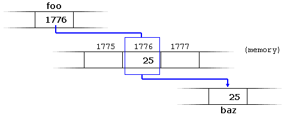

***************************
Topic #2 Aside --- Pointers
***************************

* Variables we make in our program go into RAM

.. code-block:: cpp
    :linenos:

    int anInt = 5;

* This makes a variable called ``anInt`` and assigns it the value ``5``
* The value ``5`` is stored in RAM somewhere, and we use the label ``anInt`` to access it
* Generally, where in RAM the value is actually stored is up to the operating system
* But a neat thing about C++ is that we can ask *where* in RAM the value is stored

Address Of Operator
===================

* The address of operator --- ``&``
    * The symbol ``&`` is used a lot, but it is context sensitive

* We can get the memory address of where a given variable is stored by putting the ``&`` right in front of the variable name

.. code-block:: cpp
    :linenos:

    int anInt = 5;
    std::cout << anInt << " is at " << &anInt << std::endl;

* The result would look something *like* this

    ``5 is at 0x7ffde2544134``

* This tells us that the operating system used memory address ``0x7ffde2544134`` to store the value ``5``
    * Note that this memory address is represented in *hexadecimal*
    * Also note that your memory address will differ if you run this, and will differ every time you run the program

* The variable name, ``anInt``, is the label for this memory address in this context

Pointer Variable
================

* Instead of simply printing out the memory address, we can store it in a variable for later use
* The trick here is to be mindful of the type of data we are storing
    * If we want to store an integer pointer, we will have an integer pointer type

.. code-block:: cpp
    :linenos:
    :emphasize-lines: 4

    int myVar = 25;

    // Create a pointer variable
	int* foo = &myVar;
	int bar = myVar;

* In the above example, notice the asterisk (``*``) next to the ``int``
* This means that the data being stored in the variable labelled ``foo`` must be of type integer pointer
* ``bar`` on the other hand just has type ``int``

.. image:: img/cpp_pointer0.png
   :width: 200 px
   :align: center
   :target: https://www.cplusplus.com/doc/tutorial/pointers/

* In the above example, assuming ``myVar`` is stored at address ``1776``
    * The address is stored in the integer pointer ``foo``
    * The integer from ``myVar`` is copied to the integer ``bar``

Dereferencing
=============

* If you have a pointer variable, but you do not care about the memory address; you want to know what is stored *at* the memory address, we *dereference*

.. image:: img/cpp_pointer0.png
   :width: 200 px
   :align: center
   :target: https://www.cplusplus.com/doc/tutorial/pointers/

* For example, if you do not care that the integer pointer ``foo`` stores ``1776``, but you care what is at ``1776``

.. code-block:: cpp
    :linenos:
    :emphasize-lines: 2,4

    int myVar = 25;
	int* foo = &myVar;
	int bar = myVar;
	int baz = *foo;

* The use of ``*foo`` on line 4 means *dereference*
* It means, take the memory address stored in the integer pointer variable ``foo``, but tell me what is in that address
* If we follow the code on line 4, it will execute like this:
    * ``foo`` is a label for an integer pointer variable containing ``1776``
    * But the ``*foo`` means, get what is **at** memory address ``1776``
    * Take the value there (``25``) and copy it to the integer variable ``baz``

.. warning::

    Note the two different uses of ``*``. (a) ``int* foo`` and (b) ``*foo``. In (a), we are specifying the type to be
    integer pointer --- it's having an impact on the type, so the asterisk (``*``) is by the type in the variable
    declaration. With (b) however, we already have an existing pointer variable that we want to dereference, thus the
    asterisk (``*``) is by the already existing variable.

* The address of and dereference operators are complementary

.. code-block:: cpp
    :linenos:

    int myVar = 25;
	std::cout << *&myVar <<	std::endl;

* In proactive the above example is quite silly, but if break the instructions down
    * ``myVar`` is an integer variable holding ``25``
    * ``&myVar`` is the memory address of the ``myVar`` integer variable
    * ``*&myVar`` is what's at the memory address... of the memory address... of where the variable ``myVar`` is in RAM

.. code-block:: cpp
    :linenos:

    int myVar = 25;
	std::cout << *&*&*&*&*&*&*&*&*&*&*&*&*&*&*&*&*&*&*&*&*&myVar <<	std::endl;

* Similarly, this would work too, but that much more idiotic

.. warning::

    It's a common joke that pointers are difficult to wrap your brain around. Although it's not trivial to learn them,
    I think the joke has been blown way out of proportion. Like anything programming related, you'll pick it up with
    practice. The trick I suggest is (a) slow down, (b) think about your types, and (c) think about what you want.

.. code-block:: cpp
    :linenos:

    int myVar = 25;
	std::cout << *myVar <<	std::endl;

* The above example is nonsense code in terms of what it means
* It's asking an integer what is at the memory address stored in ``myVar``
* But ``myVar`` does not store an integer pointer, it stores an integer, thus, it's a nonsense request
* Sure, it's an integer, which is a number, and pointers are numbers too, but that doesn't make this OK since it's not a pointer; it's not something that can be dereferenced

