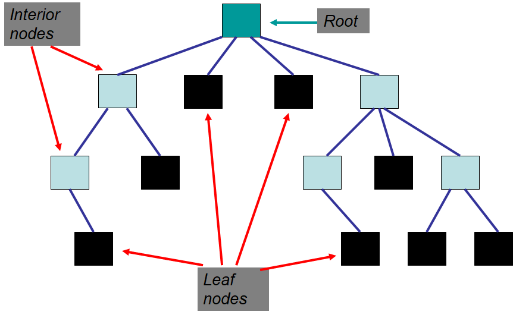

*******************
Topic #21 --- Trees
*******************

* Trees are *nonlinear* data structures
    * An easy way to think of this is, there is no obvious natural ordering

* Data can be organised in some hierarchical way
    * Family trees
    * Inheritance
    * File systems on a computer
    * Decision trees
    * Table of contents of a book

.. image:: img/tree_example.png
   :width: 500 px
   :align: center

Definitions & Terminology
=========================

Tree Definition
---------------

* A **tree** is a collection of elements such that:
    * It is empty
    * Or, it has a special element called the *root*, from which descends zero or more trees (subtrees)

* Notice that this definition is recursive

.. image:: img/tree_definition.png
   :width: 500 px
   :align: center

Nodes
-----

* A **node** is a single entity in the tree

* An **edge** connects nodes

* The **root node** is a special element that is the origin of the tree
    * A tree can have one or zero root nodes

* A **leaf node** is a node without an edge to a child node
    * Child node is discussed in the next subsection

* An **interior node** is *not* a leaf node

* An **empty tree** with no nodes or edges
    * But, with the definition of the tree we're using, this is still a tree
    * Think empty stack/queue/bag --- they still exist, but they're just empty

For next time
=============

* Read Chapter 10 Sections 1 -- 3
    * 10 pages
