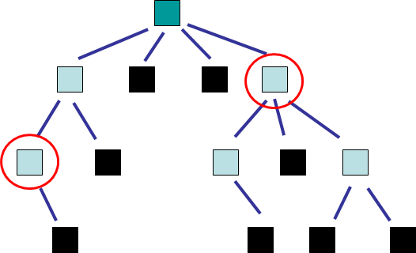
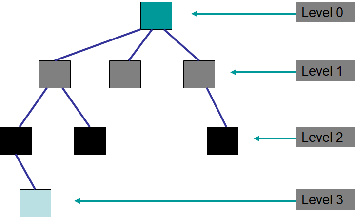

*******************
Topic #21 --- Trees
*******************

* Trees are *nonlinear* data structures
    * An easy way to think of this is, there is no obvious natural ordering

* Data can be organised in some hierarchical way
    * Family trees
    * Inheritance
    * File systems on a computer
    * Decision trees
    * Table of contents of a book

.. image:: img/tree_example.png
   :width: 500 px
   :align: center

Definitions & Terminology
=========================

Tree Definition
---------------

* A **tree** is a collection of elements such that:
    * It is empty
    * Or, it has a special element called the *root*, from which descends zero or more trees (subtrees)

* Notice that this definition is recursive

.. image:: img/tree_definition.png
   :width: 500 px
   :align: center

Perperties
----------

* A **path** is the sequence of nodes and edges leading from one node to another

* The **path length** is the number of *edges* in the path

* The **level** of a given node is the number of *edges* between the root and the node
    * Or, if you prefer, here is a recursive definition
        * The level of the root is ``0``
        * The level of a node that is not the root is the level of its parent ``+ 1``

* The **height** of a tree is the number of levels the tree has

* Questions
    * What is the length of the path between the circled nodes?
    * What is the height of this tree?
    * What is the height of a tree with only a root?
    * What is the height of an empty tree?

* The **degree/arity of a given node** is the number of *children* the node has

* The **degree/arity of a tree** is the maximum degree/arity of the tree's nodes

* Question
    * What is the degree of this tree?
    * What is the smallest degree of a node in this tree?

For next time
=============

* Read Chapter 10 Sections 1 -- 3
    * 10 pages
