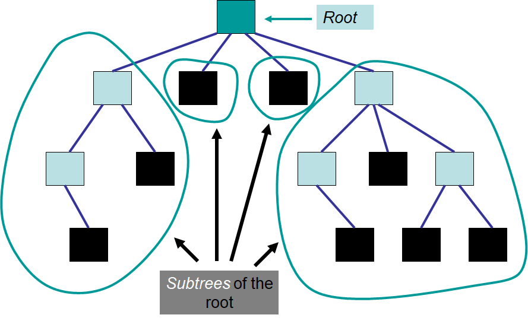
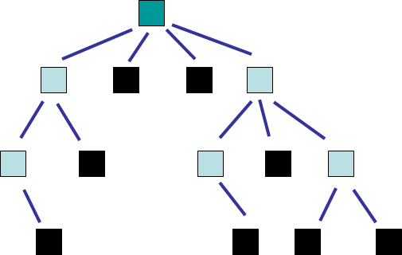

*******************
Topic #21 --- Trees
*******************

* Trees are *nonlinear* data structures
    * An easy way to think of this is, there is no obvious natural ordering

* Data can be organised in some hierarchical way
    * Family trees
    * Inheritance
    * File systems on a computer
    * Decision trees
    * Table of contents of a book

.. image:: img/tree_example.png
   :width: 500 px
   :align: center

Definitions & Terminology
=========================

Tree Definition
---------------

* A **tree** is a collection of elements such that:
    * It is empty
    * Or, it has a special element called the *root*, from which descends zero or more trees (subtrees)

* Notice that this definition is recursive

Relationships
-------------

* A **parent/predecessor** of a given node is the node directly above in the hierarchy
    * Each node can have at most one parent, except for the root, which has no parent

* A **child/successor** of a given node is the node directly below in the hierarchy
    * Each node can have between zero and many children

* A **sibling** of a given node is a node that has the same parent

* An **ancestor** of a given node is the parent, or the parent's parent, or the parent's parent's parent, or ...

* A **descendant** of a given node is the child, or the child's child, or the child's child's child, or ...

* Questions
    * Can a leaf node have any children?
    * Does the root have a parent?
    * How many parents does each node have?

For next time
=============

* Read Chapter 10 Sections 1 -- 3
    * 10 pages
