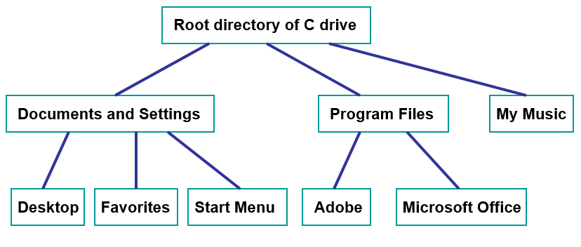

*******************
Topic #21 --- Trees
*******************

* Trees are *nonlinear* data structures
    * An easy way to think of this is, there is no obvious natural ordering

* Data can be organised in some hierarchical way
    * Family trees
    * Inheritance
    * File systems on a computer
    * Decision trees
    * Table of contents of a book

Definitions & Terminology
=========================

Tree Definition
---------------

* A **tree** is a collection of elements such that:
    * It is empty
    * Or, it has a special element called the *root*, from which descends zero or more trees (subtrees)

* Notice that this definition is recursive

.. image:: img/tree_definition.png
   :width: 500 px
   :align: center

Nodes
-----

* A **node** is a single entity in the tree

* An **edge** connects nodes

* The **root node** is a special element that is the origin of the tree
    * A tree can have one or zero root nodes

* A **leaf node** is a node without an edge to a child node
    * Child node is discussed in the next subsection

* An **interior node** is *not* a leaf node

* An **empty tree** with no nodes or edges
    * But, with the definition of the tree we're using, this is still a tree
    * Think empty stack/queue/bag --- they still exist, but they're just empty

.. warning::

    You may come across alternative definitions of trees; however, we are using this definition as it is the most
    common.

Relationships
-------------

* A **parent/predecessor** of a given node is the node directly above in the hierarchy
    * Each node can have at most one parent, except for the root, which has no parent

* A **child/successor** of a given node is the node directly below in the hierarchy
    * Each node can have any number of children

* A **sibling** of a given node is a node that has the same parent

* An **ancestor** of a given node is the parent, or the parent's parent, or the parent's parent's parent, or ...

* A **descendant** of a given node is the child, or the child's child, or the child's child's child, or ...

* Questions
    * Can a leaf node have any children?
    * Does the root have a parent?
    * How many parents does each node have?

* A **subtree** of a given node is a child node and all descendants
    * A subtree is itself a tree
    * A node may have many subtrees

.. image:: img/tree_subtree_root.png
   :width: 500 px
   :align: center

* Questions
    * What is the root of the subtree labelled *E*?
    * How many subtrees does this tree have?

Properties
----------

* A **path** is the sequence of nodes and edges leading from one node to another

* The **path length** is the number of *edges* in the path

* The **level** of a given node is the number of *edges* between the root and the node
    * Or, if you prefer, here is a recursive definition
        * The level of the root is ``0``
        * The level of a node that is not the root is the level of its parent ``+ 1``

* The **height** of a tree is the number of levels the tree has

.. image:: img/tree_path.png
   :width: 500 px
   :align: center

* Questions
    * What is the length of the path between the circled nodes?
    * What is the height of this tree?
    * What is the height of a tree with only a root?
    * What is the height of an empty tree?

.. image:: img/tree_levels.png
   :width: 500 px
   :align: center

* The **degree/arity of a given node** is the number of *children* the node has

* The **degree/arity of a tree** is the maximum degree/arity of the tree's nodes

.. image:: img/tree_levels.png
   :width: 500 px
   :align: center

* Question
    * What is the degree of this tree?
    * What is the smallest degree of a node in this tree?

For next time
=============

* Read Chapter 10 Sections 1 -- 3
    * 10 pages
