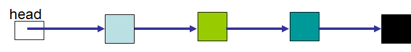

**************************
Topic #22 --- Binary Trees
**************************

Binary Tree Definition
======================

Traversals
==========

* With a simple linear structure, the order in which you traverse the nodes is rather natural
* Start at one end and go to the other
* For example, start at the head node and visit each node's next

* We could define other traversal orders if we wanted to, but that would be atypical

.. image:: img/binarytree_example.png
   :width: 500 px
   :align: center

* With a nonlinear data structure like a binary tree, the order to traverse the nodes in is not immediately obvious
* We have a few common options to choose from

Pre-order
--------

In-order
-------

Post-order
---------

Level-order
-----------

Iterative Pre/In/Post-Order
---------------------------

Traversal Analysis
------------------

Interface
=========

Implementation
==============

Linked Implementation
---------------------

Binary Tree Node
^^^^^^^^^^^^^^^^

Linked Binary Tree
^^^^^^^^^^^^^^^^^^

For next time
=============

* Have a look at the :download:`BinaryTree <../main/java/BinaryTree.java>` interface
* Read Chapter 10 Sections 4 -- 7
    * 34 pages (mostly code though)
