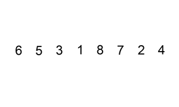

*********************
Topic #25 --- Sorting
*********************

* Like searching, sorting is a classic problem that we take for granted
* We have all sorted things before
* We know what it *means*
* We know what a correct outcome is
* But, chances are, you have not spent a lot of time really analyzing *how* you have sorted things

* Perhaps even more interesting, until relatively recently, we've been pretty terrible at it
    * And chances are, you are too

* There are many sorting algorithms out there
* They will work different ways, but result in sorted collections
* Some will more or less be the same in terms of the amount of computation required
* And some will be much better than others

* `Here is a simple visualization of some popular sorting algorithms <https://www.toptal.com/developers/sorting-algorithms>`_

Sorting Problem
===============

* Given a collection of *things*
    * Numbers
    * Strings
    * People
    * Car Parts

* The goal is to arrange the collection of *things* such that they are *in order*

Order
-----

* What *in order* means however will depend on what is being sorted
* For example
    * Numbers come with an intrinsic ordering
        * Java uses the `Natural Order <https://docs.oracle.com/en/java/javase/11/docs/api/java.base/java/lang/Comparable.html>`_
        * *"This ordering is referred to as the class's natural ordering, and the class's compareTo method is referred to as its natural comparison method."*
    * Strings could be ordered alphabetically
        * Perhaps by length?
    * Sort people based on height
        * Or age?
        * Or month and day of birthday?
    * Car Parts by mass?
        * Or production code?
        * Date they were made?
        * Volume?
        * The amount of dust particles on the surface?

* With numbers, we don't feel the need to ask
* But with other things, we need to have a well defined ordering for the *things*
    * The things themselves have the order-*ness* property, not a sorting algorithm

* We've already discussed this a few times already in the context of an ordered bag and binary search tree
    * `Comparable defines a natural ordering <https://docs.oracle.com/en/java/javase/11/docs/api/java.base/java/lang/Comparable.html>`_

* We may also want to have more complex orderings of things
    * For example, comparing things based on multiple values
    * I like to sort my music by artist and year
    * `Comparator defines an unnatural ordering <https://docs.oracle.com/en/java/javase/11/docs/api/java.base/java/util/Comparator.html>`_

.. note::

    For ease, we will use numbers in the examples, but the ideas are generalizable to other *things* if they have a
    defined order.

    We will define a collection of numbers ordered if and only if the elements are non-decreasing order. If we want to
    be more specific and include include duplicate values, we could say that the elements are
    *monotonically increasing*. This is just fancy way of saying the numbers are increasing or the same/equal as we go,
    but **never** decreasing. For example:

        :math:`1, 2, 3, 5, 5, 6, 8, 8, 8, 9`

    There is nothing stopping us from defining the order we want to be decreasing, but here we will simply use
    increasing.

Bogosort
========

* Here's a fun idea

1. Assume we have a function called ``isSorted(collection)`` that returns true if the collection is sorted, false otherwise
    * :math:`O(n)`
2. Assume we have another function called ``shuffle(collection)`` that randomly shuffles the collection
    * :math:`O(n)`
    * Think of shuffling a deck of cards

* The algorithm is then:
    ``while not isSorted(collection): shuffle(collection)``

* Best case scenario, we get lucky with our collection already being sorted as we only need to use ``isSorted`` once
* Worst case is... *forever?*
* Really, we could get **really** unlucky and shuffle the elements such that they are the same, not in order order every time

* As you can probably tell, this is not a particularly great sorting algorithm in terms of computation required
* If your :math:`n` is very small, sure you will *probably* end up with a sorted collection after a while
* But to put things into perspective, there are a total :math:`8.0658175x10^{67}` permutations of a deck of 52 cards``!``
    * To put this in perspective, there are roughly :math:`2.4x10^{67}` atoms in the Milky Way
    * If we assigned each possible ordering to every atom in the Milky Way, we'd run out of atoms
        * we'd have roughly :math:`5.7\times10^{67}` permutations left over
    * `There's also a fun story to go with this <https://www.reddit.com/r/AskReddit/comments/6il1jx/comment/dj71u1v/?utm_source=share&utm_medium=web2x&context=3>`_

Bubble Sort
===========

* The general idea of bubble sort is to look at the list, and if we see any adjacent numbers out of order, swap them
* What's neat about this is, as long as we swap *out of order* adjacent values, it actually doesn't matter the order we apply the swaps

    :math:`4, 3, 2, 1`

* With the above example, we *could* go this route

    :math:`4, 3, 2, 1`

    :math:`3, 4, 2, 1`

    :math:`3, 2, 4, 1`

    :math:`2, 3, 4, 1`

    :math:`2, 3, 1, 4`

    :math:`2, 1, 3, 4`

    :math:`1, 2, 3, 4`

* Or, we could go this way

    :math:`4, 3, 2, 1`

    :math:`4, 3, 1, 2`

    :math:`3, 4, 1, 2`

    :math:`3, 1, 4, 2`

    :math:`3, 1, 2, 4`

    :math:`1, 3, 2, 4`

    :math:`1, 2, 3, 4`

* Selecting an arbitrary pair of values to switch works, but we would like to have a more systematic strategy
* Instead of randomly selecting pairs, start at the beginning and look at each adjacent pair and move up the list

**Pass 1**

    :math:`4, 3, 2, 1`

    :math:`3, 4, 2, 1`

    :math:`3, 2, 4, 1`

    :math:`3, 2, 1, 4`

* However, simply doing one pass does not guarantee that the list will be in order
* In fact, all it does guarantee is that the largest value in the list will have *bubbled up* to its correct spot

* The trick is to repeat this process until the list is sorted

**Pass 2**

    :math:`3, 2, 1, 4`

    :math:`2, 3, 1, 4`

    :math:`2, 1, 3, 4`

**Pass 3**

    :math:`1, 2, 3, 4`

Worst Case Scenario
-------------------

* The above example showed the *worst case scenario* for this specific bubble sort idea --- the list is in reverse order
* The question is, how many passes must we do to guarantee that the list is sorted?

* If the list is length :math:`n`
* And after a single pass the largest value is in its proper location
* After a second pass, the second largest value is in its proper location
* After a third, the third largest will be where it needs to
* ...
* After :math:`n` passes, we know the list is sorted
    * Actually, :math:`n-1` since putting the :math:`(n-1)^{th}` thing in its proper spot would result in also having the last element, the :math:`n^{th}`, also be in its proper spot
    * See the above example, where :math:`n = 4` and we only needed 3 passes

Best Case Scenario
------------------

* Consider the case where the list is already in order

    :math:`1, 2, 3, 4`

* If may feel rather silly doing a total of :math:`n-1` passes since after a single pass we can conclude that it's already sorted
* In this case, an easy way to stop the sort early is to check if we ever finish a pass and make no swaps
    * If we never swapped anything, then nothing was out of order, therefore the list must be sorted

Algorithm
---------

* While the list is not sorted
    * For each adjacent pair of values
        * If they are out of order
            * Swap them
            * Note that the list is not yet known to be sorted

Computational Complexity
------------------------

* For the best case scenario, we still need to do a complete pass over all :math:`n` elements since we can only conclude if it is sorted by looking at the whole list
    * Best case :math:`O(n)`

* For the worst case, each pass is :math:`O(n)`, but we need a total of :math:`n-1` passes
    * Worse Case :math:`O(n^{2})`

Insertion Sort
==============

* The idea of insertion sort is to select elements from the unsorted list and *insert* them into a sorted list in the correct spot such that the sorted list remains sorted
    * In the above gif, there is a single list with a sorted and unsorted part
* Similar to bubble sort, the order that we select the elements from the unsorted list doesn't matter in terms of getting a sorted collection in the end

.. list-table:: Insertion Sort Example
    :widths: 50 50
    :header-rows: 1

    * - Unsorted
      - Sorted
    * - :math:`4, 3, 2, 1`
      -
    * - :math:`3, 2, 1`
      - :math:`4`
    * - :math:`3, 2`
      - :math:`1, 4`
    * - :math:`3`
      - :math:`1, 2, 4`
    * -
      - :math:`1, 2, 3, 4`

* Typically, for ease, each element in the unsorted list is picked for insertion in the order that they appear

Computational Complexity
------------------------

* To think of the computational complexity, consider that we have a list of size :math:`n`
* If we select one of those things, we need to then find where in the sorted list it belongs
* If this is the first element we are adding to the sorted list, then there is nothing in that sorted list, therefore finding where the element should be inserted is trivial
* If it's the second element, we need to look at one element in the sorted list to determine where the second element goes
* If it's the third element, we need to look at two elements in the sorted list
* ...
* If we are considering the :math:`n^{th}` element from the unsorted list, we need to look at :math:`n-1` elements in the sorted list

* Therefore, if we have :math:`n` things to sort, and for each we need to look at, on average, :math:`n/2` things in the sorted list to determine where to insert, then we have :math:`O(n^{2})`

Worst Case Scenario
-------------------

* The situation for the worst case scenario would be if, for each of the :math:`n` elements to be sorted, it had to be compared to every single element in the sorted part
* For example, in the above gif, the worst case scenario would be if the numbers were in reverse order
    * We put the largest element (8) in the sorted list
    * We then take the next largest (7), and we have to put it on the other side of the largest (8)
    * We take the third largest (6), and it has to go on the other side of all elements already sorted (7, 8)
    * ...
    * Take the last element, which happens to be the smallest (1), and go over the whole sorted list to find where it belongs (2, 3, 4, 5, 6, 7, 8)

* Based on this gif, where it starts scanning the sorted list from the end, the configuration of the elements would be if the elements were in reverse order
* However, if the list was scanned from the beginning, the configuration would be if the elements were already in order

Best Case Scenario
------------------

* The situation for the best case would be if, for each of the :math:`n` elements, we only need to compare it to one thing
* In the gif example, the best case would be if the list happened to already sorted
    * Put the smallest element (1) in sorted
    * Select the next smallest (2), and since it's larger than the smallest (1), we do not need to look past it
    * Select the next one (3), and since it's larger than the second smallest (2), we do not need to look past it
    * ...
    * Look at the last element, the largest (8), and compare it to the sorted list and see that it is larger than the first thing it considers (7), therefore we do not need to look past it

Algorithm
---------

* For each element in the unsorted list
    * Scan the sorted list to find where the new element goes
        * Insert the new element into the sorted list

Selection Sort
==============

.. image:: img/sort_selectionsort.gif
   :height: 333 px
   :align: center
   :target: https://en.wikipedia.org/wiki/Selection_sort

* The general idea is
    * Scan the collection for the current smallest element and put it in a sorted list
    * Scan the collection for the current smallest element and add it to the end of the sorted list
    * Scan the collection for the current smallest element and add it to the end of the sorted list
    * ...

.. list-table:: Insertion Sort Example
    :widths: 50 50
    :header-rows: 1

    * - Unsorted
      - Sorted
    * - :math:`4, 3, 2, 1`
      -
    * - :math:`4, 3, 2`
      - :math:`1`
    * - :math:`4, 3`
      - :math:`1, 2`
    * - :math:`4`
      - :math:`1, 2, 3`
    * -
      - :math:`1, 2, 3, 4`

Algorithm
---------

* In fact, the basic idea is more or less the algorithm

* For each element in the unsorted list
    * Scan the unsorted list for the smallest element
        * Add element to the end of the sorted list

Computational Complexity
------------------------

* Assuming we have a collection of :math:`n` things that need to be sorted
* For each element, we must do a linear search through the unsorted collection for the current smallest element
    * :math:`O(n)`

* First time we scan :math:`n` elements
* Next time we scan :math:`n-` elements
* Then :math:`n-2` elements
* ...

* Since we have :math:`n` things that need to be sorted, and we need to do a linear for each, it's :math:`O(n^{2})`

Best and Worse Case Scenario
----------------------------

* An interesting thing about selection sort is that there is no difference between the best or worse case scenarios
* No matter the configuration of the unsorted collection, an :math:`O(n)` linear search must be done for each of the :math:`n` elements to be sorted

* So, where insertion and bubble had a best case of :math:`O(n)` and worse case of :math:`O(n^{2})`, selection sort is always going to be :math:`O(n^{2})`

Radix Sort
==========

* So far we have seen sorting algorithms that work based on comparing elements to other elements to determine where they should go
* However, it is actually possible to sort elements without ever comparing them to any other element

* The general idea is to group numbers based on individual digits
    * *Radix* means base, like base 10 numbers

* You may go from least significant to most significant digit
    * Here, we start with the least significant

* This strategy is probably best explained with an example
* Given an unsorted list, create a bin for each digit and place each element into the bin with the matching least significant digit

.. list-table:: Radix Sort Example Part 1
    :widths: 50 50

    * - :math:`44, 33, 11, 22, 154, 10, 1, 43, 99, 47`
      - :math:`\{10\} \{11, 1\} \{22\} \{33, 43\} \{44, 154\} \{\} \{\} \{47\} \{\} \{99\}`

* The next steps are to concatenate the bins and continue this process, but for each digit, moving left to right
    * Add leading zeros if needed

.. list-table:: Radix Sort Example Part 2
    :widths: 50 50

    * - :math:`10, 11, 01, 22, 33, 43, 44, 154, 47, 99`
      - :math:`\{01\} \{10, 11\} \{22\} \{33\} \{43, 44, 47\} \{154\} \{\} \{\} \{\} \{99\}`
    * - :math:`001, 010, 011, 022, 033, 043, 044, 047, 154, 099`
      - :math:`\{001, 010, 011, 022, 033, 043, 044, 047, 099\} \{154\} \{\} \{\} \{\} \{\} \{\} \{\} \{\} \{\}`

* If we concatenate the final bins, we end up with a sorted list

    :math:`1, 10, 11, 22, 33, 43, 44, 47, 99, 154`

Mergesort
=========

Quicksort
=========

Heapsort
========

For next time
=============

* Most sorting images are taken directly from their wikipedia articles
    * Click the image to visit their respective pages

* Read Chapter 9 Section 2
    * 26 pages
