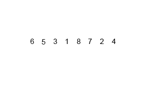
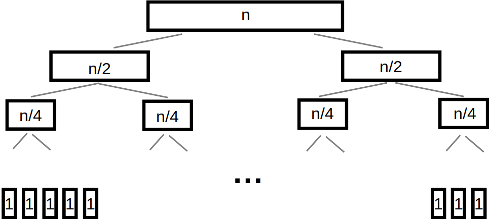

**************************
Topic #26 --- More Sorting
**************************

* Other pretty cool sorting algorithms

Mergesort
=========

* There are two important, but simple ideas at the root of mergesort
    1. *Merging* two sorted lists, with the below idea, results in a single sorted list of all elements
    2. An empty list, or a list of size 1, is *sorted*

Merging Lists
-------------

1. Start with two sorted lists
2. Create an new empty list
3. Compare the first elements of the two lists
4. Remove the smaller of the two from its list and append it to the end of the new list
5. Go to 3

.. list-table:: Merge Example
    :widths: 50 50
    :header-rows: 1

    * - Two Sorted Lists
      - Merged List
    * - | :math:`2, 5, 8, 9`
        | :math:`1, 3, 4, 6, 7`
      -
    * - | :math:`2, 5, 8, 9`
        | :math:`3, 4, 6, 7`
      - :math:`1`
    * - | :math:`5, 8, 9`
        | :math:`3, 4, 6, 7`
      - :math:`1, 2`
    * - | :math:`5, 8, 9`
        | :math:`4, 6, 7`
      - :math:`1, 2, 3`
    * - | :math:`5, 8, 9`
        | :math:`6, 7`
      - :math:`1, 2, 3, 4`
    * - | :math:`8, 9`
        | :math:`6, 7`
      - :math:`1, 2, 3, 4, 5`
    * - | :math:`8, 9`
        | :math:`7`
      - :math:`1, 2, 3, 4, 5, 6`
    * - | :math:`8, 9`
        |
      - :math:`1, 2, 3, 4, 5, 6, 7`
    * - |
        |
      - :math:`1, 2, 3, 4, 5, 6, 7, 8, 9`

* In the last two rows, since the second list was empty, we know the remainder of the first list could simply be appended to the merged list

Splitting Lists
---------------

* The merge algorithm requires sorted lists to start from
* However, when given an unsorted collection to sort, there are no sorted lists to start merging
* Fortunately this is trivial to address
    * Keep splitting the unsorted collection in half

* Eventually this will result in a set of lists that are either empty or size 1

    :math:`[a, b, c, d, e, f, g]`

    :math:`[a, b, c, d], [e, f, g]`

    :math:`[a, b], [c, d], [e, f], [g]`

    :math:`[a, b], [c, d], [e, f], [g]`

    :math:`[a], [b], [c], [d], [e], [f], [g], []`

Putting it Back Together Again
------------------------------

* To get to the single sorted list, simply merge all the smaller sorted lists together until 1 list remains

    :math:`[t], [u], [v], [w], [x], [y], [z], []`

    :math:`[t, u], [v, w], [x, y], [z]`

    :math:`[t, u, v, w], [x, y, z]`

    :math:`[t, u, v, w, x, y, z]`

Recursively Thinking
--------------------

* The beauty of this algorithm is it's simplicity when thinking about it recursively

* **Mergesort**
    * If the list is size 0 or 1
        * Return the sorted list of size 0 or 1
    * Otherwise
        * Split the list into a first and second half
        * Sort the first half with **Mergesort**
        * Sort the second half with **Mergesort**
        * Merge the first and second half back together
        * Return the sorted merged list

Complexity Analysis
-------------------

* A simple way to think about the analysis is to consider
    * How much work is involved for a single merging of two lists
    * How many times merging needs to happen

* It can get more nuanced, but this level of detail is sufficient

Merging
^^^^^^^

* We will have two lists to merge into one
* One list will be size :math:`n`, the other will be size :math:`m`
* These lists will either be the same length or nearly the same length, but either way, we can say :math:`n >= m`
* Since we're concerned about worst case scenario, we will consider the case where :math:`n = m`, therefore we have :math:`2n` elements total
* There will be some number of comparisons taking place, but ultimately, each of these :math:`2n` elements will need to be moved to the merged list
* Therefore, because we ignore coefficients, the complexity of merging is :math:`O(n)`

Number of Merges
^^^^^^^^^^^^^^^^

* A single merging of two lists is linear
* Note that below, we use the value :math:`n` to represent the total number of elements to be sorted
* Now the goal is to determine the number of times merging needs to happen

* If we have a total of :math:`n` elements to be sorted, where :math:`n = 2^{k}`, these will get split into :math:`n` lists of size 1
    * To keep things simple, we're considering that :math:`n` is a power of 2

* Consider the bottom row of the tree in the above figure
* Each of these :math:`n` lists of size 1 need to be merged with another list of size 1
* Once this happens, we are left with :math:`n/2` lists of size 2
* This requires a total of :math:`n/2` merges for that bottom row, and each merge merged 2 elements, which is :math:`O(n)` for that bottom row

* Following this, we are left with :math:`n/2` lists of size 2
* If each of the :math:`n/2` lists of size 2 are merged, this would result in :math:`n/4` lists of size 4 after :math:`n/4` merges
    * :math:`O(n)`

* Following this pattern, if each row of merges takes :math:`O(n)` time, it becomes a matter of determining how many rows there are
* If we have :math:`n` (or, :math:`2^{k}`) lists of size 1, how many "rows" of merges are required to obtain 1 list of size :math:`n` (or, :math:`2^{k}`)
    * Each row halves the number of lists (doubles the size of each list), we will have :math:`k` rows
    * :math:`k = log_{2}(2^{k}) = log_{2}(n)`
    * Therefore we have :math:`log_{2}(n)` rows
    * And each row takes :math:`O(n)` time
    * Thus, mergesort is :math:`O(n log_{2}(n))`

Quicksort
=========

Heapsort
========

Radix Sort
==========

* So far we have seen sorting algorithms that work based on comparing elements to other elements to determine where they should go
* However, it is actually possible to sort elements without ever comparing them to any other element

* The general idea is to group numbers based on individual digits
    * *Radix* means base, like base 10 numbers

* You may go from least significant to most significant digit, or *vice versa*
    * Here, we start with the least significant

* This strategy is probably best explained with an example
* Given an unsorted list, create a bin for each digit and place each element into the bin with the matching least significant digit

.. list-table:: Radix Sort Example Part 1
    :widths: 50 50

    * - :math:`44, 33, 11, 22, 154, 10, 1, 43, 99, 47`
      - :math:`\{10\} \{11, 1\} \{22\} \{33, 43\} \{44, 154\} \{\} \{\} \{47\} \{\} \{99\}`

* The next steps are to concatenate the bins and continue this process, but for each digit, moving left to right
    * Add leading zeros if needed

.. list-table:: Radix Sort Example Part 2
    :widths: 50 50

    * - :math:`10, 11, 01, 22, 33, 43, 44, 154, 47, 99`
      - :math:`\{01\} \{10, 11\} \{22\} \{33\} \{43, 44, 47\} \{154\} \{\} \{\} \{\} \{99\}`
    * - :math:`001, 010, 011, 022, 033, 043, 044, 047, 154, 099`
      - :math:`\{001, 010, 011, 022, 033, 043, 044, 047, 099\} \{154\} \{\} \{\} \{\} \{\} \{\} \{\} \{\} \{\}`
    * - :math:`0001, 0010, 0011, 0022, 0033, 0043, 0044, 0047, 0154, 0099`
      - :math:`\{0001, 0010, 0011, 0022, 0033, 0043, 0044, 0047, 0099, 0154\} \{\} \{\} \{\} \{\} \{\} \{\} \{\} \{\} \{\}`

* Once we end up with the bin for zero being size :math:`n`, we're done

    :math:`1, 10, 11, 22, 33, 43, 44, 47, 99, 154`

Computational Complexity
------------------------

* Assuming:
    * We have a collection of :math:`n` things that need to be sorted
    * The longest number to be sorted has :math:`w` symbols
        * E.g. the number of digits in the base 10 numbers

* Each of the :math:`n` elements need to be placed in their correct bin
    * Assuming the use of a dictionary, this will take :math:`n` :math:`O(1)` operations
    * Therefore, :math:`O(n)`

* This process needs to be repeated for each symbol
    * :math:`O(n * w)`
    * This is typically how the computational complexity is expressed for radix sort

* It is possible that in your case the length of the numbers :math:`w` is fixed and reasonably small, so sometimes people will treat this like a constant
    * If one thinks of it this way, the complexity *could* be interpreted as :math:`O(n)`

.. note::

    The radix value does have an impact on the algorithm too (e.g. base 10 numbers vs. base 16); however, (a) it mostly
    impacts the space complexity, (b) it will only impact the computational complexity if a naive strategy of a linear
    search is used to place elements in the correct bins, and (c) the radix value is very likely to be small and fixed,
    thereby making it effectively a constant.

For next time
=============

* Most sorting images are taken directly from their wikipedia articles
    * Click the image to visit their respective pages

* Read Chapter 9 Section 2
    * 26 pages
