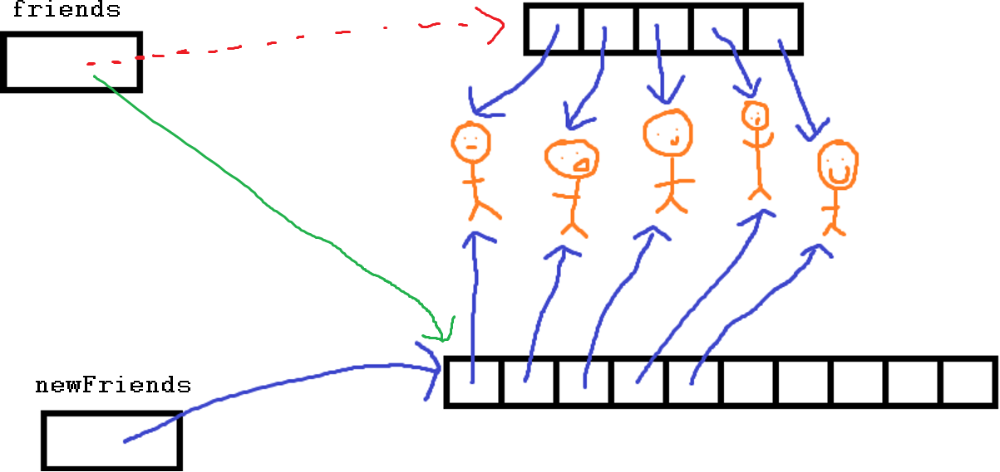
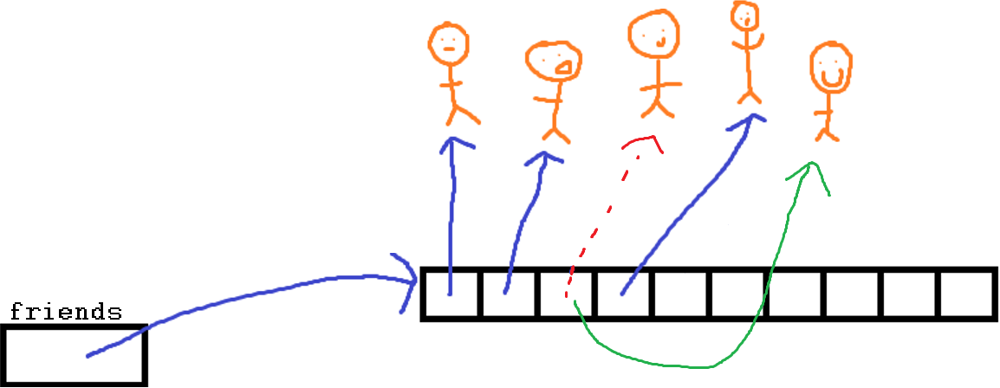

***************************
Topic #3 --- Objects Review
***************************

* Let's review the idea of objects

Objects and Classes
===================

* Objects are *things* that typically know stuff, can do actions, and can be acted on
* Often, when programming with Java, we will have interacting objects

Objects
-------

* All objects have
    * **Properties**
        * These are the *data*
        * These are called *fields*
        * They're variables, but they belong to an object

    * **Behaviours**
        * This is what the object can do
        * These are called **methods**
        * They're functions, but they belong to an object

Class
-----

* Every object belongs to a *class*
    * A *class* defines what it means to be an object of that class

* For example
    * We can think of ``Human`` as a class
        * With the fields ``firstName`` and ``lastName``
        * And methods ``eat()`` and ``goToBed()``

    * We can make Bob Smith an instance of the ``Human`` class
        * ``firstName`` is Bob
        * ``lastName`` is Smith

* All objects of the same class have the same fields, but their values can differ
    * All instances of ``Human`` have ``firstName`` and ``lastName``
    * But Bob Smith's ``firstName`` is Bob
    * If we made an instance for Jane Doe, then their ``firstName`` would be Jane

But Why?
--------

* Classes and objects make abstraction pretty easy
    * How many of you know exactly how an internal combustion engine works?
    * How many of you drove here today in a car with an internal combustion engine?

* It also lets us encapsulate ideas together
    * Although, there are arguments as to why this isn't great

High-Level Idea
---------------

* Your typical class will consist of
    * Fields
    * Methods
    * Constructors (which are also methods)

* In Java, we write our class code in a file with the same name as the class with the file extension being .java
    * The ``Human`` class would be in a file called Human.java

Contact List Example
====================

* The above is very high-level
* It may be easiest to learn with an example
* Let's say we want to write a program to keep track of the contact information of our friends
* I will make a class that will define what a ``Friend`` is
* I will make another class that will define how we will manage a collection of ``Friend`` objects

.. warning::

    The example may not make complete sense until it comes together in the end.

Friend Class
------------

* What type of information should our ``Friend`` class keep track of?
    * First Name
    * Last Name
    * Email Address
    * ...

* We know we need a constructor, which was ``__init__`` in Python

* What behaviours should our ``Friend`` instances have?
    * Hmmmmmm....
    * Well, based on what I remember from Python, we should have
        * accessors and mutators
            * getters and setters
        * the ``__repr__`` thing?
        * ``__eq__``?

Setting Fields and Writing the Constructor
^^^^^^^^^^^^^^^^^^^^^^^^^^^^^^^^^^^^^^^^^^

* The constructor is a special method that is called automatically when an object of the class is created
* We'd typically setup stuff that needs to be setup for an instance of the class in the constructor

**Python**

.. code-block:: python
    :linenos:
    :emphasize-lines: 5

    class Friend:

        # Python --- Constructor and
        # creating and setting fields
        def __init__(self, first_name, last_name, email):
            self._first_name = first_name
            self._last_name = last_name
            self._email = email

* Remember, in Python we use ``self`` to refer to an instance of the class
* Putting the underscore in front of the field name is a convention to mean private

**Java**

.. code-block:: java
    :linenos:
    :emphasize-lines: 4,5,6,10,11,12

    public class Friend {

        // Class Attribute Declaration
        private String firstName;
        private String lastName;
        private String email;

        // Constructor and assigning fields
        public Friend(String firstName, String lastName, String email) {
            this.firstName = firstName;
            this.lastName = lastName;
            this.email = email;
        }
    }

* The class is set to ``public`` so we can access it from any other class
* We define the fields to have scope to the class
    * So they are accessible to the whole class

* The fields are ``private`` since we want to control how these fields are used
* The constructor is ``public``, has the same name as the class, and does not have a ``self`` parameter
* The ``this`` in the above example let's Java resolve the ambiguity
    * ``this.firstName`` is the class attribute where ``firstName`` is a local parameter for the constructor
    * It is not always necessary to use ``this`` in Java like how we use ``self`` in Python

Getters and Setters
^^^^^^^^^^^^^^^^^^^

**Java**

.. code-block:: java
    :linenos:
    :emphasize-lines: 2

        public String getFirstName() {
            return firstName;
        }

        public void setFirstName(String firstName) {
            this.firstName = firstName;
        }

* Getter and setter for ``firstName``
    * Would be the same for ``lastName``

* Notice that we do not need the ``this`` in front of ``firstName``

* You may still feel like making the fields private and then writing the getters and setters is silly
    * Honestly, in this example, it likely is a bad idea
    * We will revisit the use of the getters and setters in this class later

* Here is a contrived example to show where the use of a setter can check the data first before making a change

**Java**

.. code-block:: java
    :linenos:

        /**
         * Update the email address. Will only work if the email address
         * contains the @ symbol for simple data correctness check
         *
         * @param email     new email address
         */
        public void setEmail(String email) {
            if (email.contains("@")) {
                this.email = email;
            }
        }

toString
^^^^^^^^

* You may remember that ``__repr__`` in python was a special method that would return a string version of the object
    * And, if you called ``print(some_object)``, the ``__repr__`` would automatically get called

* When we wrote our own classes, we ended up overriding the ``__repr__`` we got for free
    * The default one simply prints out the object name and a memory address, which wasn't very helpful
    * ``<__main__.Friend object at 0x7f130d9c52e0>``
    * *Technically*, the behaviour we get for free is inherited from the closest "super" class
        * We will learn more about this later

* An example of a ``__repr__`` for our ``Friend`` class might look something like this
* We just print out the name of the ``Friend`` and their email

**Python**

.. code-block:: python
    :linenos:

    # Python --- __repr__
    def __repr__(self):
        return self._first_name + " " + self._last_name \
               + ":\t" + self._email

* We can do the same thing in Java, but in java it's called ``toString()``
* If we do not write our own, the default behaviour is to return a string of the class name and a *hash code*
    * ``Friend@77459877``
    * Again, *technically* the behaviour we get for free is inherited

.. code-block:: java
    :linenos:

        public String toString() {
            return firstName + " " + lastName + ":\t" + email;
        }

* And like Python, we can simply print it and ``toString`` will automatically get called
    * ``System.out.println(aFriend);``

.. warning::

    The idea is that this *returns* a string; we do not want to just print something

equals
^^^^^^

* We had another special function that we liked to use called ``__eq__``
* ``__eq__`` let us define what it means for two of the objects to be equivalent
* It also let us call ``==`` on the objects too

* In Java, we use the ``equals()`` method to define what it means for two of the objects to be equivalent
* **HOWEVER**, unlike Python, this doesn't overload the ``==`` operator
    * ``==`` for the objects is reserved to check if the objects are literally the same object
    * Same memory address --- it compares the memory addresses

* On the other hand, ``.equals()`` is used to actually compare the content of the objects in some way
    * We need to think about what it means for two objects of the type to be &equivalent*

* The default behaviour is to is to check if the objects are in the same memory address (``==``)
    * Similar to ``toString``, the behaviour we get for free is inherited

* So, what should it mean for two ``Friend`` objects to be *equal*?
* Well, **we** get to define this
* We can make it whatever we want
    * Same eye colour?
    * Same height and weight?
    * Same number of skin cells?

* But, we need to really think about what makes sense in our context
    * Let's go with their ``firstName`` and ``lastName`` being equal
        * Although, this example is perhaps still not overly great

.. code-block:: java
    :linenos:

        /**
         * Sample equals method for comparing two friend objects.
         * In this example, we will simply compare first and last
         * names.
         *
         * This example is deliberately kept very simple
         *
         * @return      if the two friend objects are equal
         */
        public boolean equals(Friend other) {
            return this.firstName.equals(other.firstName)
                    && this.lastName.equals(other.lastName);
        }

* Notice how we actually use the string's `equals` too
* In the above example, using ``this`` is not necessary, but may be helpful in eliminating ambiguity

.. warning::

    The example ``equals()`` included in the ``Friend.java`` file is a little more complex,
    but is a more complete and correct ``equals``. :doc:`See this aside for more details. </topic3-equals>`

Creating an Instance of a Friend
^^^^^^^^^^^^^^^^^^^^^^^^^^^^^^^^

.. code-block:: java
    :linenos:

    public class SomeClass {
        public static void main(String[] args) {

            // Declare a Friend variable
            // Create an instance of a Friend
            // Assign the variable to reference the newly created Friend
            Friend aFriend = new Friend("Bob", "Smith", "bsmith@gmail.com");

        }
    }

* Here's an example of us actually creating an instance of the ``Friend`` class
* This is a really really really simple example where we create it and do nothing with it

* There is a bit going on here:
    * Declare a ``Friend`` variable
        * ``Friend aFriend``
    * Create an instance of a ``Friend``
        * ``new Friend("Bob", "Smith", "bsmith@gmail.com")``
    * Assign the variable to reference the newly created object
        * The equals bit
        * We have to be careful about what is actually stored in the ``aFriend``

        .. image:: img/reference_aFriend.png
           :width: 250 px
           :align: center

* If I were to write another line of code like this
    * ``Friend bFriend = new Friend("Jane", "Doe", "jdoe@gmail.com");``
* ``aFriend`` would have a ``firstName`` of Bob
* ``bFriend`` has a ``firstName`` of Jane
* They both have the ``firstName`` field, but the actual value associated with it differs

    .. image:: img/reference_aFriend_bFriend.png
       :width: 500 px
       :align: center

* Below is an example of two``Friend`` objects being created and being used
    * We get ``aFriend``'s first name
    * Use the ``toString`` method
    * Use the ``equals`` method

.. code-block:: java
    :linenos:

    Friend aFriend = new Friend("Bob", "Smith", "bsmith@gmail.com");
    Friend bFriend = new Friend("Jane", "Doe", "jdoe@gmail.com");

    System.out.println(aFriend.getFirstName());
    System.out.println(aFriend);
    System.out.println(bFriend);
    System.out.println(aFriend.equals(bFriend));

* What do you think the output of this would be?

References
^^^^^^^^^^

* We have to be careful about what is actually stored in these variables
* We're not storing the object in that variable --- we store a reference to where the object is in memory

.. code-block:: java
    :linenos:
    :emphasize-lines: 4

    Friend aFriend = new Friend("Bob", "Smith", "bsmith@gmail.com");
    Friend bFriend = new Friend("Jane", "Doe", "jdoe@gmail.com");

    bFriend = aFriend;

* In the above example, ``bFriend = aFriend`` copies the contents of ``aFriend`` and puts the copy in ``bFriend``
    * So, the reference stored in ``aFriend`` gets copied

* This also means that the object that ``bFriend`` used to point to now has no reference to it

    .. image:: img/reference_lost.png
       :width: 500 px
       :align: center

.. warning::

    You may think that assignment works differently for primitive types when compared and objects,
    but, think about what is actually stored in the variable.

Contact List Class
------------------

* We need a way to keep track of our ``Friend`` objects
* To do this, we will make a new class called ``ContactList``
* What fields should this have?
    * A list of the ``Friends`` we're keeping track of
        * For this we can use an array
    * A count of how many ``Friend`` objects our ``ContactList`` contains
        * Just an ``int``

Setting Fields and Writing the Constructor
^^^^^^^^^^^^^^^^^^^^^^^^^^^^^^^^^^^^^^^^^^

* In the below examples, ``class ContactList:`` and ``public class ContactList {`` are excluded

**Python**

.. code-block:: python
    :linenos:

    def __init__(self):
        self._friend_count = 0
        self._friends = []

* In this Python example, keeping track of ``_friend_count`` is perhaps not necessary since we can simply use ``len(self._friends)``
* We can keep appending and appending to our ``_friends`` list

**Java**

.. code-block:: java
    :linenos:

    public class ContactList {

        static final int DEFAULT_CAPACITY = 10;

        private int capacity;
        private int friendCount;
        private Friend[] friends;

        public ContactList() {
            friendCount = 0;
            friends = new Friend[DEFAULT_CAPACITY];
        }

        public ContactList(int capacity) {
            friendCount = 0;
            friends = new Friend[capacity];
        }
    }

* First, notice that we actually wrote two constructors
    * Overloading
    * We can even do something called :doc:`constructor chaining </topic3-chaining>`

* Since arrays have a fixed size, our strategy here is to make an array with a sufficiently large size, but only use what we need
* The first constructor will make use of some constant value set in the class to make the array
* The second will take a capacity as a parameter and make the array that size

* If we create a ``ContactList`` object
    * ``ContactList contacts = new ContactList(5);``

* We will have something like this created

    .. image:: img/contacts.png
       :width: 600 px
       :align: center

Adding Friends
^^^^^^^^^^^^^^

**Python**

.. code-block:: python
    :linenos:

    def add(self, first_name, last_name, email):
        # Make the friend object
        new_friend = Friend(first_name, last_name, email)

        # Append friend to our friends list
        # and update friend count
        self._friends.append(new_friend)
        self._friends_count += 1

**Java**

.. code-block:: java
    :linenos:
    :emphasize-lines: 16, 17, 18

        /**
         * Add a new friend to the friends array. Will create an instance
         * of a Friend based on parameters. If our array runs out of space
         * we will expand capacity to manage the situation.
         *
         * @param firstName     friends first name
         * @param lastName      friends last name
         * @param email         friends email address
         */
        public void add(String firstName, String lastName, String email) {
            // Create the Friend object
            Friend newFriend = new Friend(firstName, lastName, email);

            // If we have run out of space in our array
            // we need to deal with it
            if (friendCount == friends.length) {
                expandCapacity();
            }
            // Add friend to the next available spot
            friends[friendCount] = newFriend;
            friendCount++;
        }

        private void expandCapacity() {
            // Make a new array of twice the size of the previous
            Friend[] newFriends = new Friend[friends.length * 2];

            // Copy over the contents of the friends list
            // to the new bigger friends list
            for(int i = 0; i < friends.length; ++i) {
                newFriends[i] = friends[i];
            }
            // Have friends now reference the new friends
            friends = newFriends;
        }

* You may notice that ``friendCount`` plays double duty here --- friends count and next available spot in the array

* Since our array has a fixed size, we can't simply keep adding to it
* Our solution is to ``expandCapacity``
    1. Create a new array twice as big as the original
    2. Copy over the contents of the original array to the new bigger array
        * `You could also use this instead <https://docs.oracle.com/en/java/javase/11/docs/api/java.base/java/util/Arrays.html#copyOf(T%5B%5D,int)>`_
    3. Make out friends array now reference the new bigger array

* The ``expandCapacity`` method gets called automatically by the ``add`` method if our array has run out of space
* If the array had enough room, ``expand capacity`` is never called
* Either way, when we add the ``newFriend`` to our array, we are now guaranteed to have room

* You will also see that the ``expandCapacity`` method is ``private``
    * This method is important for the inner workings of the ``ContactList`` class
    * This method is not something I want the user of my class to care about
        * Abstraction

Remove Friends
^^^^^^^^^^^^^^

**Java**

.. code-block:: java
    :linenos:
    :emphasize-lines: 8, 11

        public void remove(String firstName, String lastName) {
            // Create a temp friend object for easy
            // use of the Friend class' equals()
            Friend toDelete = new Friend(firstName, lastName, "");

            // Linear search for the friend we are trying to delete
            for (int i = 0; i < friendCount; ++i) {
                if (toDelete.equals(friends[i])) {
                    // Have friend at the end of the array be referenced
                    // by the array index we removed from
                    friends[i] = friends[friendCount - 1];
                    friends[friendCount - 1] = null;
                    friendCount--;
                }
            }
        }

* We'll create a temporary ``Friend`` based on the parameters so we can make use of our ``Friend`` class' ``.equals``
* To remove the ``Friend`` all we need to do it lose reference to it
    * Garbage
* In the above example, we made the array at the index of the removed ``Friend`` to reference the ``Friend`` at the end of the array
    * ``friendCount - 1``
* After this, the array has no reference to the ``Friend`` that was removed

* You may notice that the array at index ``friendCount - 1`` is set to ``null``
    * This is done to deal with the edge case of removing the last friend

* You may also notice that this method, as it is written, will not do anything special if the ``Friend`` we try to remove does not exist
* What should we do in this scenario?
    * Ignore it?
    * Return a boolean?
    * Crash the program?
    * Explode?

* This will be discussed further a little later in the course

Update Friend's Email
^^^^^^^^^^^^^^^^^^^^^

.. code-block:: java
    :linenos:

        public void updateEmail(String firstName, String lastName, String newEmail) {
            // Create a temp friend object for easy
            // use of the Friend class' equals()
            Friend toUpdate = new Friend(firstName, lastName, "");

            // Linear search for the friend we are trying to update
            for (int i = 0; i < friendCount; ++i) {
                if (toUpdate.equals(friends[i])) {
                    friends[i].setEmail(newEmail);
                }
            }
        }

Index Of Friend
^^^^^^^^^^^^^^^

* You may have noticed that ``remove`` and ``updateEmail`` look very similar
* Perhaps we should make another method called ``indexOf`` that does a linear search through the array
* If we find the thing, we'll return its index, otherwise return -1

.. code-block:: java
    :linenos:
    :emphasize-lines: 18, 29

        public int indexOf(String firstName, String lastName) {
            // Create a temp friend object for easy
            // use of the Friend class' equals()
            Friend toFind = new Friend(firstName, lastName, "");

            // Linear search for the friend we are trying to find
            for (int i = 0; i < friendCount; ++i) {
                if (toFind.equals(friends[i])) {
                    return i;
                }
            }
            // -1 will signify that we didn't find
            // what we were looking for
            return -1;
        }

        public void remove(String firstName, String lastName) {
            int friendIndex = indexOf(firstName, lastName);
            if (friendIndex != -1) {
                // Have friend at the end of the array be referenced
                // by the array index we removed from
                friends[friendIndex] = friends[friendCount - 1];
                friends[friendCount - 1] = null;
                friendCount--;
            }
        }

        public void updateEmail(String firstName, String lastName, String newEmail) {
            int friendIndex = indexOf(firstName, lastName);
            if (friendIndex != -1) {
                friends[friendIndex].setEmail(newEmail);
            }
        }

.. warning::

    The above change actually altered the functionality of the ``remove`` and ``updateEmail`` methods.
    Try to figure out what has changed. Is this change good or bad? **Hint:** What happens if there are
    multiple ``Friend`` objects with the same ``firstName`` and ``lastName``?

Get
^^^

* We will want a method to return an actual ``Friend`` object based on a given index

.. code-block:: java
    :linenos:
    :emphasize-lines: 3

        public Friend get(int index) {
            // Make sure the index provided is valid
            if (index > -1 && index < friendCount) {
                return friends[index];
            } else {
                return null;
            }
        }

* Realistically, the check on the index here could be much better, but we will talk about this stuff later in the course

* We could overload ``get`` and add another version that will take the ``firstName`` and ``lastName`` of a ``Friend`` and return that ``Friend``

.. code-block:: java
    :linenos:

        public Friend get(String firstName, String lastName) {
            int index = indexOf(firstName, lastName);
            return get(index);
        }

* Easy to write since we make use of the functions that exist that do all the work for us already

Clear Friends
^^^^^^^^^^^^^

.. code-block:: java
    :linenos:

        public void clear() {
            friends = new Friend[friends.length];
            friendCount = 0;
        }

* For this, just make a new, empty array of the same size of the original array
* Since the old array referenced by ``friends`` has no more reference, it get managed by the garbage collector

* We could have gone through the array and set each index to reference ``null``, but the above is easier

toString
^^^^^^^^

* What should the string representation of our ``ContactList`` class be?
* How about we simply print out the friend's information, one per line
* To make a ``toString`` for the ``ContactList`` class,

.. code-block:: java
    :linenos:
    :emphasize-lines: 4

        public String toString() {
            String s = "";
            for (int i = 0; i < friendCount; ++i) {
                s = s + friends[i].toString() + "\n";
            }
            return s;
        }

* Notice that we can actually make good use of the ``Friend`` class' ``toString`` method

.. warning::

    Although the above example is correct, in practice we'd want to use something called a ``StringBuilder``.
    :doc:`See this aside for more details. </topic3-builder>`

Friend Count
^^^^^^^^^^^^

* We will want to be able to know how many ``Friend`` objects we have in our ``ContactList``
* Basically a getter for the ``friendCount`` field

.. code-block:: java
    :linenos:

        public int size() {
            return friendCount;
        }

What We Get
===========

* Modularity
    * Break a problem down into smaller components
    * Ideally, these components should be independent from each other
    * Each component performs a well defined task
    * We encapsulate data and behaviours together

* Information Hiding
    * Hide some of the implementation details
    * It can protect important pieces of the system from being modified by others bits
    * It gives us some control over how our code is used
    * For example
        * You all used Python lists, but you didn't know any of their implementation details
        * And it didn't matter!

For next time
=============

* Assuming you have not done it, read Chapter 1 of your text
    * 15 pages

Code
====

* Download and play with the :download:`Friend <../src/main/java/Friend.java>` and  :download:`ContactList <../src/main/java/ContactList.java>` code.

* If everything was done correctly, the following code should work

.. code-block:: java
    :linenos:

    public class SomeClass {
        public static void main(String[] args) {

            ContactList myFriends = new ContactList(5);

            myFriends.add("Bob", "Smith", "bsmith@gmail.com");
            myFriends.add("Jane", "Doe", "jdoe@gmail.com");
            myFriends.add("Clarence", "Cartwrite", "treelover1523@hotmail.com");
            myFriends.add("Sandy", "Seaside", "boatsboatsboats@yachtclub500.com");
            myFriends.add("Adam", "Fluffson", "fluffyman28@hotmail.com");
            myFriends.add("Adrian", "Andrews", "aandrews@hotmail.com");

            System.out.println("Print after adds and expand");
            System.out.println(myFriends);

            myFriends.updateEmail("Clarence", "Cartwrite", "supertreelover1523@hotmail.com");

            System.out.println("Print after update");
            System.out.println(myFriends);

            myFriends.remove("Bob", "Smith");

            System.out.println("Print after remove");
            System.out.println(myFriends);

            myFriends.clear();

            System.out.println("Print after clear");
            System.out.println(myFriends);

        }
    }
