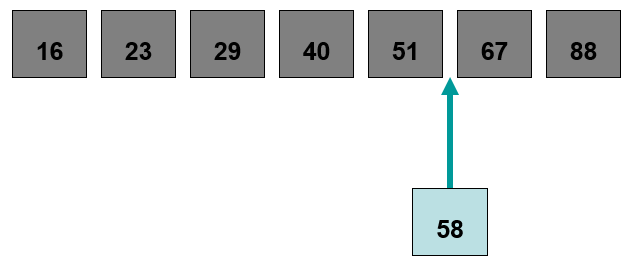

************************
Topic #4 --- Collections
************************

* Collections
* Abstract Data Types
* Data Structures
* Implementations
* Abstraction

Collections and ADTs
====================

* A collection is a group o *things* that we want to treat as a special conceptual unit
    * A contact list
    * A stamp collection

* In computer science, we have a few popular elementary collections
    * Stacks
    * Queues
    * Lists
    * Trees
    * Graphs

* This list is far from complete, but they will be a big part of your early computer science courses

Linear Collections
------------------

* Linear collections are those that arrange data in a sequential way where each thing has a predecessor and a successor
    * Except for the ends

Stack
^^^^^

.. image:: img/stack_example.png
   :width: 500 px
   :align: center

* Adding and removing data from a stack happens from one end
* The last thing we add to the stack will be the first thing off

Queue
^^^^^

.. image:: img/queue_example.png
   :width: 500 px
   :align: center

* Adding to a queue happens at one end and removing happens at the other
* The first thing that gets added would be the first thing to be removed

List
^^^^

* Adding and removing from a list will depend on the type of list we have
* In the above example, the list is ordered, so adding to the list should preserve the order

* Python lists are *lists*, and they are a generalization of stacks and queues

Nonlinear Collections
---------------------

* Sometimes there is no natural way to arrange our data in a nice sequential
* Sometimes there are many successors
* Sometimes the idea of successor does not make sense

Trees
^^^^^

.. image:: img/tree_example.png
   :width: 500 px
   :align: center

* The data is arranged in a hierarchical way
* Every element has at most one *parent*, but potentially many *children*
* If I ask you "What comes after Program Files" in this example, there is no obvious answer
* We can think of trees as a generalization of lists

Graphs
^^^^^^

.. image:: img/graph_example.png
   :width: 500 px
   :align: center

* Data is often represented along with relationships to other data
    * Vertices/Nodes
    * Edges

* We can think of graphs as a generalization of trees

Abstraction
===========

* A really big idea for problem solving is *abstraction*
    * You do this a lot in every day life

* We will try to separate the **WHAT** from the **HOW**
    * What we can do
    * How it's actually done

* We know *what* we have to do to drive a car, but we don't need to know *how* the card does what it does
* We know that we wanted to append things to lists in Python, but you didn't need to know how the Python list does that

* The above ADTs are all just the *what*
    * We can add and remove stuff to a list
    * This is how we *interface* with the thing

* At no point do we talk about *how* or *implement* these ADTs actually do their thing
    * In fact, maybe there are multiple options for *how* for a given *what*

Layering
--------

* If our systems are large, we may start to have multiple levels, or, *layers*, of abstraction
* If this is the case, we may want to group our components and restrict how our layers of abstraction interact

* In real life, we can play the layers game
    * Tell me how to cook pasta?
        * Boil salted water and then add pasta
    * Tell me in more detail
        * Get a pot, fill with water, put on stove, and ....
    * ...
    * ...
    * ...
    * Tell me in more detail
        * Neurons start to fire and muscles contract...
    * MORE DETAIL
        * Ion pumps and ....

* The point is, it's `turtles all the way down <https://en.wikipedia.org/wiki/Infinite_regress>`_
* If I want to make pasta for dinner, I don't care, and I don't want to care about ion pumps

Data Structures
===============

* A data structure is an actual implementation of an ADT

* Using the ``ContactList`` example, the *what* would be:
    * Keep track of ``Friend`` objects
    * Add and remove ``Friend`` objects
    * Get a ``Friend``
    * ...

* And, the *how* would be the actual code we see
    * We used an array to keep track of the ``Friend`` objects
    * Do a linear search through the array to find a specific ``Friend``

* A large focus in this class will be both the *what* and the *how and how to keep them separate
    * The interface and the implementation

.. warning::

    It is not uncommon for people to use data structure as a catch all to mean both the ADT and the specific implementation.

For next time
=============

* Read Chapter 3 Section 1 of your text
    * 3 pages
