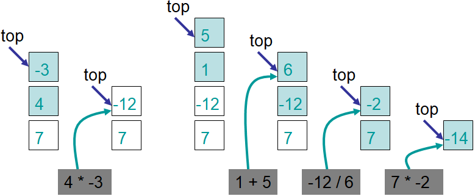

**************************
Topic #5 Aside --- Postfix
**************************

* Postfix expression evaluation is one of the classic stack examples

Postfix Expressions
===================

* We as humans prefer *infix* notation for our mathematical expressions
    * ``3 + 4 * 2 = 11``
    * ``(7 + 2) / 3 = 3``

* But this is just a convention
* We can use other notations, like *postfix* notation
    * ``3 4 2 * + = (3 (4 2 *) +) = 11``
    * ``7 2 + 3 / = (7 2 +) 3 /) = 3``

Pseudocode for Evaluating Postfix Expressions
---------------------------------------------

.. code-block::
    :linenos:

    For each symbol in expression
        If symbol is an operand
            PUSH symbol onto stack
        If symbol is an operator
            POP twice from the stack
            Apply operator to the two popped operands
            PUSH result onto stack

Evaluate
--------

* With the pseudocode, evaluate ``7 4 -3 * 1 5 + / *``

* Again, notice that we were able to use the idea of a stack to solve a problem easily despite not knowing the implementation
