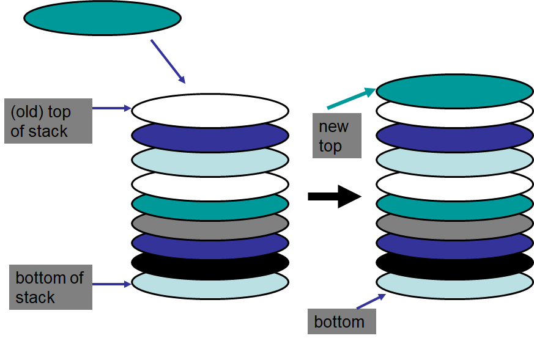
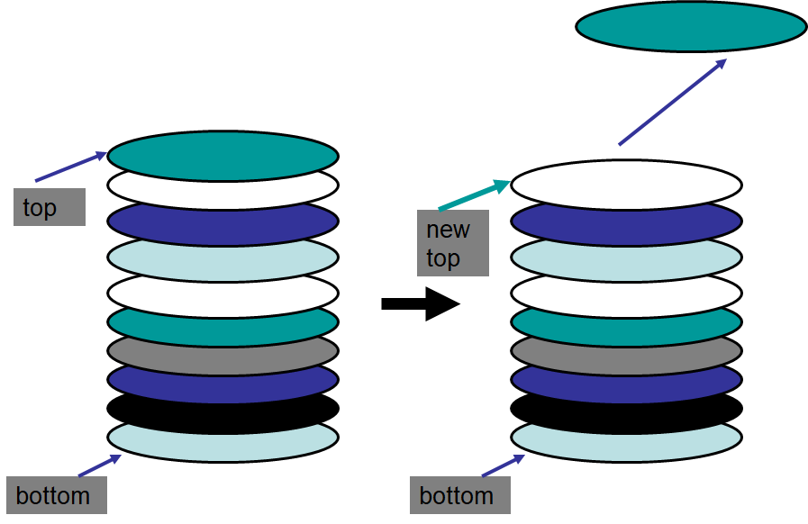

**************************
Topic #5 --- The Stack ADT
**************************

* Stacks are a collection of elements that are only added and removed from one end
    * The *top*

* Given this, the **L**\ ast thing **I**\ n will be the **F**\ irst thing **O**\ ut
    * LIFO

* For example
    * A stack of plates that you'd see at a buffet
    * Webpage history with the back button
    * Undo in your text editor
    * Callstack

**Adding to a Stack**

**Removing from a Stack**

Stack Operations
================

Collection Operations
---------------------

* For the collections we're looking at, we need a way to:
    * Add something to the collection
    * Remove something from the collection
    * Look at something, but do not remove it

* However, the way these are done may differ between collections

* Other things we will want to do with our collections are:
    * ``isEmpty`` --- see if the collection is empty
    * ``size`` --- Check how many things are in the collection
    * ``toString`` --- Get a string version of the collection

Stack Context
-------------

* **Push**
    * Add something to the *top* of the stack

* **Pop**
    * Remove something from the *top* of the stack

* **Peek**
    * Look at the thing on the *top* of the stack, but do **not** remove it

* And we will also want our ``isEmpty``, ``size`` and ``toString``

.. warning::

    It is against our definition of a stack to access anything from anywhere other than the *top* of the stack.

Stack ADT
---------

* With this, we now know what the operators are and how they are used

* Notice how none of the above explains a single thing about *how* the stack is implemented
    * Nothing about where we store the data
    * Nothing about how the operators do what they do

* Notice that this also has nothing to do with Java
    * Or Python
    * Or C++
    * Or ...

* This is just the definition of the stack ADT

Example Use
===========

* We'll use a stack to solve a problem without having to know how it is implemented
    * We can even write the pseudocode for an algorithm using a stack

Maze Solving
------------

    .. image:: img/maze.png
       :width: 250 px
       :align: center

* It is easy to find a path through a maze with a simple *depth first search* algorithm
* The high-level idea is simple
    * Pick path you have not visited yet,
    * Keep going until you find the end or hit a dead end
    * If you hit the end, you're done
    * If you hit a dead end, just backtrack until you can find another path you haven't visited yet
    * Repeat

* The backtracking is very easily handled by a stack
    * The top is the last thing we looked at
    * The thing after the top is the second last thing we looked at
    * ...

Pseudocode for Traversing a Maze
^^^^^^^^^^^^^^^^^^^^^^^^^^^^^^^^

.. code-block::
    :linenos:

    Add the start of the maze to the stack

    While the stack is not empty
        Get the top of the stack with a peek (current cell)
        If the top is the end
            Huzzah, done!

        If an unvisited neighbour of the current cell exists
            Push the neighbour onto the stack
        If no admissible neighbour exists
            Pop from the stack

    If we leave the loop with an empty stack, there is no solution

Example
^^^^^^^

    .. image:: img/maze_gif.gif
       :width: 250 px
       :align: center

* Try to see where the ``push``, ``pop``, and ``peek`` operations are happening

* Again, notice that we were able to use the idea of a stack to solve a problem easily despite not knowing the implementation
    

Interface
=========

* There are many possible ways one could implement a stack data structure
* But, all implementations must be a *stack*
    * They must follow our definition of a stack ADT

* In Java, we can create an **interface** that defines what the operations of the stack ADT are without actually implementing it
* Then, when someone implements the stack ADT, the interface will make sure that the implementation *implements* the operators

* The interface will simply be a list of *abstract methods* and relevant constants
    * Abstract methods are the method signature/header and no actual body
    * Our methods will be ``public``
        * ``public int someMethod(int a, int b);``
        * Although, we don't actually have to say ``public`` here since it has to be
    * Constants will be ``static final``

Stack Interface
------------------

.. code-block:: java
    :linenos:

    public interface Stack <T> {

        // Javadoc comments within Stack.java file
        void push(T element);
        T pop();
        T peek();
        boolean isEmpty();
        int size();
    }

Generics
--------

* You are probably wondering what ``<T>`` is

* Imagine you wanted to have a stack of type ``Integer``, then you'd have to make
    * ``public void push(Integer element);``
    * ``public Integer pop();``
    * ...

* Then, maybe you want to make a stack of Strings
    * ``public void push(String element);``
    * ``public String pop();``
    * ...

* Then maybe a stack of Friends
    * ``public void push(Friend element);``
    * ``public Friend pop();``
    * ...

There has to be a Better Way!
^^^^^^^^^^^^^^^^^^^^^^^^^^^^^

* There is, **generics**

* ``<T>`` is a stand-in for a specific type that we can specify later when we want to create a stack with a specific type
    * You can think of it as like a variable for a type

* Jumping ahead a little, we can specify the type of things we want in our stack like this
    * We will talk about ``ArrayStack`` in the next topic

.. code-block:: java
    :linenos:

    public class SomeClass {
        public static void main(String[] args) {

            Stack<Integer> myIntegerStack = new ArrayStack<Integer>();
            Stack<String> myStringStack = new ArrayStack<String>();
            Stack<Friend> myFriendStack = new ArrayStack<Friend>();
        }
    }

* In the above example, we are creating three stacks, each with a different type of object as its contents
* We have gotten a little ahead of ourselves, but the takeaway is, when we create the instance of the stack, we specify the type we want within the ``<`` and ``>`` brackets
    * We will talk a little more about this in the next topic

.. warning::

    We do not actually need to include the ``<Type>`` on the instantiation side. From now on, for simplicity, I will use the *diamond operator*(``<>``) like so:

        .. code-block:: java
            :linenos:

                    Stack<Integer> myIntegerStack = new ArrayStack<>();
                    Stack<String> myStringStack = new ArrayStack<>();
                    Stack<Friend> myFriendStack = new ArrayStack<>();

For next time
=============

* Checkout the :doc:`Postfix expression evaluation stack example. </topic5-postfix>`
* Checkout the :download:`Stack.java<../main/java/Stack.java>` interface.
* Read Chapter 3 Sections 2 -- 6
    * 13 pages
