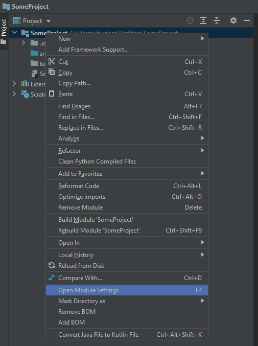
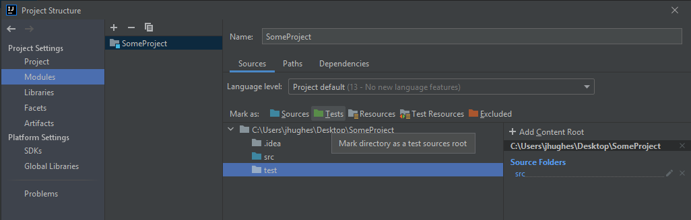

************************
Topic #6 Aside --- Tests
************************

* At the end of Topic 6 we played with our implementation by interacting with it
* This also allowed us to test the basic functionality

Unit Testing
============

* Ideally, when we test our code, we should test each *unit* or *component*
    * *Unit Testing*
    * We want good *coverage*

* When doing so, we will write individual functions to test the units/components
* These tests can also be run automatically

* By writing out tests like this, we end up being deliberate in our testing
    * We take the time to think of the things needing testing
    * It can also help us keep our units/components isolated

* It also obviously helps with testing and debugging
* If we ever make changes to the unit/component being tested, if our changes break it, the automated testing will find it

* Writing tests can be a bit of an art, so it's best to get a lot of practice

JUnit
=====

* JUnit is a very popular unit testing framework for Java
* It's easy to use and automates testing for us
* We will focus on three special things (there is a lot more too it then what will be covered here)
    * ``@Test`` annotation
    * ``@DisplayName`` annotation
    * asserts

* Assuming you are using IntelliJ, here is an easy way to setup JUnit

1. Make a new folder/directory called ``test`` in your project next to ``src``

.. image:: img/test_folder.png
   :width: 500 px
   :align: center

2. Right-click the project name and select *Open Module Settings*

3. Select the ``test`` folder ans select the *Tests*, the green folder, near the top

4. Create a new class for testing called something appropriate
    * Perhaps ``TestArrayStack`` for the below example

5. We need to add JUnit to our class path and an easy way to do it is write ``@Test`` in the new class and hit Alt-Enter
6. Select *Add 'JUnit5....*

.. image:: img/test_altenter.png
   :width: 500 px
   :align: center

* Checkout the :download:`ArrayStackTest.java<../test/java/ArrayStackTest.java>` for testing the ``ArrayStack``.