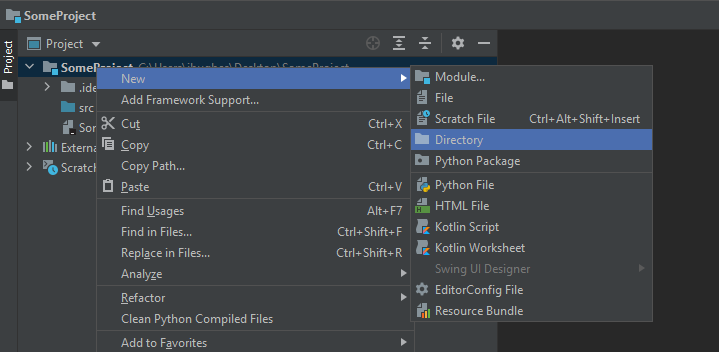
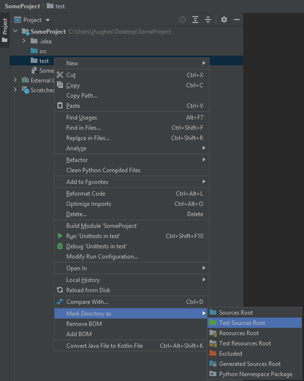
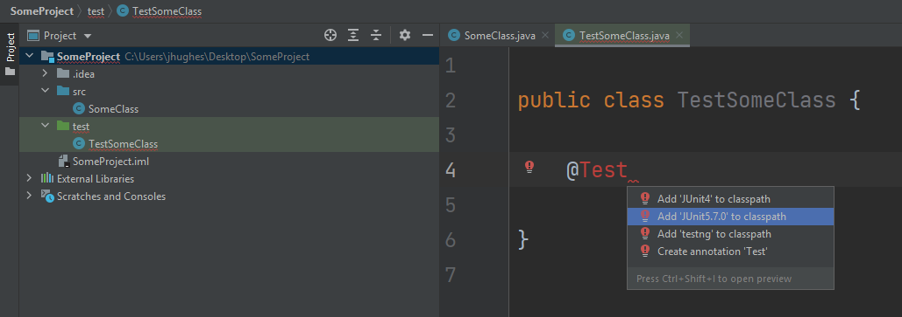

************************
Topic #6 Aside --- Tests
************************

* At the end of Topic 6 we played with our implementation by interacting with it
* This also allowed us to test the basic functionality

Unit Testing
============

* Ideally, when we test our code, we should test each *unit* or *component*
    * *Unit Testing*
    * We want good *coverage*

* When doing so, we will write individual functions to test the units/components
* These tests can also be run automatically

* By writing out tests like this, we end up being deliberate in our testing
    * We take the time to think of the things needing testing
    * It can also help us keep our units/components isolated

* It also obviously helps with testing and debugging
* If we ever make changes to the unit/component being tested, if our changes break it, the automated testing will find it

* Writing tests can be a bit of an art, so it's best to get a lot of practice

JUnit
=====

* JUnit is a very popular unit testing framework for Java
* It's simple to use and automates testing for us
* We will focus on three special things (there is a lot more to it then what will be covered here)
    * ``@Test`` annotation
    * ``@DisplayName`` annotation
    * Assertions

* Assuming you are using IntelliJ, here is a simple way to setup JUnit

1. Make a new folder/directory called ``test`` in your project next to ``src``

2. Right click the ``test`` folder and select *Mark Directory as -> Test Sources Root*

3. Create a new class for testing called something appropriate
    * Perhaps ``ArrayStackTest`` for the below example

4. We need to add JUnit to our class path and a simple way to do it is write ``@Test`` in the new class and hit Alt-Enter
5. Select *Add 'JUnit5....*

Testing ArrayStack
==================

* Checkout the :download:`ArrayStackTest.java<../test/java/ArrayStackTest.java>` for testing the ``ArrayStack``.
* Have a look at all the methods, the imports, function names, etc.

* Below are some examples from the file:

.. code-block:: java
    :linenos:
    :emphasize-lines: 5

    @Test
    @DisplayName("A new stack starts empty.")
    void aNewStackIsEmpty() {
        Stack<Integer> stack = new ArrayStack<>();
        assertTrue(stack.isEmpty());
    }

* Things to note:
    * We add ``@Test`` before the function name
    * We include ``@DisplayName`` to provide a good description of what is being tested
        * This is not actually needed
    * The function name ``aNewStackIsEmpty`` is descriptive

* The ``assertTrue`` is being used to test a specific thing here
    * If the stack is in fact empty after it is created

.. code-block:: java
    :linenos:
    :emphasize-lines: 5

    @Test
    @DisplayName("An empty stack has size 0.")
    void emptyStackHasSizeZero() {
        Stack<Integer> stack = new ArrayStack<>();
        assertEquals(0, stack.size());
    }

* Given that we have a test for ``aNewStackIsEmpty``, if this passes, we know our newly created stack is empty
* We can now test if the ``size`` of the stack is 0 when it is empty
