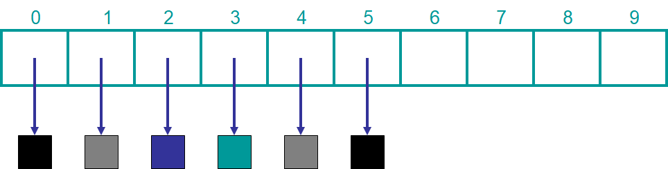
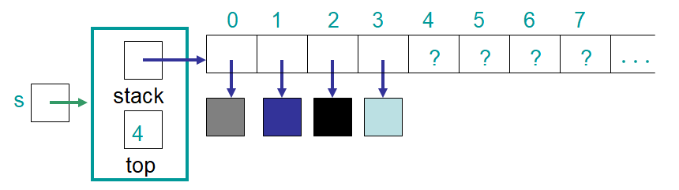
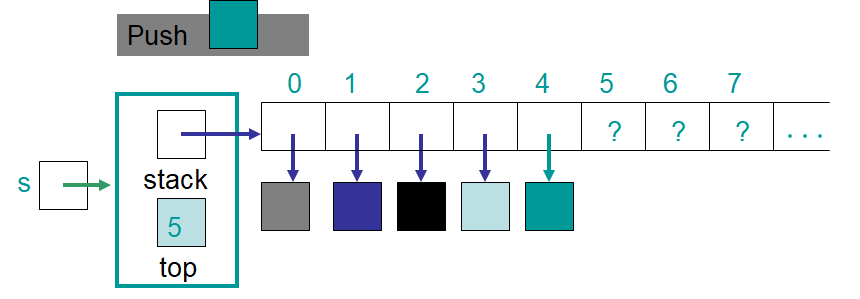
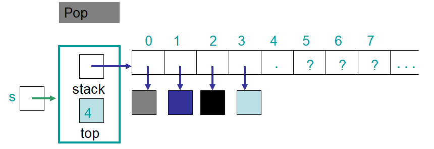

***********************
Topic #6 --- ArrayStack
***********************

* We now are familiar with *what* we want the stack ADT to do without talking about *how*
* Obviously, in order to use a stack in Java, we need to actually implement a stack

* We now need to think about implementation issues
    * How are we going to keep track of our data?
    * How will we know where the top is?
        * This will depend on the choice of how we store the data

Implementing a Stack --- Array Container
========================================

ArrayStack Implementation Issues
--------------------------------

* We've already seen that arrays are great for storing contiguous data

* If this is the case, how should we keep track of the top of the stack?

* What are the pros and cons of making keeping the top index 0?
    * We always know where the top is
    * Every time we ``push`` or ``pop`` we'd need to move everything in the stack

* What are the pros and cons of making the top the other end?
    * We'd need another variable to keep track of where the top is
    * We do not need to shuffle anything around

* The strategy we will use is a variable to keep track of *the next available spot* in the array
    * ``push`` at the ``top`` index and update ``top``
    * ``pop`` at the ``top - 1`` index and update ``top``
* Also, due to zero based indexing, the variable keeping track of ``top`` will always be the number of things in the stack (``size``)

.. image:: img/arraystack3.png
   :width: 500 px
   :align: center

Implementation
--------------

* Let's start our implementation of the ``ArrayStack``

.. code-block:: Java
    :linenos:
    :emphasize-lines: 1

    public class ArrayStack<T> implements Stack<T> {

        private static final int DEFAULT_CAPACITY = 100;
        private T[] stack;
        private int top;

    }

* We want our ``ArrayStack`` to implement the ``Stack`` interface
    * This way anyone using our implementation knows that it is a ``Stack``
        * The ``ArrayStack`` **is a** ``Stack``
            * Anything expecting a ``Stack`` will be happy getting an ``ArrayStack`` since **it is a stack**
    * Note line 1 where we specifically say ``ArrayStack<T> implements Stack<T>``

* Since our ``ArrayStack`` is generic, we don't know what type the array should be at this stage, so we make it an array of type ``T``

.. warning::

    When you start implementing an interface, you may see your IDE to tell you there is an error. This is because, since
    you are saying that you are implementing the interface, Java is expecting you to implement all abstract methods from
    the interface.

        .. image:: img/warning_implement.png
           :width: 500 px
           :align: center

**Constructors**

* Like the ``ContactList`` example, we will make two constructors
    * One will use the default value
    * The other will allow us ot provide a starting size of the array

Expand Capacity
^^^^^^^^^^^^^^^

Exceptional Situations
----------------------

For next time
=============

* Finish reading Chapter 3
    * 16 pages
