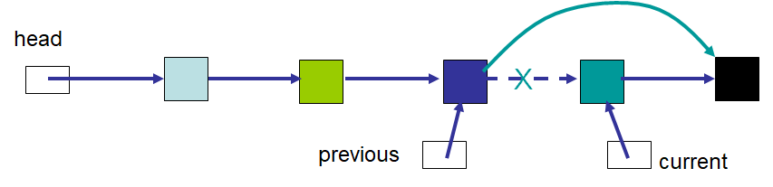

******************
Topic #7 --- Links
******************

.. warning::

    We are not yet defining a new ADT. We're just prepping to start implementing other ADTs with something other than an array.

* Arrays have a fixed size
    * But we can change capacity

* When using an array, we may have to shift things around when adding and removing
* Traditionally speaking, arrays are in contiguous memory addresses
    * JVM asterisk --- In Java, arrays are objects, and objects go into the *heap*, which isn't necessarily contiguous.

Linked Structure
================

* A linked data structure is one that consists of objects referencing other objects

    .. image:: img/links_example0.png
       :width: 500 px
       :align: center

* With this linking idea, we do not need to store the data in consecutive memory locations
    * Successors can be anywhere

* We can insert and delete things without having to shift data
* Linked structures do not have a fixed size

Nodes
=====

* A *node* is a basic unit in our linked structures
* Here we are focusing on *singly linked structures*
    * Each node has only one *link*

* The series of nodes linked together is what makes up the singly linked structure
    * They link to their successor

* A node for a singly linked structure typically has only two fields
    * **data** --- the stuff we want to hold
        * To compare to the array, this would be the stuff we're putting into the cells of the array
    * **next** --- a reference to the successor/next node
        * Arrays don't have this because the successor is just in the next index in the array
            * Asterisk

Inserting into a Linked Structure
=================================

.. image:: img/links_example1.png
   :width: 500 px
   :align: center

* Given the example linked structure
* How would you access the *first* item's data?
* How would you access the *second* item's data?
* How would you access the *third* item's data?
* How would you access the predecessor?
* **HINT:** What are the fields we would have in our node object?

* How would we add something to the *front* of this linked structure?
* How would we add something to the *middle* of this linked structure?
* How would we add something to the *end* of this linked structure?

* How would we remove something to the *front* of this linked structure?
* How would we remove something to the *middle* of this linked structure?
* How would we remove something to the *end* of this linked structure?

Adding to the Front
-------------------

.. image:: img/links_addfront0.png
   :width: 500 px
   :align: center

* Make the node we want to insert's ``next`` reference the current head

.. image:: img/links_addfront1.png
   :width: 500 px
   :align: center

* Make head, the reference to the start of the linked structure, point to the new node

.. image:: img/links_addfront2.png
   :width: 500 px
   :align: center

Adding to the Middle
--------------------

* Locate the node the new node will come after
    * In this example, it is referred to as ``current``

.. image:: img/links_addmiddle1.png
   :width: 500 px
   :align: center

* Make the new node's ``next``  reference the preceding node's (``current``) ``next``

.. image:: img/links_addmiddle2.png
   :width: 500 px
   :align: center

* Have the preceding node's (``current``) ``next`` reference the new node

.. image:: img/links_addmiddle3.png
   :width: 500 px
   :align: center

Adding to the End
-----------------

* We see that adding to the middle is a more general case compared to adding to the front
    * Adding to the front is a special case

* Is adding to the rear a special case?

Removing from a Linked Structure
=================================

Deleting from the Front
-----------------------

* Removing from the front may be the easiest operation

* Make head, the reference to the start of the linked structure, point to the first node's ``next``

Deleting from the Middle
------------------------

.. image:: img/links_removemiddle0.png
   :width: 500 px
   :align: center

* Locate the node to be deleted (``current``) and the node immediately before it (``previous``)

* Make the proceeding node's (``previous``) ``next`` reference the node to be deleted's (``current``) ``next``

Deleting from the End
---------------------

* Is deleting from the end a special case?

Node Implementation
===================

.. image:: img/links_reference.png
   :width: 400 px
   :align: center

* Remember, reference variables contain a reference to an object
* The linked structure uses these references to link it together

* The node implementation for the singly linked structure is kept simple
    * A field to keep track of the data
    * A field to keep track of the next/successor node
    * Constructors
    * Getters and setters

.. code-block:: java
    :linenos:

    public class Node<T> {

        private T data;
        private Node<T> next;

        public Node() {
            this(null);
        }

        public Node(T data) {
            this.data = data;
            this.next = null;
        }

        public T getData() {
            return data;
        }

        public void setData(T data) {
            this.data = data;
        }

        public Node<T> getNext() {
            return next;
        }

        public void setNext(Node<T> next) {
            this.next = next;
        }
    }

Explore the Implementation
--------------------------

.. code-block:: java
    :linenos:

    // Create a Node
    Node<Integer> head = new Node<>(5);
    System.out.println(head.getData());

    // Make a linked structure of the numbers 0 -- 9
    Node<Integer> currentNode = head;
    Node<Integer> newNode;

    for (int i = 1; i < 10; ++i) {
        newNode = new Node<>(i);
        currentNode.setNext(newNode);
        currentNode = currentNode.getNext();
    }

    // Print the contents of the linked structure
    currentNode = head;
    while (currentNode!= null) {
        System.out.println(currentNode.getData());
        currentNode = currentNode.getNext();
    }

    // Try adding to the front, middle, and end of the structure

    // Try removing from the front, middle, and end of the structure

Variations
==========

* For many of the stuff we're learning, there are variations
* You may be wondering: *Can we add references going more than one direction?*
    * Absolutely

Doubly Linked
-------------

.. image:: img/links_double.png
   :width: 400 px
   :align: center

* How would our ``Node`` implementation need to change to achieve this?

For next time
=============

* Download and play with the :download:`Node.java <../main/java/Node.java>` file
* Try writing code to add/remove from the front/middle/end of the linked structure
* Read Chapter 4 Sections 1 -- 3
    * 7 pages
