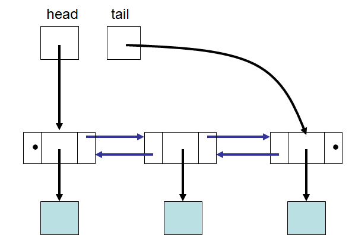

************************************
Topic #8 Aside --- Nested Node Class
************************************

* Consider the doubly linked structure

* Since we need a reference to both the ``next`` and ``previous`` nodes, we can't use our existing ``Node`` :class:
    * Simple to make, but still needs a change

* Also consider that the ``Node`` class would only be used for a linked implementation of something
    * As far as the user of a ``LinkedStack`` is concerned, they don't care about the ``Node`` class, they just care that the ``LinkedStack`` works
        * *I don't know, I don't want to know*
    * Kinda like the private method ``expandCapacity`` in the ``ArrayStack``

* Does it make sense to have the ``Node`` class accessible from everywhere?

Nested Classes
==============

* We can put the ``Node`` class inside the ``LinkedStack`` class
* If we do this, we can still access the ``Node`` class from the ``LinkedStack`` class
* But, it's only accessible from within that class, so it keeps our ``Node`` class out of the way

* Thinking about the doubly linked structure, what should I call the node for the, ``DoubleNode``?

* If we nest it within a class using the doubly linked structure, we can call it ``Node``, but give it ``next`` and ``previous``
* And we will not introduce any ambiguity since the singly linked and doubly linked structure nodes are nested within their respective classes

* We can achieve similar results with packages, but since the two classes are inextricably connected, nesting ``Node`` just makes sense

Nesting in LinkedStack
======================

.. code-block:: java
    :linenos:
    :emphasize-lines: 65-94

    import java.util.NoSuchElementException;

    public class LinkedStack<T> implements Stack<T> {

        private Node<T> top;
        private int size;

        public LinkedStack() {
            top = null;
            size = 0;
        }

        @Override
        public void push(T element) {
            Node<T> toPush = new Node<T>(element);
            toPush.setNext(top);
            top = toPush;
            size++;
        }

        @Override
        public T pop() {
            if (isEmpty()) {
                throw new NoSuchElementException("Popping from an empty stack.");
            }
            T returnElement = top.getData();
            top = top.getNext();
            size--;
            return returnElement;
        }

        @Override
        public T peek() {
            if (isEmpty()) {
                throw new NoSuchElementException("Popping from an empty stack.");
            }
            return top.getData();
        }

        @Override
        public boolean isEmpty() {
            return size == 0;
        }

        @Override
        public int size() {
            return size;
        }

        @Override
        public String toString() {
            StringBuilder builder = new StringBuilder();
            builder.append(", ");
            Node<T> currentNode = top;
            while (currentNode != null) {
                builder.insert(0, currentNode.getData());
                builder.insert(0, ", ");
                currentNode = currentNode.getNext();
            }
            builder.delete(0, 2);
            builder.append("<-- Top\n");
            return builder.toString();
        }

        private static class Node<T> {

            private T data;
            private Node<T> next;

            public Node() {
                this(null);
            }

            public Node(T data) {
                this.data = data;
                this.next = null;
            }

            public T getData() {
                return data;
            }

            public void setData(T data) {
                this.data = data;
            }

            public Node<T> getNext() {
                return next;
            }

            public void setNext(Node<T> next) {
                this.next = next;
            }
        }
    }
