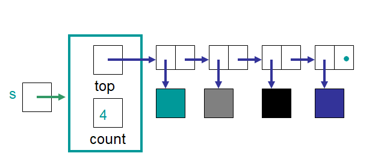
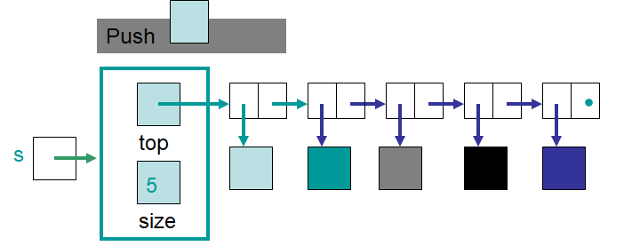
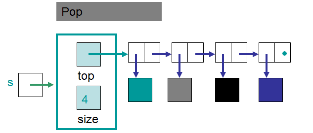
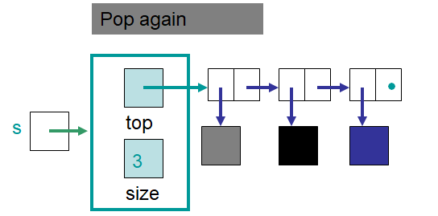
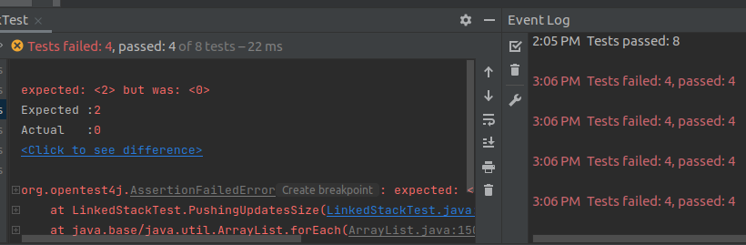

************************
Topic #8 --- LinkedStack
************************

* We have already implemented a ``Stack`` as an ``ArrayStack``
* We have also seen how we can use a series of nodes to create a linked structure
* Let's now implement a ``Stack`` as a ``LinkedStack`` which uses a linked structure to hold onto the data

StackADT
========

* :download:`We already wrote our Stack.java<../main/java/Stack.java>` interface

* Remember, for a ``Stack`` we want
    * ``push``
    * ``pop``
    * ``peek``
    * ``size``
    * ``isEmpty``

* Also remember that these say nothing about *how* exactly these are implemented

Implementing a Stack --- Linked Container
=========================================

* We will keep track of the top of the stack with a field called ``top`` that references the head of the linked structure
    * All pushing and popping happens at the head end of the linked structure
* We will also keep track of the count

Implementation
--------------

.. code-block:: java
    :linenos:

    import java.util.NoSuchElementException;

    public class LinkedStack<T> implements Stack<T> {

        private Node<T> top;
        private int size;

        public LinkedStack() {
            top = null;
            size = 0;
        }

* Like the ``ArrayStack``, we want our ``LinkedStack`` to implement the ``Stack`` interface
* The constructor starts the stack as empty with nothing on it

Push
^^^^

.. code-block:: java
    :linenos:
    :emphasize-lines: 4, 5

        @Override
        public void push(T element) {
            Node<T> toPush = new Node<T>(element);
            toPush.setNext(top);
            top = toPush;
            size++;
        }

* In ``push``, notice how this is just *adding to the front of a linked structure*

Pop & Peek
^^^^^^^^^^

.. code-block:: java
    :linenos:
    :emphasize-lines: 7

        @Override
        public T pop() {
            if (isEmpty()) {
                throw new NoSuchElementException();
            }
            T returnElement = top.getData();
            top = top.getNext();
            size--;
            return returnElement;
        }

        @Override
        public T peek() {
            if (isEmpty()) {
                throw new NoSuchElementException();
            }
            return top.getData();
        }

* Like the ``ArrayStack``, popping or peeking from an empty stack throws an exception
* Notice how ``pop`` does a *remove/delete from the front of a linked structure*

Size and isEmpty
^^^^^^^^^^^^^^^^

.. code-block:: java
    :linenos:

        @Override
        public boolean isEmpty() {
            return size == 0;
        }

        @Override
        public int size() {
            return size;
        }

* The ``LinkedStack`` is empty if its ``size == 0``
    * Can you think of another way to check if it's empty?

toString
^^^^^^^^

.. code-block:: java
    :linenos:

        @Override
        public String toString() {
            StringBuilder builder = new StringBuilder();
            builder.append(", ");
            Node<T> currentNode = top;
            while (currentNode != null) {
                builder.insert(0, currentNode.getData());
                builder.insert(0, ", ");
                currentNode = currentNode.getNext();
            }
            builder.delete(0, 2);
            builder.append("<-- Top");
            return builder.toString();
        }

* It's a little ugly here
* We have it matching the output format that the ``ArrayStack``'s ``toString`` had

Testing LinkedStack
===================

* To ensure correctness, we will write tests with JUnit
    * :doc:`If you have not yet, read the testing aside </topic6-testing>`

* All the tests will be the same as the ``ArrayStack``, except we do not need to check the ``expandCapacity``
    * ``expandCapacity`` is not a thing in our ``LinkedStack`` implementation

.. code-block:: java
    :linenos:

        @Test
        @DisplayName("A new stack starts empty.")
        void aNewStackIsEmpty() {
            Stack<Integer> stack = new LinkedStack<>();
            assertTrue(stack.isEmpty());
        }

        @Test
        @DisplayName("An empty stack has size 0.")
        void emptyStackHasSizeZero() {
            Stack<Integer> stack = new LinkedStack<>();
            assertEquals(0, stack.size());
        }

        @Test
        @DisplayName("isEmpty return false when it is non empty.")
        void nonEmptyStackIsEmptyReturnsFalse() {
            Stack<Integer> stack = new LinkedStack<>();
            stack.push(99);
            assertFalse(stack.isEmpty());
        }

        @Test
        @DisplayName("Pushing items updates the size of the stack.")
        void pushingUpdatesSize() {
            Stack<Integer> stack = new LinkedStack<>();
            stack.push(99);
            stack.push(101);
            assertEquals(2, stack.size());
        }

        @Test
        @DisplayName("Pushing an item results in it being on the top.")
        void pushedItemIsTopOfStack() {
            Stack<Integer> stack = new LinkedStack<>();
            stack.push(99);
            assertEquals(99, stack.peek());
        }

        @Test
        @DisplayName("Push and Pop returns in LIFO order.")
        void pushingAndPoppingReturnsElementsInLIFOOrder() {
            Stack<Integer> stack = new LinkedStack<>();
            for (int i = 0; i < 6; ++i) {
                stack.push(i);
            }
            for (int i = 5; i >= 0; --i) {
                assertEquals(i, stack.pop());
            }
        }

        @Test
        @DisplayName("Pop throws NoSuchElementException when stack is empty.")
        void popEmptyStackThrowsException() {
            Stack<Integer> stack = new LinkedStack<>();
            assertThrows(NoSuchElementException.class, () -> stack.pop());
        }

        @Test
        @DisplayName("Peek throws NoSuchElementException when stack is empty.")
        void peekEmptyStackThrowsException() {
            Stack<Integer> stack = new LinkedStack<>();
            assertThrows(NoSuchElementException.class, () -> stack.peek());
        }

Introduction Errors for Fun
---------------------------

* To see what happens when a test fails, let's add an error into our ``LinkedStack`` implementation
* Comment out the ``size`` updates in the ``LinkedStack`` class

.. code-block:: java
    :linenos:
    :emphasize-lines: 6, 16

        @Override
        public void push(T element) {
            Node<T> toPush = new Node<T>(element);
            toPush.setNext(top);
            top = toPush;
            //size++;
        }

        @Override
        public T pop() {
            if (isEmpty()) {
                throw new NoSuchElementException();
            }
            T returnElement = top.getData();
            top = top.getNext();
            //size--;
            return returnElement;
        }

* Once the change is made, run the tests to see what happens

For next time
=============

* Look into the :doc:`nested node class aside. </topic8-nested>`
* Download and play with the :download:`LinkedStack <../main/java/LinkedStack.java>` code
* Download and run the :download:`LinkedStackTest <../test/java/LinkedStackTest.java>` tests
* Read Chapter 4 Section 6
    * 13 pages

Playing
=======

* We can use the same code we used for the ``ArrayStack`` to play with the ``LinkedStack``
* We only need to make one change
    * ``ArrayStack`` -> ``LinkedStack``

.. code-block:: java
    :linenos:

    // Create a LinkedStack
    Stack<Integer> myStack = new LinkedStack<>();

    // Check stack is empty
    System.out.println(myStack.size());
    System.out.println(myStack.isEmpty());
    System.out.println(myStack);

    // Test push
    myStack.push(0);
    myStack.push(1);
    myStack.push(2);
    myStack.push(3);
    myStack.push(4);
    System.out.println(myStack.size());
    System.out.println(myStack.isEmpty());
    System.out.println(myStack);

    // No test for expandCapacity since LinkedStack
    // doesn't need it, but test more pushes anyways
    // as the functionality does not change either way
    myStack.push(10);
    myStack.push(11);
    myStack.push(12);
    myStack.push(13);
    myStack.push(14);
    System.out.println(myStack.size());
    System.out.println(myStack.isEmpty());
    System.out.println(myStack);

    // Test peek
    System.out.println(myStack.peek());
    System.out.println(myStack.size());
    System.out.println(myStack.isEmpty());
    System.out.println(myStack);

    // Test Pop
    System.out.println(myStack.pop());
    System.out.println(myStack.pop());
    System.out.println(myStack.pop());
    System.out.println(myStack.pop());
    System.out.println(myStack.pop());
    System.out.println(myStack.pop());
    System.out.println(myStack.pop());
    System.out.println(myStack.pop());
    System.out.println(myStack.pop());
    System.out.println(myStack.pop());
    System.out.println(myStack.size());
    System.out.println(myStack.isEmpty());
    System.out.println(myStack);

    // Test peek and pop throwing exception
    try {
        myStack.peek();
    }
    catch (NoSuchElementException e) {
        e.printStackTrace();
    }
    try {
        myStack.pop();
    }
    catch (NoSuchElementException e) {
        e.printStackTrace();
    }