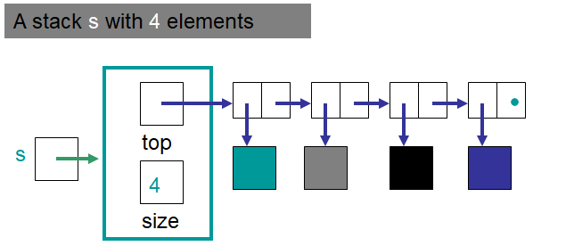

************************
Topic #8 --- LinkedStack
************************

* We have already implemented a ``Stack`` as an ``ArrayStack``
* We have also seen how we can use a series of nodes to create a linked structure
* Let's now implement a ``Stack`` as a ``LinkedStack`` which uses a linked structure to hold onto the data

StackADT
========

* :download:`We already wrote our Stack.java<../main/java/Stack.java>` interface

* Remember, for a ``Stack`` we want
    * ``push``
    * ``pop``
    * ``peek``
    * ``size``
    * ``isEmpty``

* Also remember that these say nothing about *how* exactly these are implemented

Implementing a Stack --- Linked Container
=========================================

* We will keep track of the top of the stack with a field called ``top`` that references the head of the linked structure
    * All pushing and popping happens at the head end of the linked structure
* We will also keep track of the count

.. image:: img/linkedstack1.png
   :width: 500 px
   :align: center

.. image:: img/linkedstack2.png
   :width: 500 px
   :align: center

.. image:: img/linkedstack3.png
   :width: 500 px
   :align: center

For next time
=============

* Read Chapter 4 Section 6
    * 13 pages
