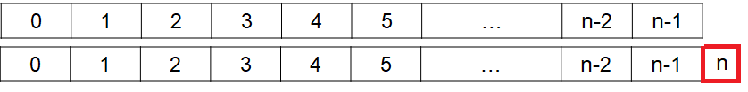

********************************************
Topic #9 Aside --- Amortized Time Complexity
********************************************

.. warning::

    This explanation of amortized time complexity analysis is brief and high-level as it is outside the scope of this course.

* There's actually a bit of a *gotcha* in the push example for an ``ArrayStack``

.. code-block:: java
    :linenos:
    :emphasize-lines: 4, 12, 13, 14

    // ArrayStack's push
    public void push(T element) {
        if (top == stack.length) {
            expandCapacity();
        }
        stack[top] = element;
        top++;
    }

    private void expandCapacity() {
        T[] newStack = (T[]) new Object[stack.length * 2];
        for (int i = 0; i < stack.length; ++i) {
            newStack[i] = stack[i];
        }
        stack = newStack;
    }

* ``expandCapacity`` is an :math:`O(n)` function
* And since ``push`` calls ``expandCapacity``, we know that ``push`` will at least be :math:`O(n)`
* **However**, how often is ``expandCapacity`` actually called?

Amortization
============

* We can *amortize*, or, *spread out* the work over multiple calls of ``push``

1. Let's say we have an empty ``ArrayStack`` with a capacity of :math:`n`
2. We get a total of :math:`n` pushes that take constant time :math:`O(1)`
3. If we try to push again, we will need to call ``expandCapacity``, which is :math:`O(n)`

* Notice how we only needed to call an :math:`O(n)` operation once every :math:`n` constant time :math:`O(1)` calls of ``push``
* We can think of amortizing/spreading out this :math:`O(n)` work over the :math:`n` constant time calls

* We think of all these parts as a whole expression
* :math:`(n O(1) + O(n)) / (n + 1) = n O(1) / (n + 1) + O(n) / (n + 1)`
* This tells us how much work is being done on average over the :math:`n +1` ``push`` calls
* If we roughly divide this out, each term comes out to :math:`O(1)`

.. image:: img/complexity_amortization0.png
   :width: 500 px
   :align: center

* Spread out the :math:`O(n)` work over the previous :math:`n` calls to ``push``

