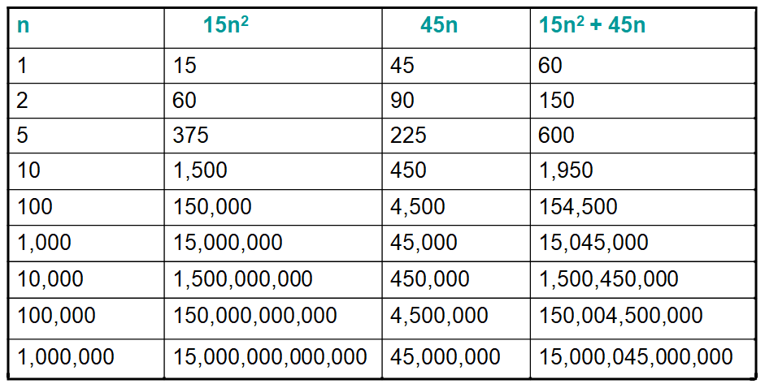
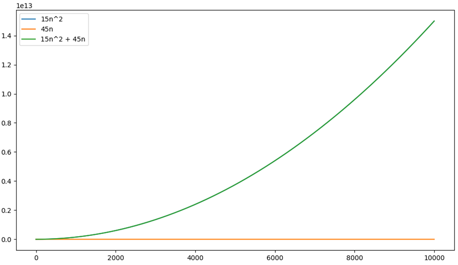
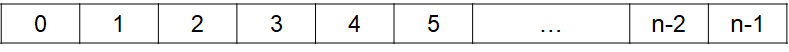
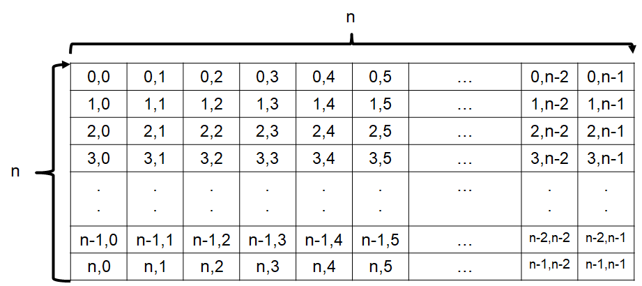

*******************************
Topic #9 --- Algorithm Analysis
*******************************

* What does it mean for an algorithm to be *good*?
* What makes one algorithm for solving a given problem better than another?
* Your algorithm may be correct, but is it practical?

* These questions can be answered in many ways, but one important measurement is how much resources does your algorithm need?
    * How much time to compute?
    * How much memory does it need?
    * How many processors does it need?
    * How does the amount of resources change relative to some input value?

* The above considerations are all important, but we will start by focusing on *Time Complexity*

Time Complexity
===============

* We analyze the amount of time the algorithm needs *relative to the input size*
    * How long does it take to sort 10 items?
    * How long does it take to sort 10,000 items?

* We also consider the number of operations needed for the algorithm, and the time complexity of those operations
    * Addition
    * Comparisons

* When we have a better understanding of our algorithm's time complexity, it can help us choose the right tool for the job

Growth Function
===============

* We want to understand the relationship between the size of the input :math:`n` and the time it takes to run the algorithm :math:`t(n)`
    * The size of input could be the length of a list to be sorted
    * How does the time to run the algorithm :math:`t(n)` change as :math:`n` changes?

* We call :math:`t(n)` the *growth function*
* Notice how :math:`t(n)` is a function of :math:`n`
    * This means the amount of time needed depends on :math:`n`

* Here is an arbitrary growth function
    * At this stage, don't worry about how we got it as we will come back to that

    :math:`t(n) = 15n^{2} + 25n`

* This table shows how each of the parts of the :math:`t(n)` growth function change as :math:`n` grows
* Take note as to which part can be blamed for most of the whole :math:`t(n)`

* When :math:`n` is small, which part of the expression gives a larger value?
* As :math:`n` **grows**, which becomes bigger?
* How much do the constants (:math:`15` and :math:`45`) impact the values?
    * Do they affect how big the numbers change as :math:`n` increases?

* This plot compares the parts of the function to the function itself
* Notice the scale of the axes
* See how the part that grows linearly, :math:`45n`, appears to be a horizontal line at this scale
* Also notice how the blue :math:`15n^{2}` line is perfectly covered by the green :math:`15n^{2} + 45n` line

* In other words, the :math:`45n` part of the function is effectively inconsequential when looking at the bigger picture
* Given this, and the fact that constants only scale the values, we say that the :math:`n^{2}` is the **dominant** term

.. warning::

    One thing students tend to miss when first learning about computational complexity is that the function tells us
    how things change relative to :math:`n`. At this stage, we're not worrying about any absolute values.

    For example, given this growth function...

        .. math::

            t(n) = n^{2} + 999n

    you may say that the :math:`999n` part of the function is going to dominate for all values :math:`n < 999`, which is
    true. However, this is not the point of complexity analysis. The point is identifying which part of the function
    **grows** faster, and in this example, :math:`n^{2}` absolutely grows faster.

    This is **not** to suggest that the observation of :math:`n < 999` is not important or valuable; this is only to
    highlight that it's about change and growth.

Deriving Growth Functions
==========================

* We learned how to go from :math:`t(n)` to :math:`O(n)`
* How do we get :math:`t(n)` in the first place?
    * Look at the code!

.. warning::

    For simplicity, we will pretend some constant time (:math:`O(1)`) statements take :math:`1` unit of work when in
    reality they may take more. This is safe to do since constants are ignored.

Statements
----------

.. code-block:: java
    :linenos:

    int x = 0;      // 1 unit of work
    int y = 1;      // 1 unit of work
    int z = x + y;  // 1 unit of work

**Growth Function:** :math:`t(n) = 3`
**Order:** :math:`O(1)`

Loops
-----

* The number of times a loop executes may dependant on some value :math:`n`

.. code-block:: java
    :linenos:

    int x = 0;                      // 1 unit of work
    for (int i = 0; i < n; ++i) {
        x = x + 1;                  // 1 unit of work n times (1*n)
    }

**Growth Function:** :math:`t(n) = 1 + 1n`
**Order:** :math:`O(n)`

* We can think of the loop and a number line
* Every time the loop runs, we put our finger on the next number

* How many things did we put our finger on?

Nested Loops
------------

* Can get hairy, but there's no secret trick beyond the rules we've seen so far

.. code-block:: java
    :linenos:

    int x = 0;                          // 1 unit of work
    int y = 0;                          // 1 unit of work
    for (int i = 0; i < n; ++i) {       // Everything in loop runs n times
        x = x + 1;                      // 1 unit of work n times (1*n)
        for (int j = 0; j < n; ++j) {   // Runs n times and everything in this loop runs another n times
            y = y - 1;                  // 1 unit of work n times, n times
        }
    }

* It may be more clear to work from the inside out

**Growth Function:** :math:`t(n) = (1n + 1)n + 2 = n^{2} + 1n + 2`
**Order:** :math:`O(n^{2})`

* ``y = y - 1;`` runs :math:`n` times (a single row)
* And the loop that ``y = y - 1`` is within is run :math:`n` times (all rows)
* How many things did we put our finger on?

Tests
-----

.. code-block:: java
    :linenos:
    :emphasize-lines: 5

    int x = 0;
    int y = 0;
    for (int i = 0; i < n; ++i) {
        x = x + 1;
        for (int j = i; j < n; ++j) {
            y = y - 1;
        }
    }

* **HINT:** I like to connect this to the :math:`n \times n` square to help

**Growth Function:** :math:`t(n) = ??`
**Order:** :math:`O(??)`

.. code-block:: java
    :linenos:
    :emphasize-lines: 2

    int x = 0;
    for (int i = 0; i < n; i = i + 2) {     // i = i + 2
        x = x + 1;
    }

* **HINT:** I like to connect this to the number line of length :math:`n` to help

**Growth Function:** :math:`t(n) = ??`
**Order:** :math:`O(??)`

.. code-block:: java
    :linenos:
    :emphasize-lines: 2

    int x = 0;
    for (int i = 1; i < n; i = i * 2) {     // i = i * 2
        x = x + 1;
    }

* **HINT:** I like to connect this to the number line of length :math:`n` to help
* **HINT:** How quickly will we run out of number in the number line?

**Growth Function:** :math:`t(n) = ??`
**Order:** :math:`O(??)`

Asymptotic Growth
=================

Big-O Notation
==============

Examples
========

For next time
=============

* Read Chapter 2 of your text
    * 14 pages
