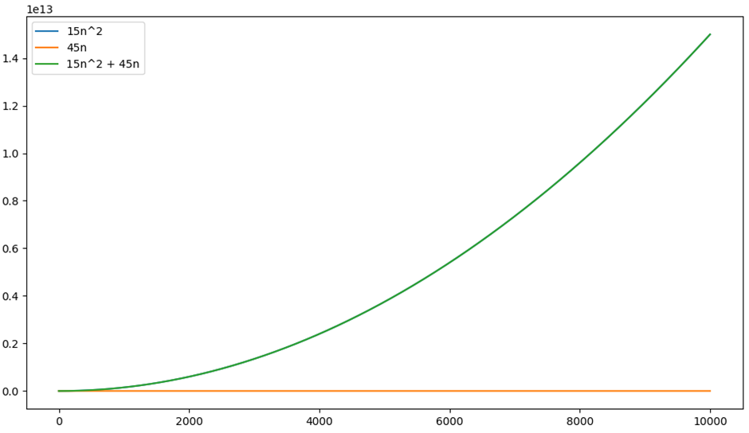
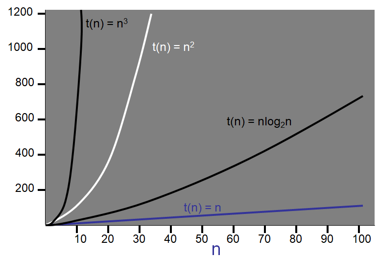
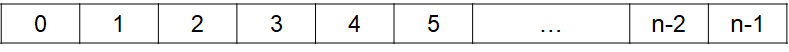
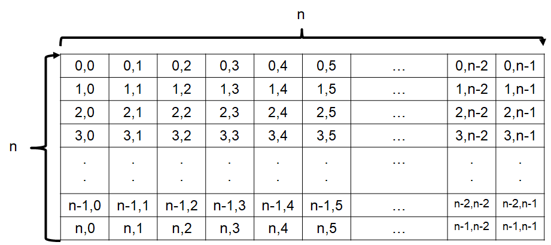

******************
Algorithm Analysis
******************

* What does it mean for an algorithm to be *good*?
* What makes one algorithm for solving a given problem better than another?
* Does the algorithm have a practical runtime?
* These questions can be answered in many ways, but one important measurement is how much resources does your algorithm need?

    * How much time to compute?
    * How much memory does it need?
    * How many processors does it need?
    * How does the amount of resources change relative to some input value?

* The above considerations are all important, but here, the focus is on *Time Complexity*

Time Complexity
===============

* The amount of time an algorithm needs *relative to the input size*

    * How long does it take to sort 10 items?
    * How long does it take to sort 10,000 items?

* Considers the number of operations needed for the algorithm, and the time complexity of those operations

    * Addition
    * Comparisons

* With an understanding of an algorithm's time complexity, one can make informed decisions when picking the tools for a job

    * For example, which data structures to use in certain scenarios

Growth Function
===============

* It is important to understand the relationship between the size of the input :math:`n` and the time it takes to run an algorithm :math:`t(n)`

    * For example, the size of input could be the length of a list to be sorted
    * How does the time to run the algorithm :math:`t(n)` change as :math:`n` changes?

* This :math:`t(n)` is called the *growth function*
* Notice how :math:`t(n)` is a function of :math:`n`

    * This means the amount of time depends on :math:`n`

* Consider this arbitrary growth function --- :math:`t(n) = 15n^{2} + 45n`

    * Details on deriving the growth function is discussed below

.. list-table:: How the growth function and the individual parts of the growth function change as :math:`n` increases.
    :widths: 50 50 50 50 50
    :header-rows: 1

    * - :math:`n`
      - :math:`15n^{2}`
      - :math:`45n`
      - :math:`15n^{2} + 45n`
      - :math:`\frac{15n^{2}}{15n^{2} + 45n}`
    * - 1
      - 15
      - 45
      - 60
      - 0.25
    * - 2
      - 60
      - 90
      - 150
      - 0.40
    * - 5
      - 375
      - 225
      - 600
      - 0.625
    * - 10
      - 1,500
      - 450
      - 1,950
      - 0.769230769
    * - 100
      - 150,000
      - 4,500
      - 154,500
      - 0.970873786
    * - 1,000
      - 15,000,000
      - 450,000
      - 15,045,000
      - 0.997008973
    * - 10,000
      - 1,500,000,000
      - 450,000
      - 1,500,450,000
      - 0.99970009
    * - 100,000
      - 150,000,000,000
      - 4,500,000
      - 150,004,500,000
      - 0.999970001
    * - 1,000,000
      - 15,000,000,000,000
      - 45,000,000
      - 15,000,045,000,000
      - 0.999997

* This table shows how each of the parts of the :math:`t(n)` growth function changes as :math:`n` grows
* Take note as to which part can be *blamed* for most of the total work done within :math:`t(n)`

* When :math:`n` is small, which part of the expression gives a larger value?
* As :math:`n` grows, which becomes bigger?
* How much do the constants (:math:`15` and :math:`45`) impact the values?

    * Do they affect how big the numbers change as :math:`n` increases?

    Plot of :math:`t(n)` (y-axis) against :math:`n` (x-axis). Note that :math:`15n^{2}` is covered by
    :math:`15n^{2} + 45n` as their growths are so similar at this scale. Further, at this scale, the portion of the
    the growth function that is linear (:math:`45n`) appears to be a horizontal line.

* This figure compares the individual parts of the growth function to the growth function itself
* Notice the scale of the axes
* Also notice how the blue :math:`15n^{2}` line is perfectly covered by the green :math:`15n^{2} + 45n` line
* See how the part that grows linearly, :math:`45n`, appears to be a horizontal line at this scale

    * In other words, the :math:`45n` part of the function is effectively inconsequential in this context

* Given this, and the fact that constants only scale the values, we say that the :math:`n^{2}` is the **dominant** term

.. warning::

    One thing students tend to miss when first learning about computational complexity is that the function describes
    how things change relative to :math:`n`. At this stage, the discussion is not about any absolute runtime value.

    For example, given this growth function :math:`t(n) = n^{2} + 999n` one may say that the :math:`999n` part of the
    function is going to dominate for all values :math:`n < 999`, which is true. However, this is not the point of
    complexity analysis. The point is identifying which part of the function *grows* faster, and in this example,
    :math:`n^{2}` grows faster.

    This is **not** to suggest that the observation of when :math:`n < 999` is not important or valuable; this is only
    to highlight that the focus here is about change and growth.

Asymptotic Growth & Big-O
=========================

* Constants and coefficients are not too important
* Non dominant terms are not too important
* The actual growth function is not that important
* The *asymptotic complexity* is important

    * The time the algorithm takes, as a function of :math:`n`, *will grow like...*

* The *order* of the algorithm is specified using *Big-O notation*
* The above example, :math:`t(n) = 15n^{2} + 45n`, has an order of :math:`O(n^{2})` since it grows like :math:`n^{2}`

Example Growth Functions and Their Order
----------------------------------------

.. list-table:: Example growth functions with their order denoted in Big-O notation.
    :widths: 50 50
    :header-rows: 1

    * - Growth Function
      - Order
    * - :math:`t(n) = 17`
      - :math:`O(1)`
    * - :math:`t(n) = 20n - 4`
      - :math:`O(n)`
    * - :math:`t(n) = 12n \log_{2}(n) + 100n`
      - :math:`O(n\log_{2}(n))`
    * - :math:`t(n) = 3n^{2} + 5n - 2`
      - :math:`O(n^{2})`
    * - :math:`t(n) = 2^{n} + 3n`
      - :math:`O(2^{n})`

    Example curves of common time complexities.

* `It is typical to see the order of a growth functions expressed as one of a few common expressions <https://en.wikipedia.org/wiki/Big_O_notation#Orders_of_common_functions>`_

.. list-table:: Example growth functions with their order left blank as an exercise.
    :widths: 50 50
    :header-rows: 1

    * - Growth Function
      - Order
    * - :math:`t(n) = 5n^{2} + 3n`
      - :math:`O(?)`
    * - :math:`t(n) = n^{3} + \log_{2}(n) - 4`
      - :math:`O(?)`
    * - :math:`t(n) = 10n \log_{2}(n) + 5`
      - :math:`O(?)`
    * - :math:`t(n) = 3n^{3} + 3n^{2} + 3`
      - :math:`O(?)`
    * - :math:`t(n) = 2^{n} + 18n^{10}`
      - :math:`O(?)`

Deriving Growth Functions
==========================

* Growth functions, :math:`t(n)`, are derived by investigating the code

.. note::

    For simplicity, constant time (:math:`O(1)`) statements will be said to take :math:`1` unit of work. In reality,
    they may take more, but they will ultimately still take constant time, and constants are ignored.

Statements
----------

.. code-block:: java
    :linenos:

    int x = 0;      // 1 unit of work
    int y = 1;      // 1 unit of work
    int z = x + y;  // 1 unit of work

**Growth Function:** :math:`t(n) = 3`

**Order:** :math:`O(1)`

Loops
-----

* The number of times a loop executes may dependant on some value :math:`n`

.. code-block:: java
    :linenos:

    int x = 0;                      // 1 unit of work
    for (int i = 0; i < n; i++) {
        x = x + 1;                  // 1 unit of work n times (1*n)
    }

**Growth Function:** :math:`t(n) = 1 + 1n`

**Order:** :math:`O(n)`

* With a loop, consider a number line
* The :math:`i^{th}` number in the number line is *visited* each time the loop executes a single iteration
* How many numbers were *visited*?

    Example number line of length :math:`n`.

Nested Loops
------------

* This can feel tricky, but there is no trick beyond the rules discussed so far

.. code-block:: java
    :linenos:

    int x = 0;                          // 1 unit of work
    int y = 0;                          // 1 unit of work
    for (int i = 0; i < n; i++) {       // Everything in loop runs n times
        x = x + 1;                      // 1 unit of work n times (1*n)
        for (int j = 0; j < n; j++) {   // Runs n times and everything in this loop runs another n times
            y = y - 1;                  // 1 unit of work n times, n times
        }
    }

* It may be easier to work from the inside out

**Growth Function:** :math:`t(n) = (1n + 1)n + 2 = n^{2} + n + 2`

**Order:** :math:`O(n^{2})`

* Consider the below :math:`n \times n` matrix in the context of the above code

    * ``y = y - 1;`` is represented by a single spot in the matrix (constant time operation)
    * ``y = y - 1;`` runs :math:`n` times by a loop, which is represented by a single row
    * The whole loop that contains ``y = y - 1`` is within another loop that is run :math:`n` times, which is represented by all rows
    * How many things were *visited*?

    Example :math:`n \times n` matrix.

Exercises
---------

.. code-block:: java
    :linenos:
    :emphasize-lines: 2

    int x = 0;
    for (int i = 0; i < n; i = i + 2) {     // note how i is incremented
        x = x + 1;
    }

* **HINT:** Keep the number line of length :math:`n` in mind

**Growth Function:** :math:`t(n) = ?`

**Order:** :math:`O(?)`

.. code-block:: java
    :linenos:
    :emphasize-lines: 5

    int x = 0;
    int y = 0;
    for (int i = 0; i < n; i++) {
        x = x + 1;
        for (int j = i; j < n; j++) {       // j starts at i
            y = y - 1;
        }
    }

* **HINT:** Keep the :math:`n \times n` matrix in mind

**Growth Function:** :math:`t(n) = ?`

**Order:** :math:`O(?)`

.. code-block:: java
    :linenos:
    :emphasize-lines: 2

    int x = 0;
    for (int i = 1; i < n; i = i * 2) {     // note how i is updated
        x = x + 1;
    }

* **HINT:** Keep the number line of length :math:`n` in mind
* **HINT:** How quickly will the numbers in the number line *run out*?

**Growth Function:** :math:`t(n) = ?`

**Order:** :math:`O(?)`

Stack Comparisons
=================

* Two implementations of the stack were implemented
* Stacks are pretty efficient in general, but which is *better*?

    * ``LinkedStack`` vs ``ArrayStack``

Popping
-------

.. literalinclude:: /../main/java/LinkedStack.java
    :language: java
    :linenos:
    :lineno-start: 32
    :lines: 32-41

.. literalinclude:: /../main/java/ArrayStack.java
    :language: java
    :linenos:
    :lineno-start: 59
    :lines: 59-68

Pushing
-------

.. literalinclude:: /../main/java/LinkedStack.java
    :language: java
    :linenos:
    :lineno-start: 23
    :lines: 23-30

.. literalinclude:: /../main/java/ArrayStack.java
    :language: java
    :linenos:
    :lineno-start: 37
    :lines: 37-57
    :emphasize-lines: 4, 17, 18, 19

For Next Time
=============

* Read the :doc:`amortized time complexity aside <amortized>`.
* Read Chapter 2 of your text

    * 14 pages
