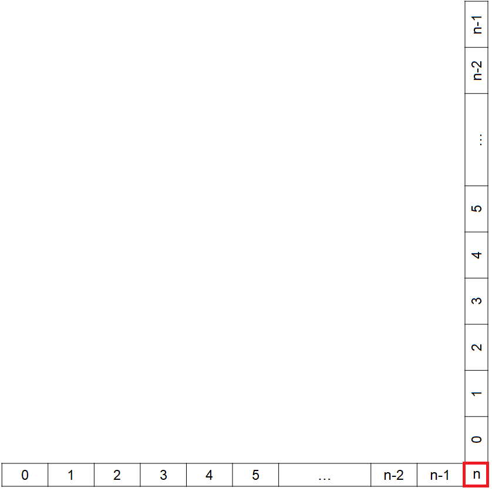
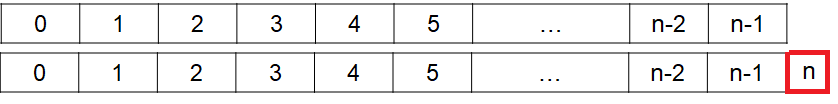

***********************************
Aside --- Amortized Time Complexity
***********************************

.. warning::

    This explanation of amortized time complexity analysis is brief and high-level as it is outside the scope of this
    course. It is only included here for those interested as some may find that the additional context helps with their
    understanding.

* There's actually a bit of a *gotcha* in the push example for an ``ArrayStack``

.. literalinclude:: /../main/java/ArrayStack.java
    :language: java
    :linenos:
    :start-after: // [start-push]
    :end-before: // [end-push]

* Since ``expandCapacity`` is an :math:`O(n)` method
* And since ``push`` calls ``expandCapacity``, ``push`` will at least be :math:`O(n)`
* However, how often is ``expandCapacity`` actually called?

Amortization
============

* The trick is to realize that the work can be *amortized*, or, *spread out* over multiple calls of ``push``

#. Consider an empty ``ArrayStack`` with a capacity of :math:`n`
#. A total of :math:`n` constant time ``push`` operations can occur before the capacity it hit

    * :math:`n \times O(1)` operations

#. The :math:`(n+1)^{th}` ``push`` will require a call to ``expandCapacity``, which is a linear time operation

    * :math:`1 \times O(n)` operation

* In other words, the :math:`O(n)` operation gets called once every :math:`n` constant time calls of ``push``
* This :math:`O(n)` work can be *amortized*/*spread out* over the :math:`n` constant time calls
* Consider all this as a roughly calculated expression to shows how much work is being done, on average, over the :math:`n + 1` ``push`` calls

    :math:`=\frac{n \times O(1) + 1 \times O(n)}{n + 1}`

    :math:`= \frac{n \times O(1)}{n + 1} + \frac{1 \times O(n)}{n + 1}`

    :math:`\approx O(1) + O(1)`

    :math:`\approx 2 \times O(1)`

    :math:`\approx O(1)`

* The below figures show a visualization of how one can think of the work being amortized

    Depiction of the amount of work taking place for each of the :math:`n + 1` calls to ``push``.

    A depiction of all the work required for the :math:`n + 1` calls to ``push`` amortized over the previous :math:`n`
    calls to ``push``.