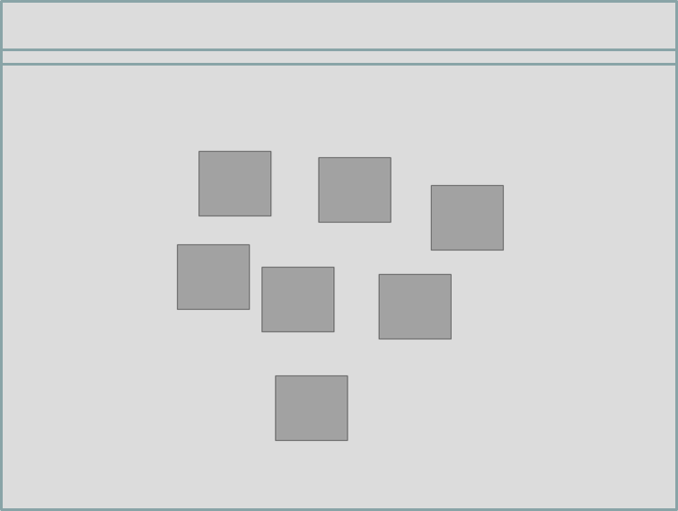
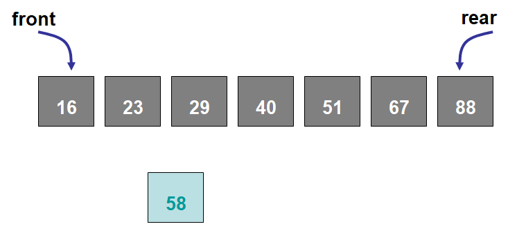
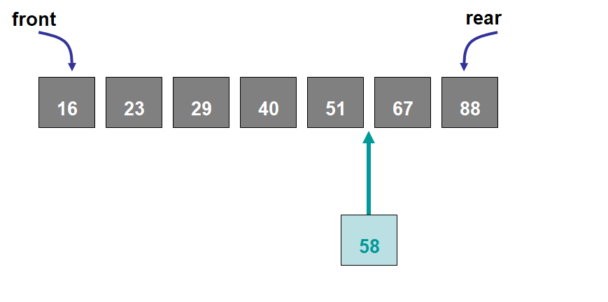
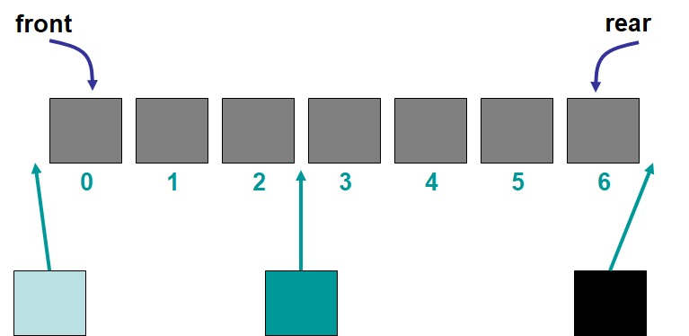
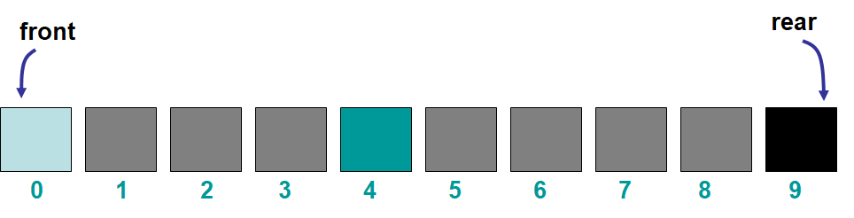

***********
The Bag ADT
***********

* Like stacks and queues, a bag is a data structure
* However, bags are more general than stacks and queues

* Bags have more flexibility on how they are used

    * Where and how elements are added, removed, and accessed

Bags
====

    A representation of an arbitrary bag containing seven elements.

* The high-level idea of a bag shouldn't really be thought of as having an ordering

    * The underlying implementation may be with some linear container
    * But the idea is that the information in the bag has no meaningful order

* Like the other collections, there needs to be a way to

    * Add
    * Remove
    * Get the size
    * Check if it's empty

* But given the more general definition of the bag, how exactly these should be done is not obvious

    * Adding to a Bag

        * How should elements be added?
        * Where should they go?

    * Removing from a Bag

        * How should elements be removed?
        * Where should they be removed from?

    * Other potential functionality?

        * Access a specific element?
        * Check if a given element exists?
        * ...

* Notice that the general idea of the bag is quite high-level and the answer to the above questions really *depends*
* To help determine how these operations should work, more specialized bags can be defined
* Although there are several possibilities for specialized bags, the ones covered here are

    * Sorted Bags
    * Indexed Bags

Sorted Bag
----------

* If the elements must be sorted, then how they are added and removed must be done carefully

    * Unlike the general bag, this specific kind of bag will have an ordering

* The ordering of the elements will depend on some characteristic of the contents of the bag

    * Numbers in ascending order
    * Strings in alphabetical order

* The elements themselves are what determine the ordering

    Example sorted bag of seven integers. The integer 58 is to be added to the collection.

* There is only one way to add the element to the sorted bag

    * The element must be added such that the sorted property of the bag is preserved

    Example of inserting the integer ``58`` into the only valid spot in the sorted bag. Notice that the integer ``67``
    is the first element within the sorted bag that is larger than the element being added.

* Should there be restrictions on how elements are removed?

Indexed Bags
------------

* Indexed bags are bags where the elements are referenced by a numeric position

    * The numeric position is called the index
    * Like arrays or Python lists

* This specific kind of bag will have an ordering

    * Element position is important
    * The elements are not *sorted* based on some property of the elements
    * User determines the ordering of the elements

* Every time an element is added or removed, the indices may need to change

    Example indexed bag with seven elements. The three elements are to be added to the specified locations within the
    bag. One element is to be added to the front, another to the middle, and the last to the end.

    Example of the indexed bag after three elements were added to the front, middle, and end of the bag. Note that the
    elements' indices changed as a result of the adds.

* Elements can be added to any arbitrary index, assuming it is valid

    * The specified index would be the index it should exist at *after* adding

* Like adding, elements can be removed from any valid index

Functionality
=============

* The bag interface will be kept simple

    * Add an element
    * Remove a specific element
    * Check if an element is contained in the bag
    * Count the number of occurrences of an element in the bag
    * Check if it's empty
    * Get the size
    * Get an iterator for the bag

        * Iterators are handy tools for looping and consistency
        * More on iterators later

.. code-block:: java
    :linenos:

    public interface Bag<T> extends Iterable<T> {

        boolean add(T element);
        boolean remove(T element);
        boolean contains(T target);
        int count(T target);
        boolean isEmpty();
        int size();
        Iterator<T> iterator();
    }

Sorted Bag Functionality
------------------------

* A sorted bag will do everything a bag can
* However, there will be some specific requirements for the sorted bag

    * Add happens such that the sorted property is preserved
    * Remove the first element
    * Remove the last element
    * Get the first element (but leave it in the bag)
    * Get the last element (but leave it in the bag)

.. code-block:: java
    :linenos:
    :emphasize-lines: 1

    public interface SortedBag<T extends Comparable<? super T>> extends Bag<T> {

        @Override
        boolean add(T element);
        T removeFirst();
        T removeLast();
        T first();
        T last();
    }

* Notice that, despite wanting all the ``Bag`` methods, they are not included in the ``SortedBag`` interface
* This is because the ``SortedBag`` *extends* the ``Bag`` interface

    * ``public interface SortedBag<T extends Comparable<? super T>> extends Bag<T>``

* The ``extends`` keyword means that this interface/class will *inherit* all the methods from the class being extended

    * ``Bag`` is being extended in this case
    * Similarly, the type ``T`` is extending ``Comparable`` --- ``T extends Comparable<? super T>``

        * This will be discussed in more detail later

* Although not explicitly included in the ``SortedBag`` interface, the methods from ``Bag`` are still part of what defines a ``SortedBag``

    * A ``SortedBag`` cannot be implemented without implementing all the methods from the ``Bag`` interface

* The idea of inheritance will be discussed in more detail later

Indexed Bag
-----------

* Similar to the ``SortedBag`` interface, the ``IndexedBag`` interface will make use of inheritance by extending the ``Bag`` interface
* In addition to the ``Bag`` methods, ``IndexedBag`` specific methods are included

    * Add an element to a specific index
    * Remove an element from a specific index
    * Change (set) the element at a specific index
    * Get an element at a specific index
    * Find the index of a specified element

.. code-block:: java
    :linenos:

    public interface IndexedBag<T> extends Bag<T> {

        @Override
        boolean add(T element);
        boolean add(int index, T element);
        T set(int index, T element);
        T get(int index);
        T remove(int index);    // Different signature from the inherited remove
        int indexOf(T element);
    }

For Next Time
=============

* Read Chapter 6 Section 1 -- 5 on Lists

    * 23 pages

Playing Code
------------

* Download the various bag interfaces:

    * :download:`Bag </../main/java/Bag.java>`
    * :download:`SortedBag </../main/java/SortedBag.java>`
    * :download:`IndexedBag </../main/java/IndexedBag.java>`
